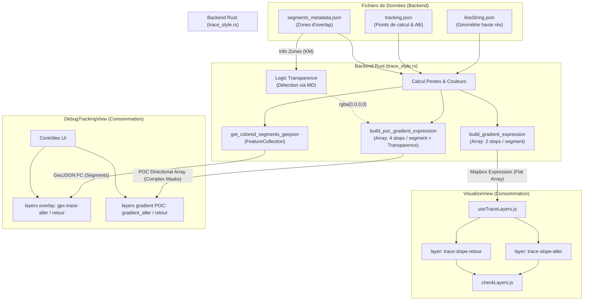
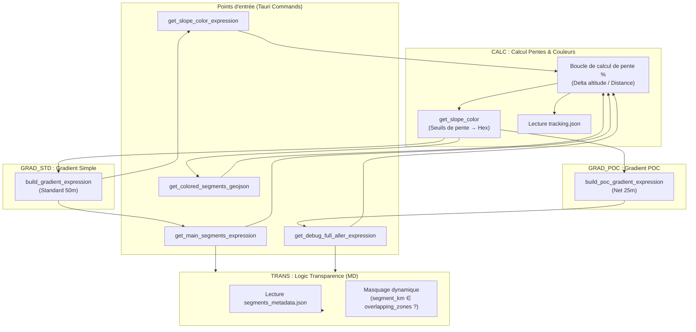

# Analyse de l'affichage des layers Mapbox dans VisualizeView

Ce document détaille la gestion des couches (layers) Mapbox et des styles de carte lors de la visualisation d'une trace ou d'une variante, avec un focus particulier sur la logique Aller/Retour et les structures de données transmises à Mapbox.

---

## 📊 Flux de traitement des données (LineString)

Le schéma ci-dessous illustre comment les fichiers de données bruts sont transformés par le backend Rust pour alimenter les deux types de vues.



---

## 🔗 Lien technique : Segments_metadata vs Transparence

Il existe un lien structurel direct entre le fichier `segments_metadata.json` et la "Logic Transparence" du backend Rust.

### Le rôle de `segments_metadata.json`
Ce fichier contient les **bornes kilométriques** de chaque zone de chevauchement :
- `aller_start_km` / `aller_end_km`
- `retour_start_km` / `retour_end_km`

Ces données sont essentielles car une même portion de route physique correspond à deux distances différentes dans la chronologie de la trace (par exemple, le km 5 à l'aller peut correspondre au km 45 au retour).

### Le mécanisme de décision (Rust)
Dans `trace_style.rs`, la logique de transparence utilise ces bornes comme **déclencheurs** :

1.  **Lecture** : Le backend charge les zones d'overlap du JSON.
2.  **Comparaison** : Pour chaque segment de la trace, Rust calcule sa position `segment_km`.
3.  **Filtrage par direction** :
    - Si on génère le calque **Aller** : Rust vérifie si `segment_km` tombe dans une plage `retour_start_km` / `retour_end_km`.
    - Si oui, le flag `should_hide` passe à `true`.
4.  **Injection** : Dès que `should_hide` est vrai, la couleur habituelle de pente est remplacée par `"rgba(0, 0, 0, 0)"`.

**Résultat** : Les métadonnées dictent précisément *où* injecter la transparence pour que les deux sens de circulation ne se superposent pas visuellement de manière confuse, tout en conservant une seule ligne continue pour Mapbox.

---

## 🕹️ Comparaison du Pilotage (Contrôle des Layers)

Bien que les deux vues manipulent des couches Aller/Retour, leurs mécanismes de déclenchement sont radicalement différents.

### VisualizeView : Pilotage AUTOMATIQUE
*   **Déclencheur** : La boucle d'animation (`animateLoop`) qui s'exécute à chaque frame.
*   **Logique** : La fonction `checkLayers(distanceTraveled)` compare la position actuelle du curseur aux zones d'overlap du fichier `segments_metadata.json`.
*   **Layers Consommateurs** : Pilote exclusivement les calques de type "gradient" : **`trace-slope-aller`** et **`trace-slope-retour`**.
*   **Action** : Appelle automatiquement `updateTraceOverlapVisibility()` (via le composable `useTraceLayers.js`) pour basculer la visibilité Mapbox sans intervention de l'utilisateur.
*   **Objectif** : Fluidité totale de l'expérience visuelle durant le flyover.

### DebugTrackingView : Pilotage MANUEL
*   **Déclencheur** : L'utilisateur via l'interface de contrôle (Radio Buttons et Switchs).
*   **Logique** : La fonction `updateLayerVisibility()` réagit aux changements des variables réactives (`selectedTraceLayer`, `showTrace`).
*   **Action** : Exécute des appels directs à `map.setLayoutProperty()` pour forcer l'affichage de couches spécifiques (Aller simple, Retour simple, Gradients POC, ou Statut de variante).
*   **Objectif** : Analyse technique précise point par point pour valider les calculs du backend.

---
## Hiérarchie des Layers et Structures de Données (VisualizeView)

Les couches sont ajoutées dans l'ordre suivant (du plus bas au plus haut). L'ordre d'insertion via `addLayer` définit leur Z-index visuel (la dernière ajoutée recouvre les précédentes).

### 1. **trace-main-abandoned** (Z-Index : 0 - Plus bas)
*   **Données** : GeoJSON `LineString` (Source : `trace-master-source`) ou `FeatureCollection` (Source : `colored-segments`).
*   **Structure** : Représente la trace originale complète ou les segments "abandonnés" d'une variante.
*   **Filtre** : `['==', ['get', 'status'], 'ABANDONED']` (si source segments).
*   **Rendu** : Couleur plate (`line-color`).

### 2. **trace-variant-segment-common** (Z-Index : 1)
*   **Données** : GeoJSON `FeatureCollection` de segments individuels (Source : `colored-segments`).
*   **Structure** : Segments où la variante suit strictement la trace master.
*   **Filtre** : `['==', ['get', 'status'], 'COMMON']`.

### 3. **trace-variant-segment-new** (Z-Index : 2)
*   **Données** : GeoJSON `FeatureCollection` (Source : `colored-segments`).
*   **Structure** : Nouveaux tronçonnages créés lors de l'édition d'une variante.
*   **Filtre** : `['==', ['get', 'status'], 'NEW']`.

### 4. **trace-slope-aller** (Z-Index : 3)
*   **Données** : GeoJSON `FeatureCollection` (avec `lineMetrics: true`) couplé à une expression de gradient.
*   **Rendu Dynamique** : Utilise la propriété `line-gradient` de Mapbox.
*   **Structure de l'Expression** :
    ```json
    ["interpolate", ["linear"], ["line-progress"], 
      0.0, "color1", 
      ...
    ]
    ```

### 5. **trace-slope-retour** (Z-Index : 4)
*   **Structure** : Identique à l'Aller, mais superposé. Le switch de visibilité gère quelle pente est vue.

### 6. **comet-layer** (Z-Index : 5 - Plus haut)
*   **Données** : GeoJSON `Point` (Source mise à jour en temps réel).
*   **Rendu** : Marqueur dynamique (comète) qui doit toujours rester visible au-dessus de la trace.

---

## �️ Fonctions Mapbox API invoquées

L'application utilise les méthodes clés suivantes de l'API Mapbox GL JS pour piloter l'affichage :

### Création et Initialisation
- **`map.addSource(id, options)`** : Enregistre une source de données GeoJSON (ex: `colored-segments`, `bearing-vector`). L'option `{ lineMetrics: true }` est cruciale pour les couches utilisant des gradients.
- **`map.addLayer(layerOptions, beforeId)`** : Crée la couche visuelle. Le paramètre `beforeId` est utilisé pour insérer les couches de trace *sous* les étiquettes de la carte ou *sous* la comète.

### Mise à jour Temps Réel
- **`map.getSource(id).setData(data)`** : Met à jour la géométrie d'une source sans recréer la couche. Utilisé pour le mouvement de la comète, du point de debug et du vecteur de cap.
- **`map.setLayoutProperty(layerId, 'visibility', 'visible'|'none')`** : Contrôle l'affichage/masquage dynamique (ex: switch Aller/Retour). C'est la méthode la plus utilisée durant l'animation.
- **`map.setPaintProperty(layerId, property, value)`** : Modifie l'apparence sans toucher à la géométrie. Utilisé pour injecter dynamiquement les expressions `line-gradient` ou changer l'opacité.

### Gestion des États Globaux
- **`map.setStyle(styleUrl)`** : Bascule entre les fonds de carte (Streets, Satellite, etc.). Cette fonction provoque la suppression de toutes les sources et couches custom.
- **`map.setTerrain(options)`** : Active ou désactive le relief 3D (source `mapbox-dem`).
- **`map.flyTo(options)`** : Déplace la caméra de manière fluide vers une position, un zoom ou un cap précis.

---

## �🔄 Gestion des Changements de Style

Mapbox réinitialise l'ensemble des couches personnalisées lors d'un appel à `setStyle`. Pour maintenir l'affichage, l'application utilise deux mécanismes :

- **Écouteur `styledata`** : Détecte les changements de style et relance automatiquement `setupTraceLayers` si les couches ont été supprimées.
- **Appels explicites après `flyToPromise`** : Lors des transitions majeures, `setupTraceLayers` est rappelé après avoir attendu le chargement du nouveau style (`style.load`).

---

## Étapes de Visualisation - Trace Standard

### 1. Vue initiale
*   **État** : AnimationState = `Initialisation`
*   **Style par défaut** : `styleLancement` (défini dans les paramètres).
*   **Layers** : 
    *   `trace-slope-aller` : **Affiché**.
    *   `comet-layer` : **Affiché** mais vide.

### 2. Vue de la trace complète
*   **État** : AnimationState = `Vol_Vers_Vue_Globale`
*   **Style par défaut** : `styleLancement`.

### 3. Vue du Km 0
*   **État** : AnimationState = `En_Pause_au_Depart`
*   **Transition de Style** : **Changement vers `mapStyle`** (visualisation 3D).
*   **Rechargement** : Appel explicite à `setupTraceLayers` pour recréer les sources et layers GeoJSON.

### 4. Vue 3D et détection Aller/Retour
*   **État** : AnimationState = `En_Animation`
*   **Style par défaut** : `mapStyle`.
*   **Logique** : Basculement dynamique de visibilité par `checkLayers`.

### 5. Le dernier Km
*   **État** : Fin de `En_Animation`
*   **Style par défaut** : `mapStyle`.

### 6. Vue trace complétée finale
*   **État** : AnimationState = `Vol_Final` / `Termine`
*   **Transition de Style** : **Retour vers `styleLancement`**.
*   **Rechargement** : Les couches sont recréées via `setupTraceLayers`.

---

## Analyse de la vue DebugTrackingView

### 🛠️ Hiérarchie et Structures spécifiques (Z-Index technique : 0 à 12)

Les couches sont empilées dans cet ordre rigoureux (0 = fond, 12 = sommet) :

0.  **gpx-trace-aller** : FeatureCollection. Filtre `!= retour_overlap`.
1.  **gpx-trace-retour** : FeatureCollection. Filtre `!= aller_overlap`.
2.  **trace-variant-abandoned** : Segments typés (Noir).
3.  **trace-variant-common** : Segments typés (Vert).
4.  **trace-variant-new** : Segments typés (Bleu).
5.  **gpx-layer-gradient-aller** : LineString unique + `lineMetrics` (POC).
6.  **gpx-layer-gradient-retour** : LineString unique + `lineMetrics` (POC).
7.  **zone-markers-layer** : Cercles de couleur pour les points kilométriques.
8.  **zone-labels-layer** : Texte ("KM 10", etc.) au-dessus des marqueurs.
9.  **bearing-vector-layer** : Vecteur de cap (Rouge).
10. **calc-points-layer** : Points jaunes de la fenêtre de lissage.
11. **last-calc-point-layer** : Dernier point de calcul (plus gros).
12. **current-point-layer** : Position actuelle rattachée (Cercle rouge - Sommet).

---

## Comparaison technique : Overlay vs Gradient

### 1. Layers "Overlay" (Multi-Segments)
*   **Données** : `FeatureCollection` (Segments bruts).
*   **Propriété** : `line-color: ['get', 'color_raw']`.
*   **Traitement Mapbox** : Mapbox dessine chaque entité GeoJSON séparément en appliquant le style contenu dans ses propriétés.

### 2. Layers "Gradient" (LineString Unique)
*   **Données** : `LineString` (Une seule géométrie continue).
*   **Propriété** : `line-gradient` (Expression interpolée).
*   **Traitement Mapbox** : Mapbox calcule la progression sur la ligne (0.0 à 1.0) et applique la couleur du gradient correspondante.

---

## 💡 Comprendre les "Stops" de Gradient (Points de Contrôle)

Pour Mapbox, un `line-gradient` n'est pas une simple liste de couleurs, mais une suite de **"Stops"** (points de contrôle) composés d'un couple `[Position (0 à 1), Couleur]`.

### Qu'est-ce qu'un "Stop" ?
Imaginez une règle graduée de 0 à 100%. Un stop à `0.5, "red"` dit à Mapbox : "Au milieu de la ligne, la couleur doit être rouge". Mapbox calcule ensuite automatiquement le dégradé entre les stops.

### 1. Lissage vs Segments : Deux approches techniques
Le projet VisuGPS utilise actuellement deux manières différentes de représenter la trace, ce qui explique les différences de rendu observées.

| Caractéristique | Architecture **Gradient** (Edition / POC) | Architecture **Segments** (Visualisation) |
| :--- | :--- | :--- |
| **Objet Mapbox** | Un seul `LineString` continu. | Une `FeatureCollection` de multiples segments. |
| **Transition** | **Lissée** (Gradient sur 50m). | **Nette** (Coupure à 0m). |
| **Technique Aller/Retour** | **Masquage** (via 4 stops de transparence). | **Filtrage** (on affiche/cache des segments entiers). |
| **Métadonnées** | globales par ligne (le segment est une position). | Individuelles par segment (chaque segment est un objet). |
| **Avantage** | Esthétique premium (dégradés fluides). | Flexibilité totale sur les propriétés par segment. |

### 2. Le choix de l'architecture par Segments
Dans `VisualizeView`, le choix de découper la trace en segments GeoJSON individuels (via `get_colored_segments_geojson`) a une conséquence directe : **la perte du lissage**.

- **Pourquoi ce choix ?** : Cette architecture permet de manipuler chaque tronçon de 100m comme un objet indépendant doté de ses propres propriétés (status, type, etc.), facilitant la gestion algorithmique des variantes complexes.
- **La limite** : Mapbox ne sait pas calculer de dégradé entre deux objets géométriques distincts. Le rendu est donc obligatoirement "en escalier" (couleurs unies par segment).

### 3. L'approche "Gradient Masqué" (POC)
Comme vous l'avez souligné, le mode `DebugTrackingView` (POC) prouve qu'une alternative existe :
- On conserve une ligne unique pour garder le **lissage**.
- On utilise des **stops de transparence (4 stops)** pour "éteindre" dynamiquement les portions (Aller ou Retour) que l'on ne veut pas voir.

**Conclusion** : La "complexité" n'est pas un obstacle technique infranchissable, mais une différence de fond dans la structure des données. Pour retrouver le lissage en Visualisation, il faudrait abandonner la collection de segments au profit d'une ligne unique pilotée par des expressions de masquage complexes.

### 2. Le principe du Masquage (4 Stops)
L'expression de "4 stops" ne décrit pas la douceur d'une pente, mais le nombre de points nécessaires pour **créer un "trou" (zone invisible)** dans une ligne continue :
- **Entrée dans la zone invisible** (2 stops) : Couleur de pente -> Transparent.
- **Sortie de la zone invisible** (2 stops) : Transparent -> Couleur de pente.
- **Total** : 4 points de contrôle pour que la ligne disparaisse et réapparaisse proprement.

**En résumé** :
- **Edition (`EditView`)** = Gradient continu (Lissage conservé).
- **Visualisation (`VisualizeView`)** = Collection de segments (Coupures nettes).
- **Mode POC Debug** = Gradient masqué (Lissage + Directionnalité).

Les expressions de gradient envoyées à Mapbox sont générées dans `src-tauri/src/trace_style.rs` :

### 1. Construction de l'expression `line-gradient`
L'expression finale suit la structure de données Mapbox `interpolate` :
```json
[
  "interpolate",
  ["linear"],
  ["line-progress"],
  0.0, "couleur_depart",
  0.15, "couleur_km_1",
  ...
  1.0, "couleur_fin"
]
```

### 2. Gestion des Transitions (Lissage visuel)
Les fonctions introduisent des **points de transition** (10m à 25m) en ajoutant des "stops" de couleur rapprochés juste avant et après les jonctions de segments, créant un fondu fluide.

### 3. Logique de Transparence (Injection `rgba(0, 0, 0, 0)`)
*   **Emplacement** : Dans `trace_style.rs`, au sein de la fonction `get_debug_direction_expression` (ligne ~735).
*   **Fonctionnement** : Si un segment appartient à la direction opposée dans une zone d'overlap (condition `should_hide`), le backend injecte `"rgba(0, 0, 0, 0)"` au lieu de la couleur de pente habituelle. Cela permet de "trouer" visuellement le gradient sans scinder la géométrie unique.

---

## 🗺️ Cartographie Exhaustive du Backend Rust

Voici la vue structurée des appels backend pour les 4 domaines (CALC, GRAD, TRANS).

### Diagramme de flux Backend



### Détails par Subgraph

#### CALC : Calcul Pentes & Couleurs
*   **Fonction Clé** : `get_slope_color` (Fichier: `trace_style.rs`)
*   **Processus** : Le moteur Rust lit `tracking.json`, calcule le delta d'altitude, détermine la pente en % et renvoie un code couleur Hex.
*   **Usage** : Centralisé pour toutes les méthodes de rendu.

#### GRAD_STD : Gradient de Pente Simple
*   **Fonctions** : `build_gradient_expression` (Fichier: `trace_style.rs`)
*   **Transition** : 50 mètres (`transition_length = 25.0`).
*   **Usage** : `EditView.vue` et `VisualizeView.vue` (Couches standard).

#### GRAD_POC : Gradient + Masque Transparence
*   **Fonctions** : `build_poc_gradient_expression` (Fichier: `trace_style.rs`)
*   **Transition** : 25 mètres (`transition_length = 12.5`). Plus net pour éviter les flous sur les masques.
*   **Usage** : Uniquement dans `DebugTrackingView.vue`.

#### TRANS : Logic Transparence (Détection via MD)
*   **Fonction Clé** : `get_debug_direction_expression` (Fichier: `trace_style.rs`)
*   **Processus** : 
    1.  Charge `segments_metadata.json`.
    2.  Filtre les segments par direction (Aller/Retour).
    3.  Injecte `rgba(0,0,0,0)` si le segment doit être masqué.
*   **Stops** : C'est la source de la logique des **4 stops**.

### Fichiers Backend impliqués

| Fichier | Domaine | Rôle |
| :--- | :--- | :--- |
| `trace_style.rs` | CALC, GRAD, TRANS | Moteur central de rendu et de gradient. |
| `lib.rs` | ENTRY | Déclaration des commandes Tauri. |
| `segment_analyzer.rs` | TRANS | Génération des métadonnées (Metadata / MD). |
| `variant_processor.rs` | CALC | Gestion des données de variantes. |

---

## 🛠️ Services rendus par `useTraceLayers.js` (Frontend)

Le composable `useTraceLayers.js` est le "chef d'orchestre" de Mapbox côté client. Il fournit les services suivants :

### 1. `setupTraceLayers(configs)`
- **Rôle** : Initialisation et configuration complète des sources et des calques.
- **Détails Techniques** :
    - **Sanitisation Agressive** : Nettoie les données GeoJSON des propriétés obsolètes (`icon`, `background`) pour éviter les warnings Mapbox v3.
    - **Architecture Imposée (Segments)** : Bien que le code prévoie un "Mode 2 Standard" (gradient continu), ce mode est actuellement **dormant/latent** dans `VisualizeView`.
    - **Rendu Forcé** : `VisualizeView` alimente systématiquement la source `colored-segments`, ce qui force l'usage de la `FeatureCollection` de segments (coupures nettes), même pour la trace maîtresse sans variante.
    - **Injection de Données** : Crée les sources suivantes :
        - **`trace`** : La trace actuelle sous forme d'un objet `LineString` unique (utilisée pour le lissage en mode Standard).
        - **`colored-segments`** : La trace actuelle découpée en segments de 100m (utilisée pour le rendu par blocs).
        - **`trace-master-source`** : La **Trace Maîtresse** (circuit parent complet). Sert de fond de plan pour afficher les zones abandonnées en mode variante.
        - **`comet-source`** : Source dynamique pour l'affichage de la comète d'animation.

### 2. `updateLayerVisibility(type, isVisible)`
- **Rôle** : Contrôle dynamique de l'affichage.
- **Services** :
    - Pilotage groupé des calques de segments (`common`, `new`).
    - Pilotage individuel du calque "Abandonné".
    - Toggle de n'importe quel calque par son ID.

### 3. `updateTraceOverlapVisibility(zoneId, direction)`
- **Rôle** : Gestion de la direction dans les zones de conflit.
- **Services** :
    - Bascule instantanée entre la vue **Aller** et la vue **Retour**.
    - Assure l'exclusion mutuelle (on ne voit qu'un calque à la fois dans les zones d'overlap).

### 4. `updateVariantSlopeMode(showSlopeGradient, colors)`
- **Rôle** : Commutateur de style visuel.
- **Services** :
    - **Mode Pente** : Applique le `line-gradient` (en mode Standard) ou récupère la propriété `color_raw` des segments (en mode Variante).
    - **Mode Plat** : Désactive les dégradés pour appliquer une couleur unie globale.
    - **Fallback de sécurité** : Gère la coexistence complexe entre les propriétés `line-color` et `line-gradient`.

### 5. `updateVariantStyle(styles)`
- **Rôle** : Mise à jour "Live" des paramètres cosmétiques.
- **Services** :
    - Réajustement immédiat des épaisseurs (`line-width`) et des opacités (`line-opacity`) sans recharger les sources.
    - Mise à jour des couleurs de segments (Nouveau, Commun, Abandonné) lors d'un changement dans les paramètres.

---

## 🚀 Opportunité : Vers un Lissage en Visualisation

L'analyse montre que le fossé technique pour obtenir des transitions douces dans `VisualizeView` est très étroit :

1.  **Côté Frontend** : `VisualizeView` et `useTraceLayers.js` possèdent déjà les calques `aller` et `retour`. Il suffirait de faire pointer ces calques sur la source unique `trace` (LineString) au lieu de `colored-segments`.
2.  **Côté Backend** : Les expressions de gradient avec masques de transparence (4 stops) sont **déjà prêtes** (fonctions `get_debug_full_aller_expression`).
3.  **Finalité** : En combinant ces deux briques, `VisualizeView` pourrait offrir le même lissage premium que l'édition, tout en conservant la gestion Aller/Retour.

**Bilan** : Le code actuel de Visualisation est en "Mode Segments" par choix initial de simplification algorithmique, mais l'infrastructure pour le "Mode Gradient Masqué" est déjà là, testée et fonctionnelle dans le POC Debug.

