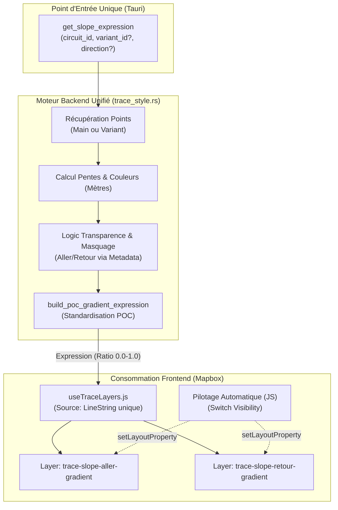

# Architecture Unifiée : Lissage et Gradients Masqués

Ce document définit l'architecture cible pour le rendu des traces dans **VisuGPS**, en remplaçant le découpage par segments par un système de **Gradients Unifiés**. Il capitalise sur les réussites du POC `DebugTrackingView` pour les porter dans la production (`VisualizeView`).

---

## 🏗️ Architecture de Données Unifiée

Le changement majeur consiste à passer d'une architecture de **Filtrage de Segments** à une architecture de **Gradients Directionnels préparés au Backend**.

---

## 🎯 Factorisation du Moteur POC

Le moteur `build_poc_gradient_expression` (GRAD_POC) devient le standard de production :

1.  **Lissage Garanti** : Maintien d'une géométrie `LineString` unique pour éviter les coupures visuelles.
2.  **Transitions Nettes** : Maintien de la transition de 25m (`transition_length = 12.5m`) pour que les masques de transparence ne bavent pas.
3.  **Transparence Directionnelle** : Utilisation systématique de `rgba(0,0,0,0)` pour "trouer" le gradient aux endroits où la direction opposée doit primer.

---

## ⚖️ Rigueur Absolue sur les Unités

Pour garantir la précision sur n'importe quelle longueur de trace, une séparation stricte des unités est imposée :

| Domaine | Unité | Justification |
| :--- | :--- | :--- |
| **Logiciel Interne (Rust)** | **Mètre (M)** | Précision maximale pour le calcul des pentes et des fenêtres de lissage. |
| **Mapping Métadonnées** | **Kilomètre (KM)** | Cohérence avec le fichier `segments_metadata.json` (format existant). |
| **Communication Mapbox** | **Ratio (0.0 - 1.0)** | Utilisation de `line-progress`. Indépendant de la longueur totale de la trace. |

> [!IMPORTANT]
> Le backend calcule systématiquement `(junction_dist / total_distance)` pour chaque "stop" du gradient. Mapbox reçoit donc une expression universelle où la position 0.5 représente toujours exactement le milieu de la trace, peu importe si elle fait 1km ou 100km.

---

## 🔄 Flux d'Exécution (VisualizeView & DebugTrackingView)

Désormais, les deux vues suivent le même cycle de vie simplifié :

### 1. Phase de Chargement (Tauri Invoke)
- La vue demande **3 expressions lissées** au backend via `get_slope_expression` :
    - `exp_full` : Sans paramètre `direction`.
    - `exp_aller` : Avec `direction: "aller"`.
    - `exp_retour` : Avec `direction: "retour"`.

### 2. Phase de Configuration (Mapbox)
- `useTraceLayers.js` crée deux calques (`aller` et `retour`) qui pointent tous deux vers la source géométrique complète.
- Il injecte `exp_aller` dans le premier et `exp_retour` dans le second.

### 3. Phase d'Animation (Pilotage)
- Le pilotage automatique (JS) se contente de faire :
    - `visible = true` pour le calque Aller s'il est avant un overlap.
    - `visible = true` pour le calque Retour s'il est dans un overlap retour.
- **Le lissage est maintenu** car la "peau" (le gradient) contient déjà les zones de transparence calculées précisément au mètre près par le backend.

---

## 🚀 Bénéfices de l'Architecture Unifiée

- **Esthétique** : Fin des "escaliers" de couleur. Transitions douces sur l'ensemble de l'application.
- **Maintenance** : Un seul bug corrigé dans `get_slope_expression` profite à la fois au mode Debug, à la Visualisation Main et à la Visualisation Variants.
- **Performance** : Déchargement du Frontend. Mapbox gère le rendu du gradient de manière native et optimisée (GPU), sans manipuler des milliers de segments GeoJSON.

