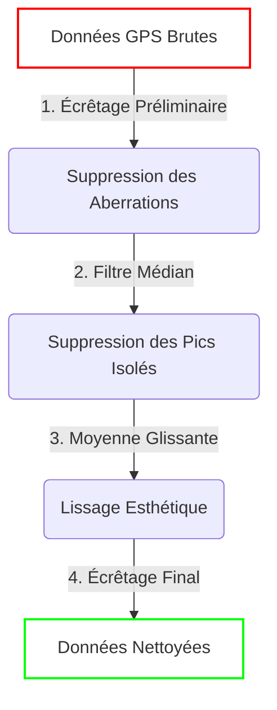
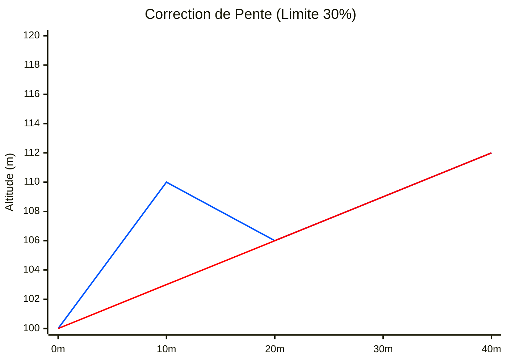
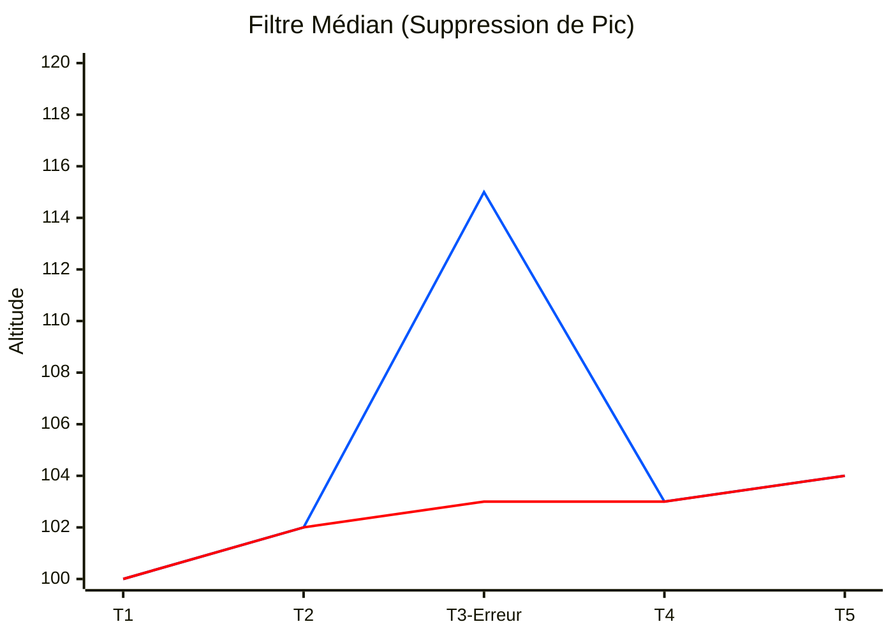
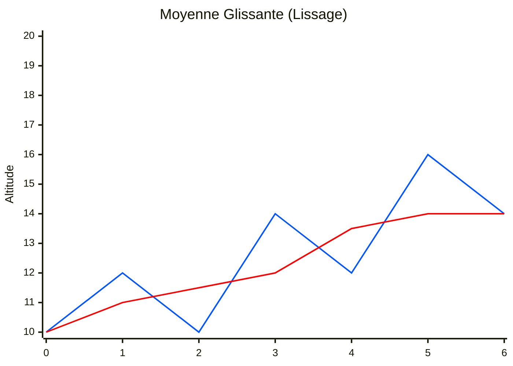
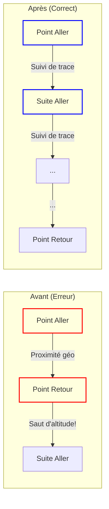

# 🏔️ Algorithme de Traitement de l'Altitude : Guide Technique

Ce document détaille le fonctionnement interne du moteur de nettoyage des altitudes de VisuGPS. Il a pour but d'expliquer comment l'application transforme des données GPS brutes, souvent bruitées, en une courbe fluide et réaliste pour l'animation 3D.

---

## 📋 Vue d'ensemble du Pipeline

Le traitement se déroule en **4 étapes successives**. Chaque étape a un rôle précis et élimine un type d'erreur spécifique.

---

## 1. Cas Concret : Le "Saut Impossible" (Aberration)

**Le Problème** : Le GPS perd le signal et vous "téléporte" 50 mètres plus haut en 2 mètres de distance. C'est physiquement impossible.

**La Solution** : L'Écrêtage (Gradient Clamping).
Le système calcule la pente entre deux points. Si elle dépasse votre paramètre `max_gradient_percent` (ex: 30%), l'altitude du point suivant est rabotée pour respecter cette limite.

> **Paramètre clé** : `Importation > Pente Maximum Autorisée (%)`

### Illustration

Dans cet exemple, le point rouge est une erreur GPS (saut de 10m sur 10m de distance = 100% de pente). Avec une limite à 30%, il est corrigé.

*(Légende : La courbe présentant le pic de 10m est corrigée pour respecter la pente maximale).*

---

## 2. Cas Concret : Le "Pic Isolé" (Bruit Impulsionnel)

**Le Problème** : Une seule valeur est fausse au milieu d'une série correcte. Par exemple, une pierre sur le chemin ou un bug capteur : `100, 101, 115, 102, 103`.

**La Solution** : Le Filtre Médian.
L'algorithme regarde une fenêtre de points autour de la cible (ex: 5 points) et choisit la valeur "du milieu" (la médiane), ignorant mathématiquement les extrêmes.

> **Paramètre clé** : `Importation > Fenêtre du Filtre Médian`

### Illustration

Le filtre médian (fenêtre de 3) supprime totalement le pic sans toucher au reste.

*(Légende : Le 115 est purement et simplement ignoré et remplacé par 103, la valeur médiane des voisins).*

---

## 3. Cas Concret : L'Escalier (Bruit de Mesure)

**Le Problème** : Les données sont justes mais "tremblotantes". La courbe fait des micro-dents de scie (+1m, -1m) qui rendent la caméra désagréable en 3D.

**La Solution** : La Moyenne Glissante.
On fait la moyenne de chaque point avec ses voisins. Cela arrondit les angles et donne un aspect "soyeux" à la courbe.

> **Paramètre clé** : `Importation > Fenêtre de Moyenne Glissante`

### Illustration

Transformation d'une courbe anguleuse en courbe fluide.

*(Légende : La ligne lissée suit la tendance mais ignore les vibrations).*

---

## 4. Cas Spécial : Les Superpositions (Aller-Retour)

**Le Problème** : Vous repassez exactement au même endroit (ex: aller-retour sur un chemin).
Si l'algorithme cherche "le point le plus proche" géographiquement pour trouver l'altitude, il risque de confondre le point de l'aller (km 2) et le point du retour (km 15), créant des sauts temporels d'altitude.

**La Solution** : Interpolation Contextuelle.
L'algorithme ne regarde plus la carte globale, mais suit la ligne point par point ("Je suis au segment 50, je vais au segment 51"). Même si le segment 500 est au même endroit, il est ignoré.

---

## 5. Cas Spécial : Le Saut Vertical (Distance Zéro)

**Le Problème** : Le format GPX contient parfois deux points avec les mêmes coordonnées (latitude/longitude identiques) mais une altitude différente.
Distance = 0m, Dénivelé = 5m.
Mathématiquement, cela fait une pente infinie ($\infty\%$), ce qui passe au travers des filtres classiques car la division par zéro échoue ou est ignorée.

**La Solution** : Aplatissement.
Si la distance entre deux points est inférieure à 1 millimètre, l'algorithme force la nouvelle altitude à être égale à la précédente. Le "saut" est supprimé.

---

## Résumé de l'impact des paramètres

| Paramètre | Effet si Trop Faible | Effet si Trop Élevé |
| :--- | :--- | :--- |
| **Pente Max** | Écrase le relief réel (cols raides deviennent plats) | Laisse passer des bugs GPS (murs verticaux) |
| **Filtre Médian** | Laisse passer les pics isolés (cailloux) | Commence à "raboter" les vrais sommets pointus |
| **Moyenne Glissante** | Courbe tremblotante, caméra nerveuse | Courbe trop molle, perte de précision aux sommets |

---

## 6. Note Technique : Filtrage Temporel vs Spatial

L'utilisateur attentif remarquera que les filtres (médian et moyenne) fonctionnent avec un **nombre de points fixes** (ex: 5 points) et non une distance (ex: 10 mètres).
Cela signifie que l'impact géographique du lissage varie selon votre vitesse :

*   **En montée lente (ex: épingle à cheveux)** : 5 points peuvent représenter seulement **2 mètres**. Le lissage est très "léger" spatialement, ce qui est parfait pour conserver la précision du virage.
*   **En descente rapide (ex: ligne droite)** : 5 points peuvent représenter **100 mètres**. Le lissage est très "fort" spatialement, ce qui est parfait pour gommer les vibrations inutiles sur une ligne droite.

**Pourquoi ce choix ?**
Le bruit des capteurs électroniques est souvent **temporel** (une erreur dure X secondes). Filtrer par "nombre de points" (donc implicitement par le temps) est généralement la méthode la plus robuste pour nettoyer le signal à la source, indépendamment de la topographie.
