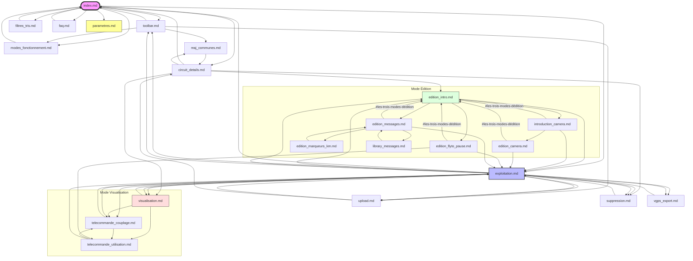

# Arborescence de la Documentation Utilisateur

Ce document présente l'organisation réelle des liens de navigation entre les différents manuels de VisuGPS. Ce schéma a été généré après un audit complet de la documentation pour refléter la nouvelle structure de navigation contextuelle.

> [!IMPORTANT]
> - Ce diagramme représente les liens **explicites** (boutons, liens "voir [X]") présents dans le texte.
> - Le bouton **Maison** (Home) de l'interface permet de revenir à `index.md` depuis n'importe quelle page.
> - Le bouton **Précédent** (Flèche gauche) de l'interface utilise l'historique de navigation de l'utilisateur.
