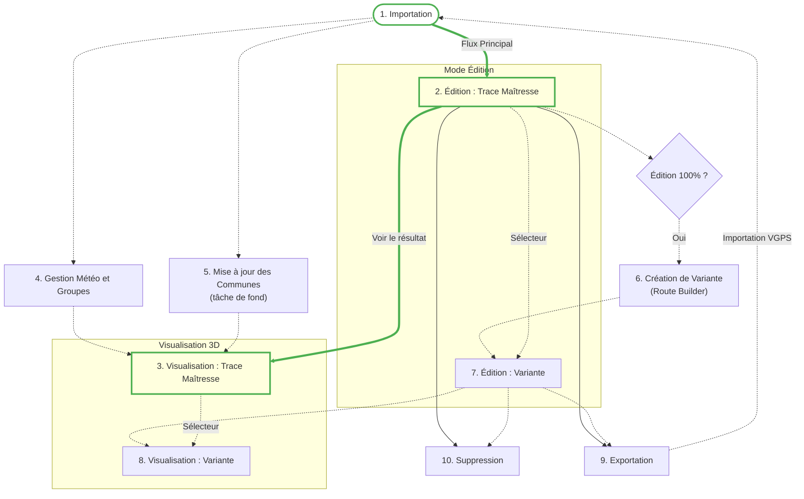

# Utilisation de VisuGPS

Ce guide d'exploitation vous accompagne dans l'utilisation quotidienne de VisuGPS, de l'import d'une trace jusqu'à sa visualisation finale.

[< Retour à l'accueil](./index.md)

## Cycle de vie d'un circuit

Voici les étapes clés, de l'importation à la visualisation finale. Les chemins en pointillés représentent les étapes optionnelles.

---

## Les Fonctionnalités Clés

Cliquez sur une section pour accéder à sa documentation détaillée. Les étapes du **flux principal** sont présentées en priorité.

### 🟢 Flux Principal (Étapes Indispensables)

#### 1. Importation de Traces
*   **[Fichiers GPX](./upload.md#1-importation-dun-fichier-gpx)** : Ajoutez des traces brutes à votre bibliothèque.
*   **[Fichiers VGPS](./upload.md#2-importation-dun-fichier-vgps)** : Importez des circuits complets (trace + mise en scène).

#### 2. Mode Édition (Trace Maîtresse)
Transformez votre trace en une expérience animée.
*   **[Vue d'ensemble](./edition_intro.md)** : Découvrir l'interface 3D.
*   **[Caméra](./introduction_camera.md)** : Placer des caméras et créer des mouvements fluides.
*   **[Évènements](./edition_flyto_pause.md)** : Créer des pauses et des survols.
*   **[Messages](./edition_messages.md)** : Ajouter des informations textuelles.
*   **[Marqueurs KM](./edition_marqueurs_km.md)** : Jalons de distance automatiques.
*   **[Bibliothèque de Messages](./library_messages.md)** : Gérer vos textes prédéfinis.

#### 3. Visualisation 3D (Trace Maîtresse)
Profitez du résultat ! Lancez la lecture de votre animation.
*   **[Lancer la Visualisation](./visualisation.md)** : Guide de la vue animation.
*   **Télécommande Mobile** : Contrôlez l'application via smartphone.
    *   **[Connexion](./telecommande_couplage.md)** : Procédure de couplage et dépannage.
    *   **[Utilisation](./telecommande_utilisation.md)** : Commandes à distance (Lecture, Caméra, Widgets).

---

### 🔵 Options et Personnalisation (Facultatif)

#### 4. Gestion Météo et Groupes
Simulez les conditions atmosphériques sur votre parcours.
*   **[Gestionnaire Météo](./meteo_manager.md)** : Configurer les scénarios, les dates et les groupes.

#### 5. Mise à jour des Communes (Tâche de fond)
Enrichissez votre trace avec les données géographiques.
*   **[Identification des communes](./maj_communes.md)** : Lancer la recherche automatique des villes traversées (IGN, Mapbox, OSM).

#### 6. Création de Variantes (Route Builder)
Accessible uniquement après avoir terminé l'édition de la trace maîtresse (100%).
*   **[Créer une variante](./route_builder.md)** : Utiliser le Route Builder pour dessiner un nouveau parcours.

#### 7. Édition de Variantes
Mise en scène 3D spécifique à vos parcours alternatifs.
*   **[Éditer une variante](./variant_edition.md)** : Gérer les caméras et événements propres à la variante.

#### 8. Visualisation de Variantes
Lecture de l'animation de vos variantes.
*   **[Visualiser une variante](./variant_visualisation.md)** : Interface et spécificités de lecture.

---

### 🔴 Fin de Cycle

#### 9. Exportations de traces
*   **[Exportation VGPS](./vgps_export.md)** : Générer une archive contenant la trace et sa mise en scène.

#### 10. Suppression de Traces
*   **[Procédure de suppression](./suppression.md)** : Comment retirer un circuit de votre bibliothèque.

---
[< Retour à l'accueil](./index.md)
