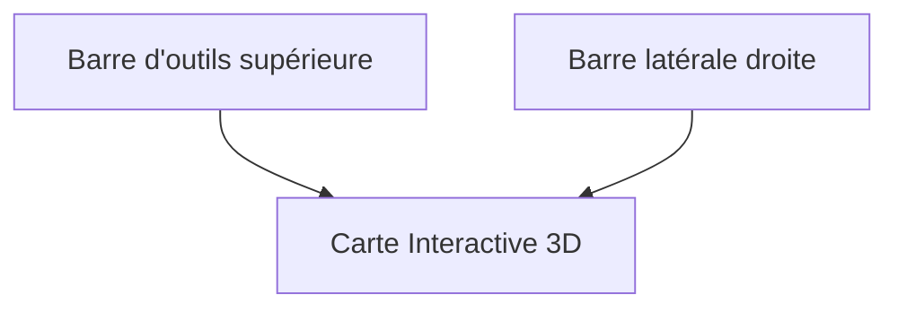

# Gestion des Variantes

Le constructeur de parcours vous permet de modifier une trace existante (trace maître) pour créer des variantes personnalisées sans altérer le fichier original.

[< Retour au guide d'exploitation](./exploitation.md)

## Accéder au Constructeur de Parcours

Pour créer ou modifier des variantes d'un circuit :
1.  Depuis l'écran d'accueil, repérez le circuit souhaité.
2.  Cliquez sur le badge **Variante** (ou **X Variantes**) 
    
         Variante
    
    ou
    
         2 Variantes
    
    situé à droite des statistiques de distance/dénivelé.
    *   *Note : Si le bouton est désactivé, vous devez d'abord finaliser l'édition de la trace maîtresse (atteindre 100% de progression caméra).*
3.  L'interface de création s'ouvre, vous permettant de dessiner votre nouveau parcours.

## Présentation de l'interface

L'interface est divisée en trois zones principales :

### La Barre d'outils supérieure

1.  **Bouton Accueil**  : Pour revenir à la liste des circuits.
2.  **Sélecteur de Mode** : Permet de choisir quel type de modification vous souhaitez effectuer :
    -  **Départ** : Modifier le point de départ.
    -  **Segment** : Créer une déviation sur le parcours.
    -  **Arrivée** : Modifier le point d'arrivée.
3.  **Sélecteur de Profil** : Définit comment le moteur calculera le chemin entre vos points :
    -  **Cyclisme** : Route + Pistes cyclables.
    -  **Route** : Chemins bitumés uniquement.
    -  **VTT / Chemin** : Inclus les sentiers et chemins de terre.
4.  **Aide / Documentation**  : Ouvre le présent guide directement dans l'application.

### La Carte Interactive 3D

C'est votre espace de dessin principal :
*   **Clic gauche** : Place un point de passage ou une ancre sur la trace.
*   **Boutons de la carte** : Utilisez les contrôles Mapbox (Zoom, Boussole) pour mieux visualiser le relief.

### La Barre Latérale

Elle regroupe tout l'historique de votre travail :
*   **Points d'édition** : Affiche les tronçons que vous êtes en train de créer.
    *   *Traces en pointillés* : Indique une modification en cours d'édition (non finalisée).
    *   *Traces en trait plein* : Indique une modification validée et finalisée.
    *   *Dépliable* : Cliquez sur un segment (Départ, Déviation, Arrivée) pour voir la liste détaillée des points qui le composent.
*   **Variantes enregistrées** : Permet de consulter, renommer ou supprimer vos variantes existantes.
*   **Icône Info**  : Affiche le comparatif Distance/D+ entre le circuit maître et votre variante.

---

## 🎯 Les Points de Référence

Lors de l'édition, vous manipulerez différents types de points :

### 1. Les Jalons de Trace (Petits points oranges)
Ce sont des points de repère calculés sur la trace maîtresse (tous les 100 mètres).
*   **Visuel** : Petits cercles **oranges** sans contour.
*   **Rôle** : Servent uniquement à **jalonner visuellement** le parcours original. **Ils ne peuvent pas servir de points d'ancrage.**

### 2. Les Points de Contrôle Caméra (Grands oranges)
Points de la trace maîtresse où un réglage de caméra a été enregistré en mode édition.
*   **Visuel** : Grands cercles **oranges** avec un **contour blanc**.
*   **Rôle** : Ce sont les **seuls points valides pour l'ancrage** de vos variantes. Ils assurent une connexion parfaite avec la mise en scène existante.

### 3. Les Points d'Ancrage (Points Verts et Rouges)
Points marquant la jonction entre votre variante et la trace maîtresse.
*   **Visuel** : Points **Verts** (pour un début de tronçon) ou **Rouges** (pour une fin de tronçon).
*   **Rôle** : Matérialisent le point de "décrochage" (Vert) ou de "raccordement" (Rouge) au parcours original.

### 4. Les Points de passage (Points jaunes)
Points intermédiaires que vous placez librement sur la carte pour dessiner votre itinéraire.
*   **Visuel** : Points **jaunes** cerclés de noir.
*   **Rôle** : Guident le moteur de routage pour calculer le chemin entre deux ancres.

### 5. Épingles de Départ et Arrivée
*   **Visuel** : Pastilles plus larges, **vertes** pour le Départ et **rouges** pour l'Arrivée.
*   **Rôle** : Identifient clairement les nouvelles extrémités de votre circuit.

---

## Les 3 modes de modification

Vous pouvez choisir le mode de modification dans la barre d'outils supérieure :

### 1. Départ Déporté 
Permet de déplacer le point de départ original en dehors de la trace maîtresse.
- **Comment faire** : 
    1. Cliquez impérativement sur un point de la trace maîtresse pour poser une **ancre** (votre point de retour sur le parcours).
    2. Tracez le nouveau chemin en cliquant sur la carte **en partant de cette ancre vers votre nouveau départ** (chemin inverse). *Note : cette étape est optionnelle si votre nouveau départ se situe directement sur la trace maîtresse.*
    3. Cliquez sur le bouton **Valider**  dans la barre latérale pour figer ce nouveau départ.
- **Résultat** : Un nouveau tronçon est calculé entre votre nouveau départ et le point d'ancrage choisi.

### 2. Arrivée Reportée 
Permet de modifier la fin de votre parcours vers une nouvelle destination.
- **Comment faire** : 
    1. Cliquez sur la trace maîtresse au point où vous souhaitez la quitter (**ancre**).
    2. Tracez votre nouveau chemin vers la nouvelle arrivée. *Note : cette étape est optionnelle si votre nouvelle arrivée se situe directement sur la trace maîtresse.*
    3. Cliquez sur le bouton **Valider**  dans la barre latérale pour figer cette arrivée.
- **Résultat** : La fin de la trace originale après l'ancre est supprimée et remplacée par votre tracé.

### 3. Déviation de Segment  (Le plus utilisé)
Permet de remplacer un morceau de la trace originale par un autre chemin (contournement, passage par un col, etc.).
- **Principe des ancres** :
    1.  Placez une **Ancre de départ**  sur la trace.
    2.  Tracez votre itinéraire alternatif en cliquant sur la carte.
    3.  Placez une **Ancre de fin**  plus loin sur la trace originale pour "refermer" la boucle.

---

## Fonctionnement du Routage 

- **Moteurs de routage** : L'application utilise deux services pour garantir la fiabilité du tracé :
    1.  **GraphHopper** (Principal) : Le moteur de référence pour le calcul d'itinéraire.
    2.  **OpenRouteService** (Backup) : Utilisé automatiquement en cas de défaillance ou d'épuisement des quotas du service principal.
- **Profils disponibles** : Cyclisme , Route , VTT / Chemin .
- **Altitudes** : L'application récupère automatiquement les altitudes précises via l'IGN (en France) ou Open-Meteo (à l'étranger) dès que vous terminez une modification.

---

## Gestion et Sauvegarde

Toutes vos modifications apparaissent dans la barre latérale droite.

### Actions sur les segments
Chaque modification (Départ, Segment, Arrivée) listée dans la barre latérale propose plusieurs actions :

- **Centrer la vue** : Cliquez sur l'**icône de couleur** à gauche du titre pour centrer instantanément la carte sur ce tronçon.
- **Renommer**  : Donnez un nom personnalisé à vos segments (ex: "Passage par le centre"). *Disponible pour les segments uniquement.*
- **Valider (Finaliser)**  : Pour les tronçons "Départ" ou "Arrivée", cliquez sur la coche pour confirmer que le point est définitif.
- **Mettre à jour le routage**  : Permet de recalculer le segment. La couleur de l'icône indique l'état du routage :
    -  **Vert** : Routage et altitudes récupérés avec succès.
    -  **Orange** : Tracé réussi, mais récupération des altitudes en échec.
    -  **Rouge** : Échec critique du routage (aucun chemin trouvé).
    -  **Bleu** : Segment "désynchronisé". Cela signifie que vous avez changé de profil (ex: passage de VTT à Route) dans la barre d'outils, mais que ce segment spécifique utilise encore l'ancien réglage. Cliquez sur l'icône pour le mettre à jour.
    *Note : Le bouton est grisé si le segment est déjà à jour avec les paramètres globaux actuels.*
- **Supprimer**  : Supprime l'intégralité de la modification choisie.
- **Détails des points** : Cliquez n'importe où sur la ligne du segment pour dérouler la liste des points d'ancrage et de passage qui le composent. Vous pouvez supprimer des points individuels depuis cette liste.

### Enregistrement et Nommage
Le processus de sauvegarde est entièrement **automatisé**. 

- **Nommage initial** : Dès que vous posez votre premier point (ancrage ou départ), une fenêtre s'affiche pour vous demander de nommer votre variante.
- **Sauvegarde automatique**  : Chaque modification validée est enregistrée instantanément. Vous n'avez pas de bouton "Enregistrer" à presser.
- **Récupération** : Vos variantes sont listées en bas de la barre latérale et persistent même si vous quittez l'éditeur.

### Données de la variante
En bas de la barre latérale, la section **Variantes enregistrées** liste vos créations.
Cliquez sur l'icône Info  pour afficher le comparatif :
- **Circuit** (Gris) : Rappel des données de la trace originale.
- **Variante** (Gras) : Distance et D+ réels de votre modification.

---

## 💡 Astuces
- **Précision** : Zoomez sur la carte avant de poser une ancre sur la trace maîtresse pour être sûr de cliquer au bon endroit.
- **Ordre** : Vous pouvez cumuler plusieurs déviations de segments sur une même variante. L'application calculera les statistiques globales automatiquement.

---

### 🛠️ Paramètres Liés
Retrouvez les réglages détaillés associés à cette fonctionnalité dans la section :
* [4. 🟣 Variante](./parametres.md#4--variante)

---

[< Retour au guide d'exploitation](./exploitation.md)
