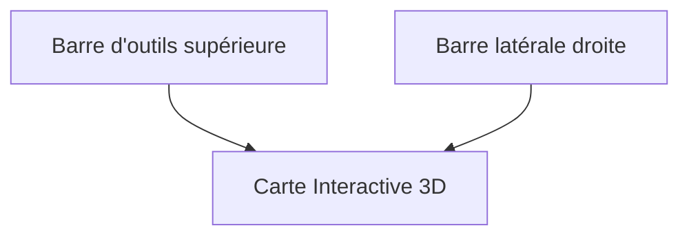

# Gestion des Variantes

Le constructeur de parcours vous permet de modifier une trace existante (trace maître) pour créer des variantes personnalisées sans altérer le fichier original.

[< Retour au guide d'exploitation](./exploitation.md)

## Présentation de l'interface

L'interface est divisée en trois zones principales :

### La Barre d'outils

1.  **Bouton Accueil** : Pour revenir à la liste des circuits.
2.  **Sélecteur de Mode** : Permet de choisir quel type de modification vous souhaitez effectuer.
3.  **Sélecteur de Profil** : Définit comment le moteur calculera le chemin entre vos points :
    -  **Cyclisme** : Route + Pistes cyclables.
    -  **Route** : Chemins bitumés uniquement.
    -  **VTT / Chemin** : Inclus les sentiers et chemins de terre.

### La Carte Interactive

C'est votre espace de dessin principal :
*   **Clic gauche** : Place un point de passage ou une ancre sur la trace.
*   **Boutons de la carte** : Utilisez les contrôles Mapbox (Zoom, Boussole) pour mieux visualiser le relief.

### La Barre Latérale

Elle regroupe tout l'historique de votre travail :
*   **Modifications** : Affiche les tronçons que vous êtes en train de créer.
    *   *Traces en pointillés* : Indique une modification en cours d'édition (non finalisée).
    *   *Traces en trait plein* : Indique une modification validée et finalisée.
*   **Variantes enregistrées** : Permet de consulter, renommer ou supprimer vos variantes existantes.
*   **Icône Info**  : Affiche le comparatif Distance/D+ entre le circuit maître et votre variante.

---

## Les 3 modes de modification

Vous pouvez choisir le mode de modification dans la barre d'outils supérieure :

### 1. Départ Déporté 
Permet de déplacer le point de départ original en dehors de la trace maîtresse.
- **Comment faire** : 
    1. Cliquez impérativement sur un point de la trace maîtresse pour poser une **ancre** (votre point de retour sur le parcours).
    2. Tracez le nouveau chemin en cliquant sur la carte **en partant de cette ancre vers votre nouveau départ** (chemin inverse). *Note : cette étape est optionnelle si votre nouveau départ se situe directement sur la trace maîtresse.*
    3. Cliquez sur le bouton **Valider**  dans la barre latérale pour figer ce nouveau départ.
- **Résultat** : Un nouveau tronçon est calculé entre votre nouveau départ et le point d'ancrage choisi.

### 2. Arrivée Reportée 
Permet de modifier la fin de votre parcours vers une nouvelle destination.
- **Comment faire** : 
    1. Cliquez sur la trace maîtresse au point où vous souhaitez la quitter (**ancre**).
    2. Tracez votre nouveau chemin vers la nouvelle arrivée. *Note : cette étape est optionnelle si votre nouvelle arrivée se situe directement sur la trace maîtresse.*
    3. Cliquez sur le bouton **Valider**  dans la barre latérale pour figer cette arrivée.
- **Résultat** : La fin de la trace originale après l'ancre est supprimée et remplacée par votre tracé.

### 3. Déviation de Segment  (Le plus utilisé)
Permet de remplacer un morceau de la trace originale par un autre chemin (contournement, passage par un col, etc.).
- **Principe des ancres** :
    1.  Placez une **Ancre de départ**  sur la trace.
    2.  Tracez votre itinéraire alternatif en cliquant sur la carte.
    3.  Placez une **Ancre de fin**  plus loin sur la trace originale pour "refermer" la boucle.

---

## Fonctionnement du Routage Magnétique

Par défaut, l'application utilise un moteur de routage (GraphHopper) qui "colle" automatiquement votre tracé aux routes et chemins existants.

- **Profils disponibles** :  Cyclisme , Route , VTT / Chemin .
- **Altitudes** : L'application récupère automatiquement les altitudes précises via l'IGN (en France) ou Open-Meteo (à l'étranger) dès que vous terminez une modification.

---

## Gestion et Sauvegarde

Toutes vos modifications apparaissent dans la barre latérale droite.

### Actions sur les segments
- **Renommer** : Cliquez sur le titre d'un segment pour lui donner un nom (ex: "Contournement Col").
- **Supprimer** : Utilisez l'icône poubelle  pour annuler une modification.
- **Finaliser** : Un segment doit être "fermé" (ancré) pour être valide.

### Enregistrement de la variante
Une fois vos modifications terminées, cliquez sur le bouton **Enregistrer Variante** .
- Donnez un nom à votre variante (ex: "Parcours 2024 - Option Longue").
- La variante sera alors listée en bas de la barre latérale.

### Consultation des statistiques
En bas de la barre latérale, la section **Variantes enregistrées** liste vos créations.
Cliquez sur l'icône Info  pour afficher le comparatif :
- **Circuit** (Gris) : Rappel des données de la trace originale.
- **Variante** (Gras) : Distance et D+ réels de votre modification.

---

## 💡 Astuces
- **Précision** : Zoomez sur la carte avant de poser une ancre sur la trace maîtresse pour être sûr de cliquer au bon endroit.
- **Ordre** : Vous pouvez cumuler plusieurs déviations de segments sur une même variante. L'application calculera les statistiques globales automatiquement.

---

[< Retour au guide d'exploitation](./exploitation.md)
