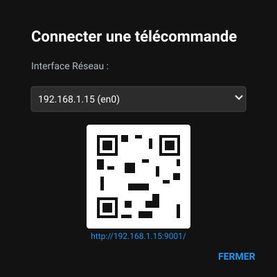
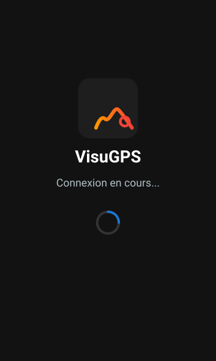
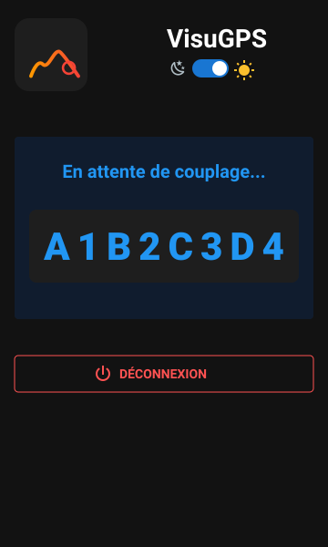
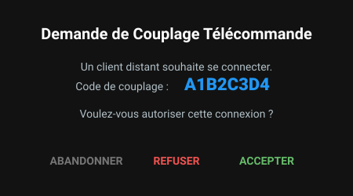
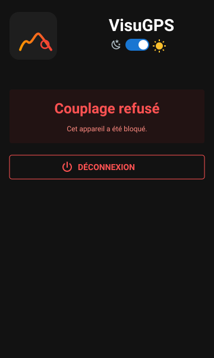
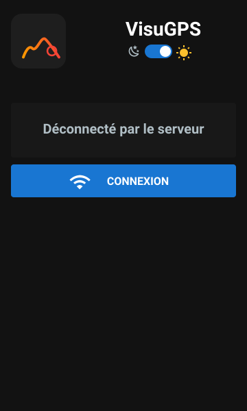
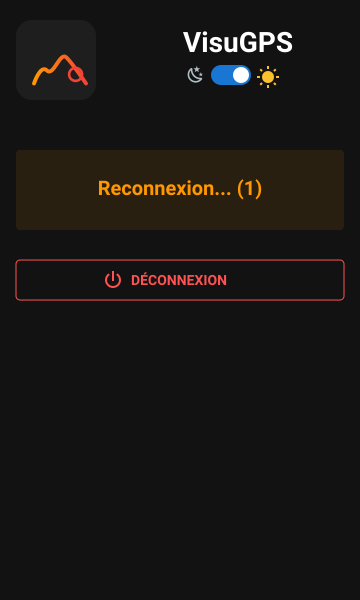
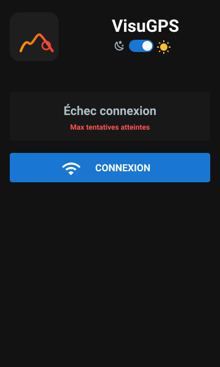

# Couplage et Connexion de la Télécommande

La télécommande VisuGPS nécessite une phase de couplage unique pour chaque nouvel appareil mobile. Ce processus garantit que seules les personnes autorisées peuvent piloter votre présentation, dans la limite de deux connexions simultanées.

[< Retour au sommaire](./exploitation.md)

---

## 1. Préparation

1.  Connectez votre ordinateur et votre mobile sur le **même réseau Wi-Fi**.
2.  Dans la barre d'outils de VisuGPS, cliquez sur l'icône  pour ouvrir le gestionnaire de connexion.

---

## 2. Étape 1 : Connexion initiale

Une fois le gestionnaire ouvert sur votre PC, vous devez établir le premier contact :

1.  **Choisissez votre interface réseau** dans la liste déroulante (généralement celle commençant par `192.168.x.x`).
2.  **Scannez le QR Code** affiché avec votre téléphone.
3.  Sur votre mobile, l'écran **"Connexion en attente..."** apparaît. Cliquez sur le bouton bleu **CONNEXION**.

---

## 3. Étape 2 : Vérification du Code

Dès que votre mobile a contacté l'ordinateur, les deux écrans affichent un **code de couplage** aléatoire.

  

    
<strong>Côté Mobile</strong>

    
    
<small>Le mobile attend que vous validiez sur le PC.</small>

  

  

    
<strong>Côté PC</strong>

    
    
<small>La boîte de dialogue d'approbation s'affiche.</small>

  

1.  **Vérifiez** que le code affiché sur votre mobile (ex: `A1B2C3D4`) est strictement identique à celui qui apparaît sur votre ordinateur.
2.  **Acceptez** la connexion sur votre ordinateur en cliquant sur **ACCEPTER**.

> [!CAUTION]
> ### Sécurité et Blacklistage
> Si vous cliquez sur **REFUSER** lors d'une demande de couplage, l'appareil distant sera **définitivement banni** (blacklisté). 
> 
> Dans ce cas, lors de toute tentative ultérieure de connexion, le mobile affichera le message d'erreur : **"Cet appareil a été bloqué"**.
> 
> 
> 
> Pour autoriser à nouveau cet appareil, vous devez purger manuellement la liste noire dans les paramètres de VisuGPS sur l'ordinateur.

---

## 4. État Connecté

Une fois l'approbation donnée, la télécommande se charge sur votre mobile et affiche la liste de vos circuits favoris.

Sur l'ordinateur, l'icône de la télécommande dans la barre d'outils devient verte : .

---

## 5. Déconnexion

Pour fermer la session de télécommande :

1.  **Sur le PC** : Cliquez sur l'icône verte  et confirmez la déconnexion.
2.  **Sur le Mobile** : Utilisez le bouton **DÉCONNEXION** en bas de l'écran d'accueil.

Une fois déconnecté, le mobile affiche le message **"Déconnecté par le serveur"** et le bouton bleu **CONNEXION** réapparaît pour vous permettre de vous reconnecter rapidement.

> [!NOTE]
> Le couplage est mémorisé par VisuGPS. Lors de votre prochaine utilisation avec le même appareil, le simple scan du QR code (ou l'ouverture de l'URL déjà en favori sur votre mobile) vous connectera directement sans redemander de code de validation.

---

## 6. Perte de Connexion

En cas de coupure réseau ou de fermeture inattendue du serveur sur le PC, la télécommande réagit automatiquement :

1.  **Phase de Reconnexion** : Le mobile tente immédiatement de rétablir le contact (jusqu'à 5 tentatives). L'écran affiche l'état de progression en orange.
    

2.  **Échec Définitif** : Si après 5 tentatives le serveur reste injoignable, le message **"Échec connexion"** s'affiche avec la précision **"Max tentatives atteintes"** en rouge.
    

Cliquez sur **CONNEXION** pour relancer manuellement une tentative une fois le problème réseau résolu.

---

### 🛠️ Paramètres Liés
Retrouvez les réglages de port et la gestion de la liste noire dans :
* [5.3. Télécommande](./parametres.md#53-télécommande)
