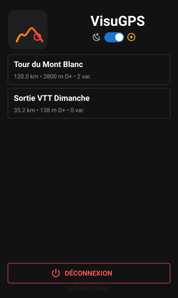
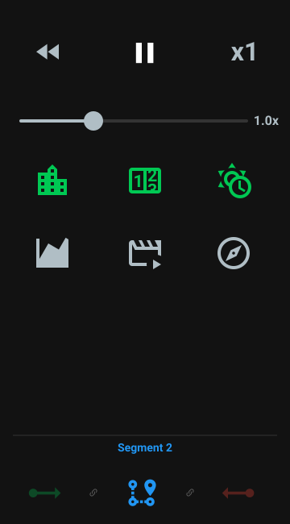
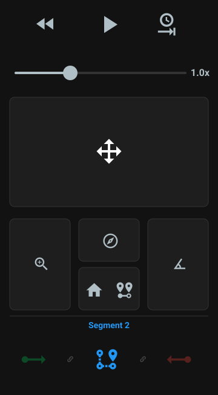

# Guide d'Utilisation de l'Interface Télécommande

L'interface de la télécommande s'adapte automatiquement à ce qui est affiché sur l'écran principal de VisuGPS.
Voici une présentation graphique complète de chaque mode avec le détail des composants.

---

## 1. Vue Accueil (Mode Connexion)
Cette vue s'affiche au lancement de l'application ou lorsqu'aucune visualisation n'est active sur le PC.

### Vue Globale de l'IHM

  

### Composants détaillés

#### Barre d'entête
*   **Logo & Titre** : Rappel visuel de l'application VisuGPS.
*   **Sélecteur de Thème** : Icons Lune  et Soleil  pour basculer instantanément entre le mode sombre et le mode clair.

#### Traces Favorites
*   **Liste Dynamique** : Affiche uniquement les circuits favoris pour pouvoir les visualiser depuis la télécommande.
*   **Action Rapide** : Appuyez sur une trace pour déclencher son chargement et passer en mode Visualisation sur l'ordinateur.

#### Actions (Bas d'écran)
*   **Bouton Déconnexion** : Permet de couper proprement la liaison avec le PC.

---

## 2. Vue Animation (Lecture en cours)
Cette vue s'active dès que l'animation "Play" est lancée. Elle est optimisée pour le pilotage en direct.

### Vue Globale de l'IHM

  

### Composants détaillés

#### Barre de Lecture (Haut)
| Composant | Icône | Description |
| :--- | :---: | :--- |
| **Bouton Recul** |  | Maintenez pour remonter le temps sur la trace. |
| **Bouton Pause** |  | Arrête l'animation et bascule vers la **Vue Pause**. |
| **Reset x1** | **x1** | Réinitialise la vitesse de lecture à la valeur normale (1.0x). |

#### Réglette de Vitesse
*   **Fonction** : Ajuste la vitesse de déplacement sur une échelle logarithmique (de 0.1x à 10x).

#### Grille des Widgets
Chaque bouton active ou désactive un widget sur la visualisation 3D.
*    **Villes** : Nom des communes traversées.
*    **Distance** : Compteur kilométrique.
*    **Météo** : Conditions météorologiques le long du parcours.
*    **Altitude** : Graphique de dénivelé.
*    **Commandes** : Aide visuelle des touches.
*    **Boussole** : Orientation et force du vent.

---

## 3. Vue Pause (Mode Exploration)
Cette vue s'active lors d'une pause. Elle permet :
*   de manipuler librement la caméra 3D.
*   de sélectionner les circuits alternatifs (Variante).

### Vue Globale de l'IHM

  

### Composants détaillés

#### Navigation (Haut)
| Composant | Icône | Description |
| :--- | :---: | :--- |
| **Bouton Recul** |  | Permet de remonter le temps manuellement pendant la pause. |
| **Bouton Lecture** |  | Reprend l'animation et revient à la **Vue Animation**. |
| **Vue Finale** |  | Déplace la caméra directement vers le point de vue final. |

#### Contrôles de Précision
*    **Déplacement (Trackpad central)** : Glissez votre doigt dans le grand rectangle central pour déplacer la caméra horizontalement (Nord, Sud, Est, Ouest).
*    **Zoom (Gauche)** : Glissez de haut en bas pour changer l'altitude de caméra.
*    **Rotation (Centre)** : Glissez horizontalement pour faire pivoter la vue (Cap).
*    **Inclinaison (Droite)** : Glissez verticalement pour changer l'angle de plongée (Tilt).

#### Actions Fondamentales
*    **Maison** : Quitte la trace en cours pour revenir au menu principal de l'application.
*    **Variante** : Ouvre le menu de sélection des parcours alternatifs ou revient à la trace principale.

---

## 4. Navigation par Segments (Mode Variante)
Ce bandeau s'affiche en bas de l'écran (sur les vues Animation et Pause) uniquement lors de la visualisation d'une **Variante**. Il permet de visualiser le découpage du parcours et de naviguer instantanément entre les sections.

### Les Icônes de Segments
| Composant | Icône | Signification |
| :--- | :---: | :--- |
| **Départ** |  | Point de départ du circuit. |
| **Commun** |  | Tronçon commun partagé entre plusieurs tracés. |
| **Segment** |  | Portion de tracé spécifique à la variante sélectionnée. |
| **Arrivée** |  | Point d'arrivée final du circuit. |

### Fonctionnement
*   **Indication visuelle** : L'étape actuelle est mise en avant (icône en surbrillance).
*   **Saut Rapide** : Appuyez sur n'importe quelle icône du bandeau pour déplacer instantanément la caméra au début du segment sélectionné (déclenche un repositionnement automatique sur la vue 3D). Les segments communs ne sont pas sélectionnables.
*   **Progression** : Le bandeau se met à jour en temps réel au fur et à mesure que l'animation avance.

---

## 5. Paramètres associés

Le comportement de la télécommande et l'affichage des circuits peuvent être personnalisés dans les réglages de l'application VisuGPS (sur le PC).

### Configuration de la Télécommande
Ces paramètres se trouvent dans **Système > Télécommande** :

| Paramètre | Description | Défaut |
| :--- | :--- | :---: |
| **Port du serveur** | Port réseau utilisé pour la communication (WebSocket/SSE). | 9001 |
| **Sensibilité (X / Y)** | Ajuste la vitesse de déplacement sur le trackpad central. | 200 |
| **Sensibilité du Zoom** | Influence la vitesse de changement d'altitude. | 150 |
| **Sensibilité du Cap** | Ajuste la vitesse de rotation (pivotement). | 50 |
| **Sensibilité Tilt** | Ajuste la vitesse d'inclinaison de la vue. | 25 |

### Affichage de l'Accueil
Puisque la télécommande affiche uniquement les favoris, vous pouvez ajuster leur nombre dans **Accueil** :

| Paramètre | Description | Défaut |
| :--- | :--- | :---: |
| **Nombre de favoris** | Définit la quantité maximale de circuits affichés sur la télécommande. | 6 |
