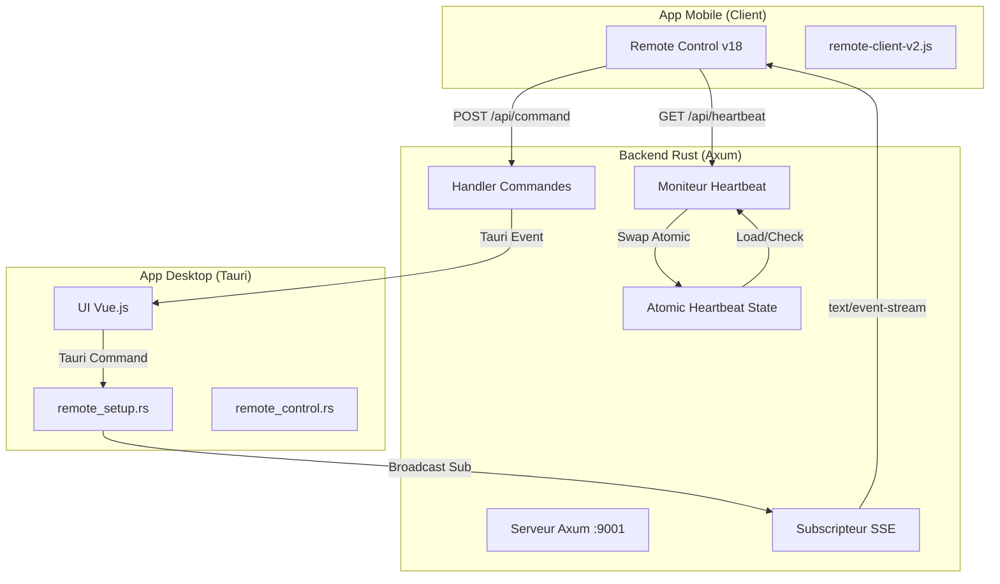

# Analyse Technique : Télécommande VisuGPS V2 (SSE)

Ce document détaille l'architecture de la version 2 du système de télécommande, basée sur **Axum**, **Server-Sent Events (SSE)** et un **Heartbeat Atomique**.

## 1. Architecture Globale

Le passage à la V2 marque l'abandon des WebSockets (trop fragiles sur certains réseaux mobiles/firewalls) au profit d'un modèle hybride plus robuste :
- **Unidirectionnel Descendant (PC -> Téléphone)** : Server-Sent Events (SSE).
- **Unidirectionnel Ascendant (Téléphone -> PC)** : Requêtes HTTP POST standard.

## 2. Composants Clés

### 2.1 Backend Rust (Axum)
Situé dans `src-tauri/src/remote_server.rs`, il utilise le framework **Axum** pour une stabilité maximale.
- **Port** : Configurable dans les paramètres (9001 par défaut).
- **Statique** : Sert les fichiers HTML/JS/CSS du dossier `src/remote_client`.

### 2.2 Système de Heartbeat (Signal de vie)
Pour éviter les blocages liés au `Mutex<AppState>`, le heartbeat utilise une horloge atomique dédiée :
- **État** : `HeartbeatState { last_heartbeat: AtomicI64 }`.
- **Mécanique** : À chaque appel de `/api/heartbeat`, le serveur échange (`swap`) la valeur atomique avec l'heure actuelle.
- **Surveillance** : Une tâche de fond (`monitor task`) vérifie toutes les 10s si le signal est trop vieux (>10s) et émet un événement de déconnexion si nécessaire.

### 2.3 Client Mobile (v18+)
Situé dans `src/remote_client/remote-client-v2.js`.
- **Watchdog** : Un mécanisme de sécurité vérifie toutes les 3s si le heartbeat a réussi. Sinon, il force une nouvelle tentative.
- **Synchronisation Forcée** : À chaque réception d'événement SSE, l'interface mobile force son passage au "Vert" (Connecté).

---

## 3. Avantages de la V2 par rapport à la V1 (WebSocket)

| Caractéristique | WebSocket (V1) | SSE + POST (V2) |
| :--- | :--- | :--- |
| **Robustesse Réseau** | Souvent bloqué par les firewalls/proxies. | Passe partout (standard HTTP). |
| **Gestion Connexion** | Handshake complexe, pertes silencieuses. | Connexion SSE persistante avec reconnexion native. |
| **Performances** | Verrouillage du Mutex global. | Lock-free (Atomique) pour le Heartbeat. |
| **Maintenance** | Code Rust manuel et complexe. | Framework Axum standard et simple. |
