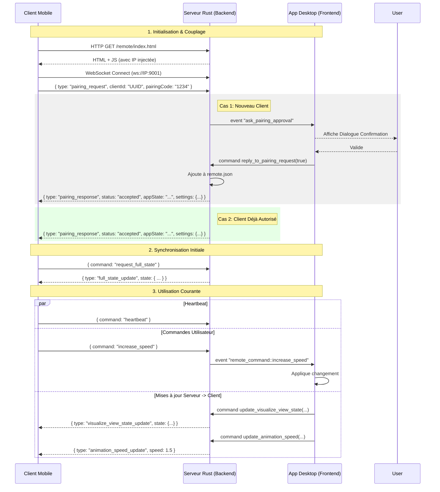

# Analyse du Système de Télécommande VisuGPS

Cette analyse détaille le fonctionnement actuel du module de télécommande ("Remote Control"), identifie les causes probables des problèmes de couplage et de connexion rencontrés, et propose des solutions concrètes.

## 1. Fonctionnement Actuel

### Architecture Globale
Le système repose sur une architecture **Client-Serveur** via **WebSocket** :
- **Serveur** : L'application Desktop (Tauri/Rust) lance un serveur HTTP et WebSocket sur le port **9001**.
- **Client** : Une interface web mobile (HTML/JS/CSS) servie directement par l'application Desktop.
- **Protocole** : Échange de messages JSON pour le couplage, les commandes (lecture/pause, vitesse) et la synchronisation de l'état.

### Processus de Couplage (Pairing)
1. **Découverte (QR Code)** :
   - L'application détecte l'adresse IP locale de l'ordinateur via `network_utils::get_best_ip()`.
   - Elle génère une URL du type `http://<IP_LOCALE>:9001/remote/` et l'affiche sous forme de QR Code via `RemoteControlDialog.vue`.
2. **Connexion Initiale** :
   - Le téléphone scanne le QR code et charge la page web.
   - Le fichier `main.js` servi contient l'IP du serveur "injectée" dynamiquement.
   - Le client tente d'ouvrir une WebSocket vers `ws://<IP_LOCALE>:9001`.
3. **Appairage** :
   - Le client génère un UUID unique (`clientId`) et un code de couplage.
   - Il envoie une requête `pairing_request`.
   - Le serveur vérifie si le `clientId` est dans `remote.json` (clients autorisés).
   - Si non, une demande de confirmation apparaît sur l'écran du PC.
   - Si validé, le client est ajouté à la liste blanche et la connexion est établie.

### Maintien de la Connexion
- **Heartbeat** : Le client envoie un "ping" (commande `heartbeat`) toutes les 30 secondes.
- **Réconnexion** : En cas de perte de connexion, le client tente de se reconnecter 3 fois (variable `MAX_RETRY_ATTEMPTS`).
- **Mode Veille** : Utilisation de `NoSleep.js` pour empêcher le téléphone de s'éteindre.

## 2. Chronogramme des Échanges (Sequence Diagram)

Voici le détail technique des messages échangés entre le Client (Mobile), le Serveur (Backend Rust) et l'Application Desktop (Frontend VueJS).

---

## 3. Diagnostic des Problèmes (Couplage & Connexion)

Les problèmes rapportés ("souvent des problèmes de couplage et/ou de connexion") proviennent probablement de trois facteurs principaux :

### A. Sélection de l'Adresse IP (Point Critique)
Le fichier `network_utils.rs` tente de deviner la "meilleure" IP locale.
- **Le problème** : Si l'ordinateur dispose de plusieurs interfaces (Wi-Fi, Ethernet, VPN, ou interfaces virtuelles comme Docker/VMware qui n'auraient pas été filtrées), l'algorithme peut choisir la mauvaise IP (ex: l'IP du VPN ou de Docker au lieu du Wi-Fi local).
- **Conséquence** : Le QR Code pointe vers une adresse inaccessible depuis le téléphone. Le téléphone n'arrive jamais à charger la page ou la WebSocket échoue ("Connecting...").

### B. Pare-feu et Réseau
- **Pare-feu Local (macOS)** : Au premier lancement, macOS demande si VisuGPS peut accepter des connexions entrantes. Si l'utilisateur a refusé ou ignoré, le port 9001 est bloqué.
- **Isolation Client (Wi-Fi)** : Sur certains réseaux Wi-Fi publics ou d'entreprise (voire certaines box domestiques), les appareils ne peuvent pas communiquer entre eux (Isolation AP).

### C. Fragilité de la Réconnexion
- **Tentatives limitées** : Le client abandonne après 3 essais. Si le téléphone passe en veille profonde et coupe le Wi-Fi momentanément, la reconnexion peut échouer définitivement, obligeant à rafraîchir la page (ce qui peut être difficile si la page ne se charge plus).
- **Changement d'IP** : Si le PC change d'IP (DHCP) pendant une session longue, le client (qui a l'ancienne IP "en dur" dans son JS chargé) ne pourra plus jamais se reconnecter sans re-scanner un nouveau QR code.

---

## 4. Solutions Proposées

Voici les améliorations recommandées, classées par priorité.

### ✅ Solution 1 : Sélection Manuelle de l'IP (Priorité Haute)
Modifier `RemoteControlDialog.vue` et le backend pour permettre à l'utilisateur de choisir l'interface réseau.
- **Pourquoi** : Cela contourne 90% des problèmes de détection automatique.
- **Implémentation** :
    1. Créer une commande Rust `get_all_local_ips()` qui renvoie une liste `Vec<(String, String)>` (Nom Interface, IP).
    2. Dans le dialogue, afficher une liste déroulante (Select) avec les IPs trouvées.
    3. Par défaut, sélectionner celle de `get_best_ip`, mais permettre à l'utilisateur de changer.
    4. Régénérer le QR Code instantanément lors du changement de sélection.

### ✅ Solution 2 : Amélioration de la Robustesse Client (Priorité Moyenne)
Renforcer la logique de reconnexion dans `remote-websocket.js`.
- **Pourquoi** : Éviter d'avoir à rafraîchir la page manuellement.
- **Implémentation** :
    1. Augmenter `MAX_RETRY_ATTEMPTS` (ex: 10 ou infini avec délai progressif).
    2. Ajouter un gros bouton **"Se Reconnecter"** explicite sur l'interface mobile en cas d'échec, qui force une nouvelle tentative sans recharger la page.

### ✅ Solution 3 : Diagnostic Réseau dans l'UI (Priorité Basse)
Aider l'utilisateur à comprendre pourquoi ça ne marche pas.
- **Implémentation** :
    1. Afficher l'état du serveur (Listening on port 9001) dans le dialogue.
    2. Ajouter un message d'aide : "Assurez-vous que votre téléphone est sur le même réseau Wi-Fi et que le pare-feu autorise VisuGPS".

---

## Plan d'Action Recommandé

Je propose de commencer par la **Solution 1 (Sélection d'IP)** qui résoudra les problèmes de couplage initial (QR Code invalide), puis d'appliquer la **Solution 2** pour le confort d'utilisation.
