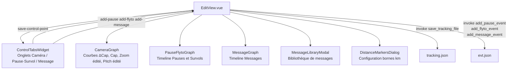
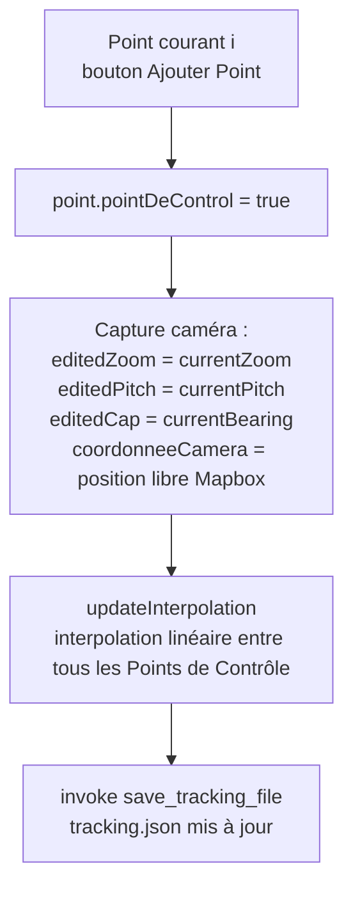
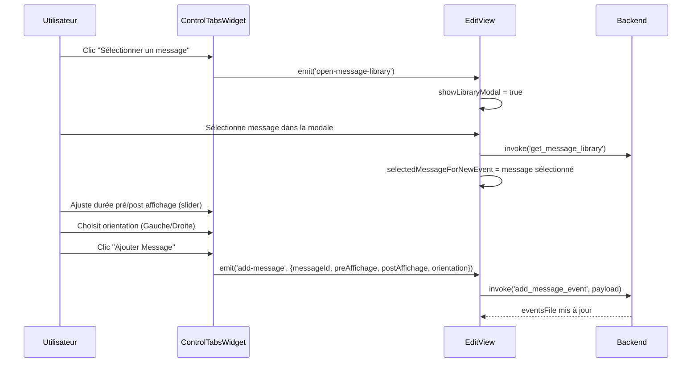

# Analyse de la Vue Édition — `EditView.vue`

> **Date** : 19 février 2026
> **Fichiers analysés** :
> - Frontend : [EditView.vue](file:///Volumes/Externe/Dev/VisuGPS/src/views/EditView.vue)
> - Composants : [CameraGraph.vue](file:///Volumes/Externe/Dev/VisuGPS/src/components/Edit/CameraGraph.vue), [ControlTabsWidget.vue](file:///Volumes/Externe/Dev/VisuGPS/src/components/Edit/ControlTabsWidget.vue), [PauseFlytoGraph.vue](file:///Volumes/Externe/Dev/VisuGPS/src/components/Edit/PauseFlytoGraph.vue), [MessageGraph.vue](file:///Volumes/Externe/Dev/VisuGPS/src/components/Edit/MessageGraph.vue), [MessageLibraryModal.vue](file:///Volumes/Externe/Dev/VisuGPS/src/components/Edit/MessageLibraryModal.vue), [MessageEditDialog.vue](file:///Volumes/Externe/Dev/VisuGPS/src/components/Edit/MessageEditDialog.vue), [DistanceMarkersDialog.vue](file:///Volumes/Externe/Dev/VisuGPS/src/components/Edit/DistanceMarkersDialog.vue)

---

## 1. Architecture Générale

`EditView.vue` (2345 lignes) est la vue centrale d'édition. Elle orchestre en parallèle **deux types de données** :

| Fichier | Rôle | Sauvegarde |
|---|---|---|
| `tracking.json` | Points de contrôle caméra (zoom, pitch, cap, position) | `save_tracking_file` |
| `evt.json` | Événements le long de la trace (Pause, Flyto, Message, Distances) | `add_pause_event`, `add_flyto_event`, `add_message_event`… |



### Modes de synchronisation caméra

La propriété `cameraSyncMode` contrôle la relation entre le curseur de progression et la caméra Mapbox :

| Mode | Comportement |
|---|---|
| `'edited'` | La carte suit automatiquement les valeurs `editedZoom`, `editedPitch`, `editedCap` du point courant |
| `'off'` | La caméra est libre ; les valeurs de la carte peuvent être capturées par "Ajouter Point" |

---

## 2. Édition du `tracking.json` — Onglet Caméra

### 2.1 Principe des Points de Contrôle

Le fichier `tracking.json` contient N points espacés régulièrement (par défaut 100m). L'utilisateur ne modifie pas tous les points individuellement : il positionne des **Points de Contrôle** (`pointDeControl = true`) qui servent d'ancres à une **interpolation linéaire**.



### 2.2 Algorithme d'Interpolation — `updateInterpolation()`

Fonction : [EditView.vue L1345-1394](file:///Volumes/Externe/Dev/VisuGPS/src/views/EditView.vue#L1345-L1394)

**Principe** : Entre deux Points de Contrôle consécutifs, tous les paramètres (`editedZoom`, `editedPitch`, `editedCap`) sont interpolés **linéairement** :

```
Pour chaque paire (CP_start, CP_end) :
    N = endIndex - startIndex    // nombre de segments entre les deux CP

    zoomStep    = (CP_end.editedZoom - CP_start.editedZoom) / N
    pitchStep   = (CP_end.editedPitch - CP_start.editedPitch) / N

    // Gestion wrap-around du bearing :
    bearingDiff = CP_end.editedCap - CP_start.editedCap
    if bearingDiff > 180  : bearingDiff -= 360
    if bearingDiff < -180 : bearingDiff += 360
    bearingStep = bearingDiff / N

    Pour j = 1 à N-1 :
        points[startIndex + j].editedZoom  = CP_start.editedZoom + j * zoomStep
        points[startIndex + j].editedPitch = CP_start.editedPitch + j * pitchStep
        points[startIndex + j].editedCap   = (CP_start.editedCap + j * bearingStep + 360) % 360
```

> [!IMPORTANT]
> Les points **après le dernier CP** récupèrent leurs valeurs d'origine (`zoom`, `pitch`, `cap` issus du calcul à l'import). Seuls les segments **entre deux CP** sont interpolés.

### 2.3 Zoom de Départ et d'Arrivée

Fonctionnalité dédiée dans l'onglet Caméra pour créer automatiquement une transition de zoom :

**Zoom de Départ** (`applyZoomDepart`) :
- Crée deux CP : point 0 (zoom = `zoomDepartValeur`, configurable 16.5–20) et point `N` (zoom du tracking)
- Interpole linéairement le zoom entre les deux
- Distance configurable : 5 à 50 incréments (500m à 5km)

**Zoom d'Arrivée** (`applyZoomArrivee`) :
- Crée deux CP : point `last - distance` (zoom du tracking) et dernier point (zoom = `zoomArriveeValeur`)
- Même mécanique symétrique

Les paramètres sont persistés dans `circuits.json` via `update_circuit_zoom_settings`.

### 2.4 Navigation et Contrôles

**Clavier** (`handleKeydown`) :

| Touche (configurable) | Action | Incrément |
|---|---|---|
| `ArrowRight` | Avancer d'un point | `incrementAvancement` (défaut: 1) |
| `ArrowLeft` | Reculer d'un point | `incrementAvancement` |
| `ArrowRight + Shift` | Avancer rapidement | `incrementAvancementShift` (défaut: 10) |
| `ArrowUp` | Augmenter le pitch | `incrementPitch` (défaut: 1°) |
| `ArrowDown` | Diminuer le pitch | `incrementPitch` |
| `ArrowUp/Down + Shift` | Pitch rapide | `incrementPitchShift` (défaut: 5°) |

**Molette** (`handleWheel`) :

| Contexte | Action | Incrément |
|---|---|---|
| Sur la carte | Modifier le zoom | `incrementZoom` (défaut: 0.1) |
| Sur la carte + Shift | Zoom rapide | `incrementZoomShift` (défaut: 1.0) |
| Sur le widget caméra | Modifier le cap (bearing) | `incrementBearing` (défaut: 1°) |
| Sur le widget caméra + Shift | Cap rapide | `incrementBearingShift` (défaut: 5°) |

**Souris + bouton droit** : Panning libre de la carte via `handleCustomMouseMove` (`panBy`).

---

## 3. Édition du `evt.json` — Onglets Pause/Survol et Message

### 3.1 Structure de `evt.json`

```json
{
  "pointEvents": {
    "42": [{ "type": "Pause" }],
    "87": [{ "type": "Flyto", "data": { "cap": 120, "coord": [lon, lat], "duree": 3000, "pitch": 45, "zoom": 14 }}]
  },
  "rangeEvents": [
    {
      "eventId": "uuid",
      "anchorIncrement": 55,
      "startIncrement": 50,
      "endIncrement": 65,
      "message": { "id": "msg-id", "text": "...", "style": {...} },
      "orientation": "Droite",
      "coord": [lon, lat]
    }
  ]
}
```

- **`pointEvents`** : dictionnaire indexé par incrément, contient des événements ponctuels (Pause, Flyto)
- **`rangeEvents`** : liste d'événements à plage temporelle (Message affiché de `startIncrement` à `endIncrement`)

### 3.2 Événement Pause

| Action | Commande Tauri | Comportement |
|---|---|---|
| Ajouter | `add_pause_event(circuitId, increment, overrideExisting)` | Crée un Pause à l'incrément courant. Erreur si Flyto déjà présent (propose remplacement) |
| Supprimer | `delete_pause_event(circuitId, increment)` | Supprime la Pause |

Visualisation : barre verticale dans `PauseFlytoGraph` à l'incrément correspondant.

### 3.3 Événement Flyto (Survol)

L'événement Flyto capture **l'état complet de la caméra Mapbox** au moment de sa création :

```javascript
const flytoContent = {
    cap:   Math.round((map.getBearing() % 360 + 360) % 360),
    coord: [map.getCenter().lng, map.getCenter().lat],
    duree: flytoDurationSetting,   // slider 0.1s à 10.0s
    pitch: Math.round(map.getPitch()),
    zoom:  Math.round(map.getZoom()),
};
```

| Action | Commande Tauri | Comportement |
|---|---|---|
| Ajouter | `add_flyto_event(circuitId, increment, flytoContent, overrideExisting)` | Crée le survol. Erreur si Pause déjà présent (propose remplacement) |
| Supprimer | `delete_flyto_event(circuitId, increment)` | Supprime le Flyto |
| Vérifier | `map.flyTo(flytoData)` | Rejoue l'animation en temps réel pour prévisualisation |

> [!NOTE]
> Un seul événement Pause **ou** Flyto est possible par incrément. Il y a une exclusion mutuelle gérée backend.

### 3.4 Gestion des Messages

La gestion des messages est le système le plus complexe de `evt.json`.

#### Bibliothèque de Messages

Les messages sont stockés dans une bibliothèque globale (via `get_message_library` / `save_message`). Chaque message possède :
- `id` : UUID
- `text` : contenu textuel
- `style` : `{ backgroundColor: 'couleur-vuetify', ... }`
- `source` : `'user'` ou `'default'` (les messages `'default'` ne peuvent être supprimés qu'en mode DEV)

La modale `MessageLibraryModal` offre :
- Filtrage par texte (`filterText`)
- Tri alphabétique (ignorant les préfixes non-lettres)
- Création de nouveau message (`MessageEditDialog`)
- Édition/Suppression avec vérification d'usage (`check_message_usage`) : impossible de supprimer un message utilisé dans un circuit

#### Flux d'Ajout d'un Message



#### Paramètres du Message

| Paramètre | Rôle | Plage |
|---|---|---|
| `anchorIncrement` | Incrément de déclenchement | = `trackProgress` courant |
| `preAffichage` | Nb incréments **avant** l'ancre où le message est déjà visible | 0–50 |
| `postAffichage` | Nb incréments **après** l'ancre où le message reste visible | 1–100 |
| `orientation` | Côté d'affichage du message | `'Gauche'` / `'Droite'` |
| `coord` | Position sur la carte (centre Mapbox courant) | [lon, lat] |

> [!NOTE]
> Mettre à jour un message existant = supprimer l'ancien puis créer le nouveau (opération non atomique côté frontend).

#### Gestion des Erreurs de Messages Manquants

Au chargement (`onMounted`), si un événement de message référence un `messageId` absent de la bibliothèque, un dialogue bloquant s'affiche :
- **Supprimer** : supprime l'événement et l'entrée dans `errors.json` via `delete_error_entry`
- **Ignorer** : l'événement reste mais ne sera pas affiché

### 3.5 Bornes Kilométriques (`DistanceMarkersDialog`)

Accessible depuis l'onglet Message. Permet de configurer/supprimer les marqueurs de distance dans `evt.json` via les commandes Tauri `remove_distance_markers` et la dialogue de configuration.

---

## 4. Graphiques de Caméra — `CameraGraph.vue`

### 4.1 Courbes Disponibles

Le `CameraGraph` est un SVG dans lequel toutes les courbes sont tracées **sur le même espace vertical** (hauteur 400px, centre à 200px = valeur de référence).

| Courbe | Nom UI | Formule | Échelle (px/unité) | Disponibilité |
|---|---|---|---|---|
| **Δ Cap calculé** | "ΔCap Calculée" | `cap[i] - cap[i-1]` (wrap 180°) | 3 px / ° | Activable |
| **Cap calculé** | "Cap Calculée" | `cap[i] - cap[0]` (wrap 180°) | 1 px / ° | Activable |
| **Δ Cap édité** | "ΔCap Editée" | `editedCap[i] - editedCap[i-1]` (wrap 180°) | 3 px / ° | Activable |
| **Cap édité** | "Cap Editée" | `editedCap[i] - editedCap[0]` (wrap 180°) | 1 px / ° | Activable |
| **Zoom édité** | "Zoom Editée" | `editedZoom[i] - zoom[0]` | 10 px / niveau | Activable |
| **Pitch édité** | "Pitch Editée" | `editedPitch[i] - pitch[0]` | 1 px / ° | Activable |

> [!NOTE]
> Les courbes **Zoom calculé et Pitch calculé ne sont PAS affichées** (ils sont uniformes à l'import, donc informationnellement nuls).

### 4.2 Détail des Formules

**Δ Cap (delta par rapport au point précédent)** — `bearingDeltaPath` :
```javascript
let delta = p.cap - lastBearing;
if (delta > 180) delta -= 360;
if (delta < -180) delta += 360;
y = graphCenterY - (delta * 3);  // 3px par degré
lastBearing = p.cap;
```
→ Visualise les **changements de direction virage par virage**. Un pic positif = virage à droite, négatif = virage à gauche.

**Cap total (delta par rapport au début)** — `bearingTotalDeltaPath` :
```javascript
const initialBearing = trackingPoints[0].cap;
let delta = p.cap - initialBearing;
if (delta > 180) delta -= 360;
if (delta < -180) delta += 360;
y = graphCenterY - (delta * 1);  // 1px par degré
```
→ Visualise la **direction globale** par rapport au cap initial. Courbe continue indiquant l'orientation générale.

**Indicateurs de position réelle** (lignes horizontales courtes à la position du curseur) :
- Pitch : position actuelle de la caméra Mapbox vs valeur par défaut
- Zoom : idem pour le zoom
- Cap : idem pour le bearing total

### 4.3 Impacts d'une Variation Importante

#### Δ Cap (Virage par Virage)

| Amplitude du Δ Cap | Impact sur le rendu |
|---|---|
| < 5° | Trace droite ou légèrement courbe → cap très fluide |
| 5°–20° | Virages normaux → légère oscillation du cap visible |
| 20°–60° | Virage marqué (lacet, épingle) → saut de cap brutal dans la visualisation si non atténué |
| > 60° | Demi-tour ou virage très serré → la caméra peut faire un **saut angulaire visible** entre deux points de tracking espacés de 100m |

**Problème concret** : si le Δ Cap calculé à l'import est de +45° entre les points 50 et 51, la caméra tourne brusquement de 45° sur une durée de ~1 incrément (soit ~100m = quelques secondes de visualisation). Cela donne une impression de "saccade".

#### Cap (Dérive Totale)

| Dérive du Cap total | Impact |
|---|---|
| Variation monotone < 45° | Cap cohérent sur tout le parcours, pas de problème |
| Oscillations répétées ± 20° | Indique un profil "aller-retour" ou zigzag → la caméra peut tourner dans des sens opposés sur des segments proches |
| Saut > 90° | Souvent dû à un lacet ou une erreur de lissage → saut brutal de la caméra |

---

## 5. Arbre des Fonctions

```
EditView.vue
├── onMounted()                                          # Initialisation complète
│   ├── fetchVariants()                                  # Chargement des variantes disponibles
│   ├── invoke('get_circuit_data')                       # Nom du circuit, zoom settings
│   ├── invoke('read_tracking_file')                     # Chargement tracking.json
│   ├── invoke('read_line_string_file')                  # Chargement lineString.json
│   ├── invoke('get_slope_color_expression')             # Couleur de la trace par pente
│   ├── loadMainTrace()                                  # Load tracking + events trace maîtresse
│   │   ├── invoke('read_tracking_file')
│   │   ├── invoke('read_line_string_file')
│   │   ├── invoke('get_events')                         # Chargement evt.json
│   │   └── turf.length()                                # Calcul longueur totale
│   ├── invoke('get_message_library')                    # Chargement bibliothèque messages
│   ├── updateInterpolation()                            # Calcul initial des valeurs interpolées
│   └── Lecture de toutes les settings Edition/*
│
├── Navigation
│   ├── handleKeydown()                                  # Avancement clavier (flèches)
│   │   └── updateCameraPosition(newIndex)               # Déplace la caméra + ligne d'avancement
│   ├── handleWheel()                                    # Molette : zoom ou bearing
│   └── handleSeekDistance(distanceKm)                   # Clic sur un graphique → cherche le point le plus proche
│       └── updateCameraPosition(closestIndex)
│
├── ONGLET CAMÉRA (tracking.json)
│   ├── saveControlPoint()                               # Enregistre la position caméra courante
│   │   ├── point.pointDeControl = true
│   │   ├── point.editedZoom/Pitch/Cap = currentZoom/Pitch/Bearing
│   │   ├── point.coordonneeCamera = map.getFreeCameraOptions().position
│   │   ├── updateInterpolation()                        # Recalcule l'interpolation entre tous les CP
│   │   └── invoke('save_tracking_file')
│   ├── deleteControlPoint()                             # Supprime un CP
│   │   ├── updateInterpolation()
│   │   └── invoke('save_tracking_file') + invoke('update_tracking_km')
│   ├── applyZoomDepart()                                # Crée la rampe de zoom au départ
│   │   ├── updateInterpolation()
│   │   └── invoke('save_tracking_file')
│   ├── removeZoomDepart()
│   ├── applyZoomArrivee()                               # Crée la rampe de zoom à l'arrivée
│   ├── removeZoomArrivee()
│   └── updateCircuitZoomSettings()                      # Persiste les settings zoom dans circuits.json
│       └── invoke('update_circuit_zoom_settings')
│
├── ONGLET PAUSE / SURVOL (evt.json — pointEvents)
│   ├── handleAddPauseEvent(override)
│   │   └── invoke('add_pause_event')
│   ├── handleDeletePauseEvent()
│   │   └── invoke('delete_pause_event')
│   ├── handleAddFlytoEvent(duration, override)
│   │   ├── Capture map.getBearing(), getCenter(), getPitch(), getZoom()
│   │   └── invoke('add_flyto_event', flytoContent)
│   ├── handleDeleteFlytoEvent()
│   │   └── invoke('delete_flyto_event')
│   └── handleVerifyFlyto(eventData)
│       └── map.flyTo(flytoData)                         # Prévisualisation de l'animation
│
├── ONGLET MESSAGE (evt.json — rangeEvents)
│   ├── handleOpenMessageLibrary()                       # Ouvre MessageLibraryModal
│   │   └── MessageLibraryModal.vue
│   │       ├── invoke('get_message_library')
│   │       ├── MessageEditDialog.vue                    # Création / édition message
│   │       │   └── invoke('save_message', target)
│   │       ├── invoke('check_message_usage')            # Vérifie si le message est utilisé
│   │       └── invoke('delete_message')
│   ├── handleSelectMessage(messageId)
│   │   └── invoke('get_message_library')               # Recharge pour récupérer le message sélectionné
│   ├── handleAddMessageEvent(messageData)
│   │   ├── [si mise à jour] invoke('delete_message_event')   # Suppression de l'ancien message
│   │   └── invoke('add_message_event', payload)
│   ├── handleDeleteMessageEvent()
│   │   └── invoke('delete_message_event')
│   ├── handleDeleteDistanceMarkers()
│   │   └── invoke('remove_distance_markers')
│   └── handleDistanceMarkersUpdated()
│       ├── invoke('get_events')
│       └── invoke('get_circuit_data')
│
├── GESTION DES VARIANTES
│   ├── fetchVariants()
│   │   ├── invoke('get_variants')
│   │   └── invoke('get_variant_details') × N
│   ├── loadFullVariant(variantId)
│   │   ├── invoke('read_line_string_file', filename=lineString_{id}_FULL.json)
│   │   ├── invoke('read_tracking_file', filename=tracking_{id}_FULL.json)
│   │   ├── invoke('get_events', variantId={id}_FULL)
│   │   └── invoke('get_slope_color_expression')
│   └── loadMainTrace()                                  # Retour à la trace maîtresse
│
└── GRAPHIQUES
    ├── CameraGraph.vue                                  # Actif si onglet = 'camera'
    │   ├── bearingDeltaPath      # SVG : Δ Cap calculé (3px/°)
    │   ├── bearingTotalDeltaPath # SVG : Cap calculé (1px/°)
    │   ├── editedBearingDeltaPath
    │   ├── editedBearingTotalDeltaPath
    │   ├── editedZoomPath        # SVG : Zoom édité (10px/niveau)
    │   └── editedPitchPath       # SVG : Pitch édité (1px/°)
    ├── PauseFlytoGraph.vue                              # Actif si onglet = 'stop'
    └── MessageGraph.vue                                 # Actif si onglet = 'message'
```

---

## 6. Paramètres Configurables (Settings)

| Paramètre | Chemin de settings | Défaut |
|---|---|---|
| `incrementAvancement` | `Edition/Commandes clavier/incrementAvancement` | 1 |
| `incrementAvancementShift` | `Edition/Commandes clavier/incrementAvancementShift` | 10 |
| `incrementPitch` | `Edition/Commandes clavier/incrementPitch` | 1 |
| `incrementPitchShift` | `Edition/Commandes clavier/incrementPitchShift` | 5 |
| `toucheAvancementAvant` | `Edition/Commandes clavier/toucheAvancementAvant` | `ArrowRight` |
| `toucheAvancementArriere` | `Edition/Commandes clavier/toucheAvancementArriere` | `ArrowLeft` |
| `touchePitchHaut` | `Edition/Commandes clavier/touchePitchHaut` | `ArrowUp` |
| `touchePitchBas` | `Edition/Commandes clavier/touchePitchBas` | `ArrowDown` |
| `incrementZoom` | `Edition/Commandes souris/incrementZoom` | 0.1 |
| `incrementZoomShift` | `Edition/Commandes souris/incrementZoomShift` | 1.0 |
| `incrementBearing` | `Edition/Commandes souris/incrementBearing` | 1 |
| `incrementBearingShift` | `Edition/Commandes souris/incrementBearingShift` | 5 |
| `duree` (Flyto) | `Edition/Pause et Survol/duree` | 2000 ms |
| `preAffichage` (Message) | `Edition/Messages/preAffichage` | 0 incréments |
| `postAffichage` (Message) | `Edition/Messages/postAffichage` | — |
| `hauteurGraphique` (Message) | `Edition/Messages/Graphe messages/hauteurGraphique` | — |
| Couleurs courbes | `Edition/Camera/Graphe caméra/Couleur courbes/*` | Configurables |
| Affichage courbes (défaut) | `Edition/Camera/Graphe caméra/Affichage courbes/*` | Configurables |
| Style carte | `Edition/Vue 3D/Carte/styleVisualisation` | — |
| Exagération relief | `Edition/Vue 3D/Carte/exaggeration` | — |
| Couleur croix centrale | `Edition/Pause et Survol/couleurCroixCentraleEdition` | white |

---

## Annexe A — Analyse des Courbes et Propositions d'Amélioration

### A.1 Problèmes Identifiés

#### Δ Cap : Saccades aux Virages Serrés

La courbe **Δ Cap** révèle les points où la caméra tourne brusquement. Un Δ Cap > 30° entre deux points consécutifs (espacement 100m) signifie que la caméra tourne très vite sur une très courte distance.

**Causes** :
1. L'algorithme de `calculate_smoothed_bearing` à l'import ne lisse que le cap, pas sa variation
2. Les lacets, épingles et virages en U génèrent des Δ Cap élevés qui ne peuvent pas être vraiment atténués sans affecter l'orientation globale
3. Les virages consécutifs dans des sens opposés (S, Z) créent des oscillations de la courbe

#### Cap : Confusion dans les Aller-Retour

Pour une trace aller-retour, la courbe Cap passe typiquement de 0° à +180° (demi-tour) puis revient vers 0° (ou −180°). Ces transitions sont gérées par le wrap-around, mais peuvent générer des discontinuités visuelles.

### A.2 Option 1 — Lissage Post-Édition par Spline Cubique du Cap (Recommandée)

**Problème visé** : l'interpolation linéaire entre deux CP génère une variation **constante** du cap sur tout le segment, ce qui ne correspond pas à la réalité de la route (on ne tourne pas à vitesse constante sur 1km).

**Solution** : Remplacer l'interpolation linéaire du bearing par une **interpolation par spline cubique (Catmull-Rom)** qui passe par les CP et offre des **tangentes continues** :

```javascript
// Au lieu de :
const bearingStep = bearingDiff / numSegments;
points[i].editedCap = CP_start.editedCap + j * bearingStep;

// Utiliser :
function catmullRomInterp(p0, p1, p2, p3, t) {
    const t2 = t * t;
    const t3 = t2 * t;
    return 0.5 * (
        (2 * p1) +
        (-p0 + p2) * t +
        (2*p0 - 5*p1 + 4*p2 - p3) * t2 +
        (-p0 + 3*p1 - 3*p2 + p3) * t3
    );
}
```

**Avantages** :
- Courbe Δ Cap beaucoup plus douce aux transitions entre segments
- Pas d'impact sur les valeurs exactes aux Points de Contrôle (la spline passe par les CP)
- La caméra décélère et accélère naturellement dans les virages

**Effort** : moyen (modification de `updateInterpolation()` uniquement côté frontend).

---

### A.3 Option 2 — Alerte Visuelle sur les Δ Cap Critiques

**Problème visé** : l'utilisateur ne sait pas quels segments posent problème sans inspecter visuellement toute la courbe.

**Solution** : Ajouter dans `CameraGraph` une **zone de fond colorée** (rouge semi-transparent) aux positions où `|ΔCap| > seuil` :

```javascript
const criticalZones = computed(() => {
    const threshold = 30; // °, configurable
    return props.trackingPoints.flatMap((p, i) => {
        if (i === 0) return [];
        const prev = props.trackingPoints[i-1];
        let delta = Math.abs(p.editedCap - prev.editedCap);
        if (delta > 180) delta = 360 - delta;
        if (delta > threshold) {
            return [{ x: p.distance * kmToPx + startOffsetPx, width: kmToPx }];
        }
        return [];
    });
});
```

**Avantages** :
- Feedback immédiat : l'utilisateur voit les zones problématiques sans analyser la courbe
- Guide naturellement vers la pose d'un CP à ces endroits pour corriger manuellement

**Effort** : faible (ajout SVG dans `CameraGraph.vue`).

---

### A.4 Option 3 — Assistant de Lissage Automatique

**Problème visé** : pour une longue trace (100+ km), poser des CP manuellement à chaque virage serré est fastidieux.

**Solution** : Un bouton "Lisser les virages" qui :
1. Détecte automatiquement tous les points où `|ΔCap| > seuil`
2. Propose des CP automatiques aux positions de transition
3. Applique une rampe de cap étalée sur N points autour du virage

```javascript
const autoSmoothBearings = (threshold = 25, rampLength = 5) => {
    trackingPoints.value.forEach((p, i) => {
        if (i === 0 || i >= trackingPoints.value.length - 1) return;
        const prev = trackingPoints.value[i - 1];
        let delta = p.editedCap - prev.editedCap;
        if (delta > 180) delta -= 360;
        if (delta < -180) delta += 360;
        
        if (Math.abs(delta) > threshold) {
            // Étale le changement de cap sur [i - rampLength .. i + rampLength]
            const start = Math.max(0, i - rampLength);
            const end = Math.min(trackingPoints.value.length - 1, i + rampLength);
            // ... interpolation sur la fenêtre
        }
    });
    updateInterpolation();
    invoke('save_tracking_file', { ... });
};
```

**Avantages** :
- Réduit drastiquement le travail manuel sur les longues traces
- Paramétrable (seuil et longueur de rampe)

**Inconvénient** : peut modifier des segments où l'utilisateur voulait un changement de cap intentionnel.

---

### A.5 Option 4 — Zoom et Pitch : Interpolation Bezier

Actuellement le zoom et le pitch sont interpolés **linéairement** entre CP. Un zoom qui passe de 16 à 20 linéairement sur 1km donne une impression mécanique.

**Solution** : Permettre de choisir l'**easing** de l'interpolation (linéaire, ease-in, ease-out, ease-in-out) via un sélecteur sur chaque CP :

```javascript
function easeInOut(t) {
    return t < 0.5 ? 2 * t * t : -1 + (4 - 2 * t) * t;
}
// Dans updateInterpolation :
const t = j / numSegments;
const easedT = easeInOut(t);
points[currentIndex].editedZoom = startCp.editedZoom + easedT * (endCp.editedZoom - startCp.editedZoom);
```

**Avantages** : profil de zoom plus naturel, notamment pour les zooms de départ/arrivée.

**Effort** : faible (modification de `updateInterpolation()`).

---

### A.6 Tableau de Recommandations

| Priorité | Option | Courbe ciblée | Effort | Gain rendu |
|---|---|---|---|---|
| 1 (rapide) | Option 2 — Alerte visuelle | Δ Cap | Faible | Diagnostic immédiat |
| 2 (recommandé) | Option 1 — Spline cubique | Cap / Δ Cap | Moyen | Élevé |
| 3 (complément) | Option 4 — Easing Zoom/Pitch | Zoom, Pitch | Faible | Moyen |
| 4 (avancé) | Option 3 — Lissage auto | Δ Cap | Élevé | Très élevé (traces longues) |
