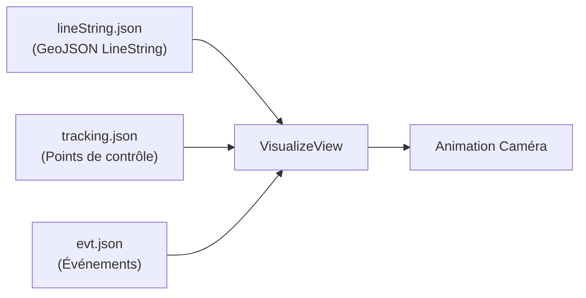
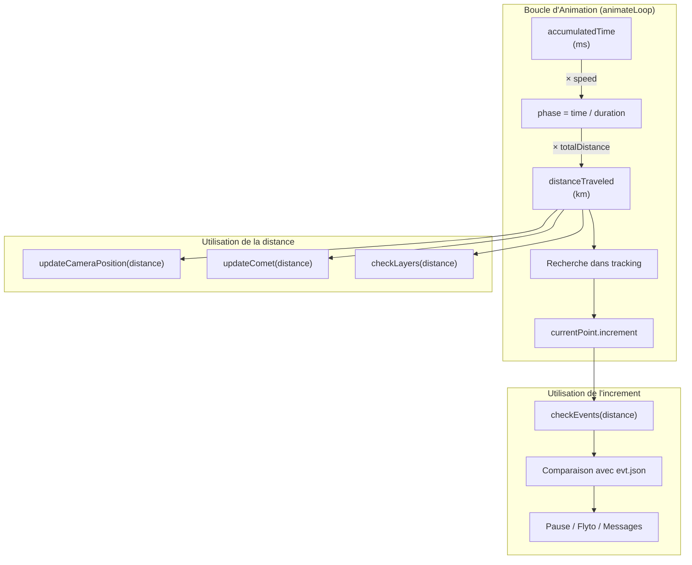
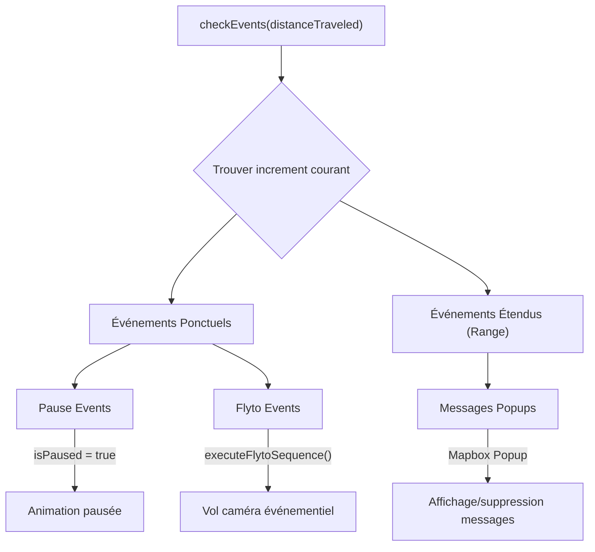
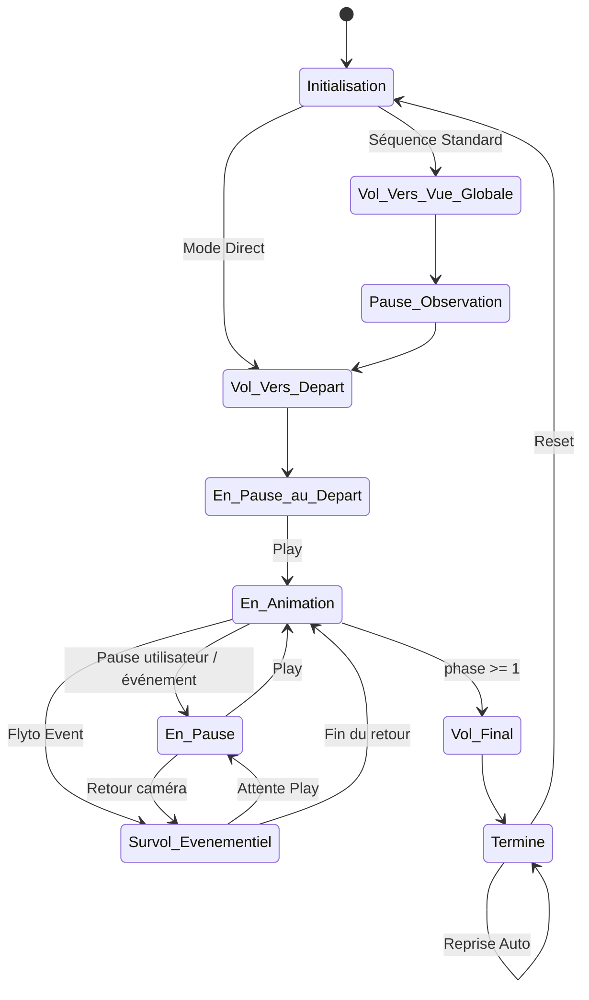
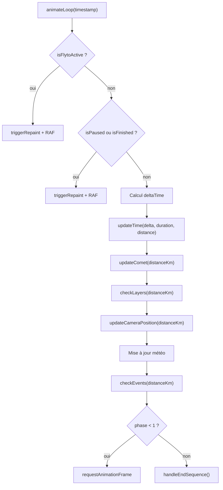
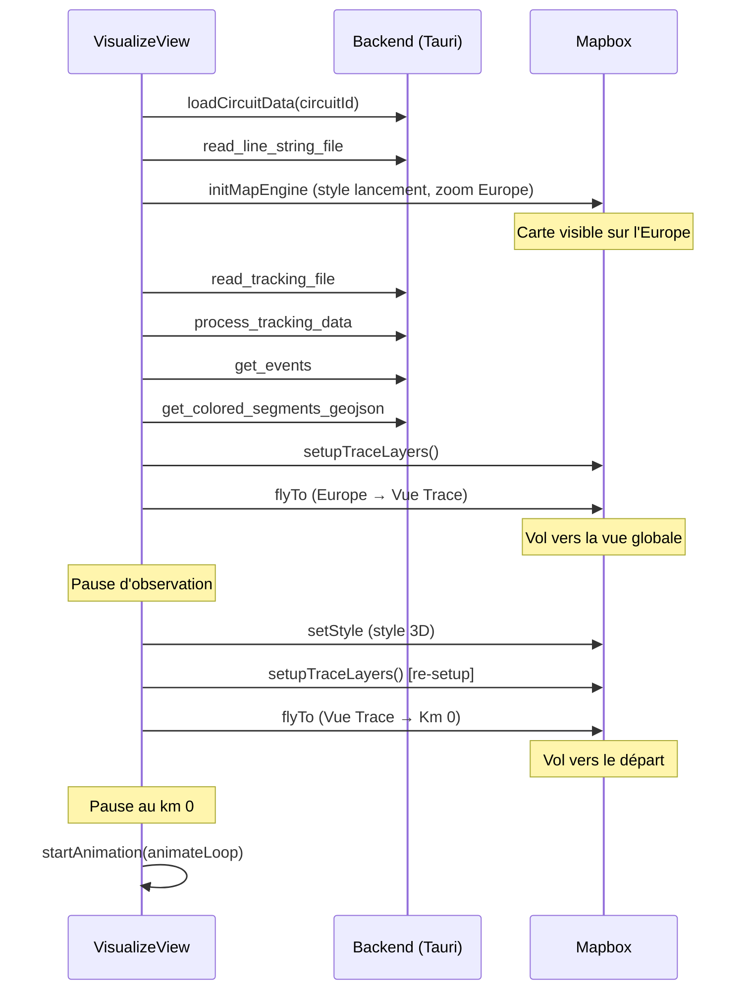
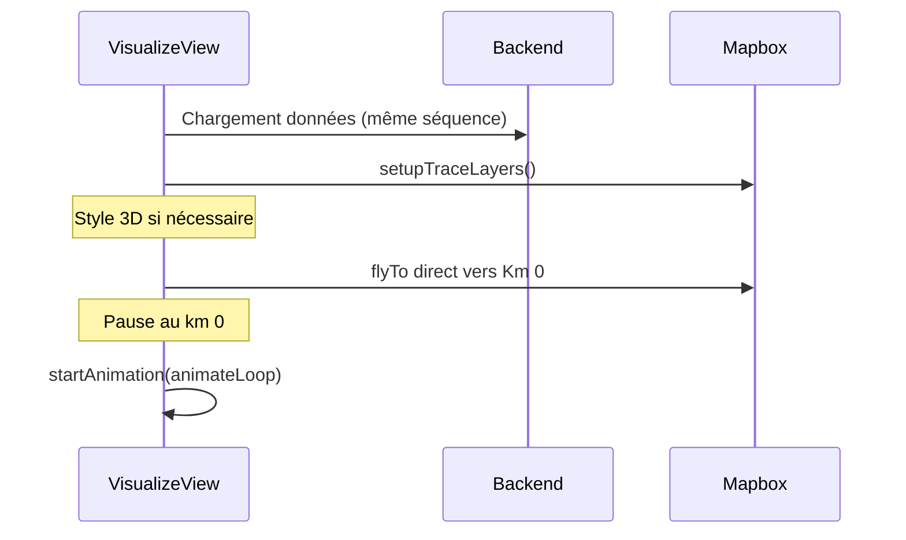

# Analyse de la Visualisation — Animation Caméra & Synchronisation

> **Fichier principal** : [VisualizeView.vue](file:///Volumes/Externe/Dev/VisuGPS/src/views/VisualizeView.vue)  
> **Date** : 18 février 2026

---

## 1. Architecture Générale

La vue `VisualizeView.vue` orchestre l'ensemble de l'animation 3D à travers **6 composables** spécialisés :

| Composable | Rôle | Fichier |
|---|---|---|
| `useMapEngine` | Initialisation Mapbox, `flyToPromise` | [useMapEngine.js](file:///Volumes/Externe/Dev/VisuGPS/src/composables/visualize/useMapEngine.js) |
| `useCircuitData` | Chargement données circuit (lineString, tracking, events) | [useCircuitData.js](file:///Volumes/Externe/Dev/VisuGPS/src/composables/visualize/useCircuitData.js) |
| `useCameraManager` | Sauvegarde/restauration état caméra, interaction | [useCameraManager.js](file:///Volumes/Externe/Dev/VisuGPS/src/composables/visualize/useCameraManager.js) |
| `useCameraInterpolator` | Interpolation caméra entre keyframes | [useCameraInterpolator.js](file:///Volumes/Externe/Dev/VisuGPS/src/composables/visualize/useCameraInterpolator.js) |
| `useAnimationController` | Gestion du temps, vitesse, distance | [useAnimationController.js](file:///Volumes/Externe/Dev/VisuGPS/src/composables/visualize/useAnimationController.js) |
| `useTraceLayers` | Création/gestion des layers Mapbox | [useTraceLayers.js](file:///Volumes/Externe/Dev/VisuGPS/src/composables/visualize/useTraceLayers.js) |

---

## 2. Synchronisation des Fichiers de Données

### 2.1 Les Trois Fichiers Clés



#### `lineString.json` — La Géométrie de la Trace
- **Contenu** : Un GeoJSON de type `LineString` (ou `Feature` avec `LineString`)
- **Rôle** : Fournit la **géométrie spatiale** de la trace sur la carte
- **Utilisations** :
  - Source pour les **layers Mapbox** (trace, pente, comète)
  - Calcul de la **longueur totale** (`turf.length()`)
  - Calcul du **centre** de la trace (`turf.center()`)
  - Découpage de la **comète** (`turf.lineSliceAlong()`)
  - Calcul du **bearing instantané** de la trace (`turf.bearing()` entre deux points proches)
- **Chargement** (ligne ~670) : `invoke('read_line_string_file', { circuitId })`
- **Variante** : `lineString_{variantId}_FULL.json`

#### `tracking.json` — Les Points de Contrôle Caméra
- **Contenu** : Tableau d'objets avec pour chaque point :
  - `coordonnee` : `[lng, lat]`
  - `distance` : distance cumulée en **km** depuis le départ
  - `increment` : index entier du point (utilisé pour les événements)
  - `zoom`, `pitch`, `cap` : paramètres caméra par défaut
  - `editedZoom`, `editedPitch`, `editedCap` : paramètres caméra édités (prioritaires)
  - `pointDeControl` : booléen, marque les keyframes caméra
  - `nbrSegment` : nombre de points jusqu'au prochain keyframe
  - `commune` : nom de la commune pour le widget
  - `altitude` : altitude en mètres
- **Rôle** : Fournit les **paramètres caméra** pour chaque position sur la trace
- **Chargement** (ligne ~781) : `invoke('read_tracking_file', { circuitId, filename: 'tracking.json' })`
- **Variante** : `tracking_{variantId}_FULL.json`

#### `evt.json` — Les Événements
- **Contenu** : Un objet structuré contenant :
  - `pointEvents` : dictionnaire `{increment: [event, ...]}` — événements ponctuels
  - `rangeEvents` : tableau d'événements sur une plage — événements étendus (messages)
- **Types d'événements ponctuels** :
  - `Pause` → met l'animation en pause à cet increment
  - `Flyto` → déclenche un vol caméra vers un point précis avec `data: { coord, zoom, pitch, cap, duree }`
- **Types d'événements étendus (rangeEvents)** :
  - Messages affichés sous forme de **Popups Mapbox** entre `startIncrement` et `endIncrement`
  - Chaque message a : `eventId`, `message`, `coord`, `orientation` (Gauche/Droite)
- **Chargement** (ligne ~920) : `invoke('get_events', { circuitId, variantId })`
- **Variante** : `{variantId}_FULL`

### 2.2 Le Lien de Synchronisation : `distance` ↔ `increment`

Le mécanisme central de synchronisation repose sur la **relation distance ↔ increment** :



**Principe fondamental** : Le temps (`accumulatedTime`) est converti en distance via un ratio linéaire :

```
phase = accumulatedTime / totalDuration
distanceTraveled = (totalDistance / 1000) × phase   // en km
```

La vitesse de parcours en ms/km est définie par le paramètre `Visualisation/Lecture/vitesse` (défaut : 3730 ms/km).

La distance est ensuite utilisée pour :
1. **Trouver le point tracking courant** (recherche linéaire inversée dans `trackingPointsWithDistanceRef`)
2. **Obtenir l'increment** correspondant (propriété `increment` du point trouvé)
3. **Interpoler la caméra** entre les keyframes voisins
4. **Vérifier les événements** associés à cet increment

---

## 3. La Comète

### 3.1 Fonctionnement

La comète est un **segment mobile de la trace** qui suit la progression de l'animation, créant un effet visuel de "traînée" derrière la position courante.

### 3.2 Paramètres

| Paramètre | Chemin Setting | Rôle |
|---|---|---|
| `cometWidth` | `Visualisation/Vue 3D/Trace/epaisseurComete` | Épaisseur du trait |
| `cometColor` | `Visualisation/Vue 3D/Trace/couleurComete` | Couleur |
| `cometOpacity` | `Visualisation/Vue 3D/Trace/opaciteComete` | Opacité |
| `cometLength` | `Visualisation/Vue 3D/Trace/longueurComete` | Longueur en **mètres** |

### 3.3 Implémentation — `updateComet(distanceTraveled)`

Fonction : [VisualizeView.vue#L1715-L1734](file:///Volumes/Externe/Dev/VisuGPS/src/views/VisualizeView.vue#L1715-L1734)

```
1. Calcul totalLen = turf.length(lineString) en km
2. currentDist = clamp(distanceTraveled, 0, totalLen)
3. cometLengthKm = cometLength (paramètre en mètres) / 1000
4. startDistance = max(0, currentDist - cometLengthKm)
5. Si currentDist > startDistance :
     → cometSlice = turf.lineSliceAlong(lineString, startDistance, currentDist)
     → Mise à jour de la source 'comet-source'
6. Sinon : vider la source
```

### 3.4 Layer Mapbox

La comète utilise un layer dédié `comet-layer` créé par `setupTraceLayers`:
- **Source** : `comet-source` (GeoJSON vide à l'initialisation)
- **Type** : `line`
- **Z-order** : Toujours au-dessus de tous les autres layers de trace (dernier dans `variantLayerOrder`)

---

## 4. Les Layers Aller / Retour

### 4.1 Contexte

Les layers aller/retour gèrent l'**affichage correct de la trace dans les zones de chevauchement** (overlap). Quand une trace passe deux fois au même endroit (aller puis retour), le système bascule dynamiquement entre deux layers pour que la pente affichée corresponde toujours à la direction **actuelle** du parcours.

### 4.2 Architecture des Layers (Mode Variante)

L'empilement des layers, du bas vers le haut :

| Ordre Z | Layer ID | Source | Rôle |
|---|---|---|---|
| 1 | `trace-main-abandoned` | `trace-master-source` | Trace master abandonnée |
| 2 | `trace-variant-segment-common` | `colored-segments` | Segments communs (couleur : `colorCommon`) |
| 3 | `trace-variant-segment-new` | `colored-segments` | Segments nouveaux (couleur : `colorNew`) |
| 4 | `trace-slope-aller` | `colored-segments` | Pente direction "aller" (visible par défaut) |
| 5 | `trace-slope-retour` | `colored-segments` | Pente direction "retour" (masqué par défaut) |
| 6 | `comet-layer` | `comet-source` | Comète |

### 4.3 Filtres GeoJSON

Chaque layer utilise des **filtres sur les propriétés** des features GeoJSON :

- **`trace-slope-aller`** : `['all', ['!=', 'segment_type', 'retour_overlap'], ['!=', 'status', 'ABANDONED']]`
  → Affiche tout **sauf** les segments de type retour et abandonnés

- **`trace-slope-retour`** : `['all', ['!=', 'segment_type', 'aller_overlap'], ['!=', 'status', 'ABANDONED']]`
  → Affiche tout **sauf** les segments de type aller et abandonnés

### 4.4 Basculement Dynamique — `checkLayers(distanceTraveled)`

Fonction : [VisualizeView.vue#L1701-L1713](file:///Volumes/Externe/Dev/VisuGPS/src/views/VisualizeView.vue#L1701-L1713)

```
1. Lire segmentMetadata.overlappingZones
2. Pour chaque zone de chevauchement :
     → si distanceTraveled ∈ [retourStartKm, retourEndKm] : direction = 'retour'
     → sinon : direction = 'aller'
3. Si direction change :
     → appeler updateTraceOverlapVisibility(null, direction)
```

### 4.5 `updateTraceOverlapVisibility(zoneId, direction)`

Fonction : [useTraceLayers.js#L302-L314](file:///Volumes/Externe/Dev/VisuGPS/src/composables/visualize/useTraceLayers.js#L302-L314)

- Si direction = `'aller'` : `trace-slope-aller` visible, `trace-slope-retour` masqué
- Si direction = `'retour'` : `trace-slope-retour` visible, `trace-slope-aller` masqué

### 4.6 Sources de Données

Les zones de chevauchement proviennent du backend via :
```
invoke('get_variant_overlap_metadata', { circuitId, variantId })
```
Le résultat est stocké dans `segmentMetadata.value` et contient un tableau `overlappingZones`, chaque zone ayant `retourStartKm` et `retourEndKm`.

---

## 5. Les Déclencheurs d'Événements

### 5.1 Vue d'Ensemble



### 5.2 Chargement des Événements

Dans `initializeVisualization` (lignes ~918-944) :

```javascript
// Chargement depuis le backend
const events = await invoke('get_events', { circuitId, variantId });

// Extraction des pauses : tableau d'increments
pauseIncrements = Object.keys(events.pointEvents)
    .filter(k => events.pointEvents[k].some(e => e.type === 'Pause'))
    .map(Number);

// Extraction des flytos : dictionnaire {increment: data}
flytoEvents = {};
Object.keys(events.pointEvents).forEach(k => {
    const ev = events.pointEvents[k].find(e => e.type === 'Flyto');
    if (ev) flytos[Number(k)] = ev.data;
});

// Événements étendus
rangeEvents = events.rangeEvents || [];
```

### 5.3 Détection dans la Boucle d'Animation — `checkEvents()`

Fonction : [VisualizeView.vue#L1737-L1827](file:///Volumes/Externe/Dev/VisuGPS/src/views/VisualizeView.vue#L1737-L1827)

**Étape 1 — Localisation du point courant** :
- Recherche inversée dans `trackingPointsWithDistanceRef` pour trouver le dernier point dont `distance <= distanceTraveled`
- Récupération de `currentIncrement` depuis ce point

**Étape 2 — Gestion du Rewind** :
- Si `isRewinding`, réinitialisation des triggers déjà déclenchés si on repasse avant eux (pour permettre un re-déclenchement)

**Étape 3 — Messages (Range Events)** :
- Pour chaque `rangeEvent`, vérifier si `currentIncrement ∈ [startIncrement, endIncrement]`
- **Apparition** : création d'un `mapboxgl.Popup` avec le contenu SVG du message
- **Disparition** : suppression du popup quand l'increment sort de la plage
- Map `activePopups` pour tracker les popups actifs (éviter les doublons)

**Étape 4 — Pause** :
- Si `currentIncrement` est dans `pauseIncrements` ET n'a pas déjà été déclenché (`triggeredPauseIncrement !== currentIncrement`)
- → `isPaused = true`, mémorisation du trigger

**Étape 5 — Flyto** :
- Si `flytoEvents[currentIncrement]` existe ET n'a pas déjà été déclenché
- Condition supplémentaire : ne pas déclencher si déjà en pause
- → Appel de `executeFlytoSequence(flyData)`

### 5.4 Séquence Flyto — `executeFlytoSequence(flytoData)`

Fonction : [VisualizeView.vue#L1829-L1881](file:///Volumes/Externe/Dev/VisuGPS/src/views/VisualizeView.vue#L1829-L1881)

```
1. isFlytoActive = true, isPaused = true
2. animationState = 'Survol_Evenementiel'
3. Sauvegarder l'état caméra actuel (saveCameraState)
4. Calculer la durée ajustée (durée / vitesse courante)
5. flyToPromise vers {coord, zoom, pitch, cap}
6. animationState = 'En_Pause', isFlytoActive = false
7. Attendre que l'utilisateur appuie sur Play (watch isPaused)
8. isFlytoActive = true → Vol retour vers la position sauvegardée
9. isFlytoActive = false, isPaused = false
10. animationState = 'En_Animation', reprise de animateLoop
```

### 5.5 Mécanismes Anti-Double-Déclenchement

Deux refs de garde empêchent les événements de se déclencher plus d'une fois par passage :
- `triggeredPauseIncrement` : mémorise le dernier increment de pause déclenché
- `triggeredFlytoIncrement` : mémorise le dernier increment de flyto déclenché

Ces refs sont réinitialisées lors du **rewind** (si l'increment courant repasse avant le trigger) et lors du **reset** complet.

---

## 6. Machine à États de l'Animation



---

## 7. La Boucle d'Animation — `animateLoop(timestamp)`

Fonction : [VisualizeView.vue#L1536-L1614](file:///Volumes/Externe/Dev/VisuGPS/src/views/VisualizeView.vue#L1536-L1614)

### 7.1 Pipeline d'une Frame



### 7.2 Calcul du Temps et de la Distance

Dans `useAnimationController.updateTime()` :

```javascript
// Avancée du temps
accumulatedTime += deltaTime × currentSpeed

// Calcul de la phase (0 → 1)
phase = min(accumulatedTime / totalDuration, 1)

// Distance parcourue (en KM)
distanceTraveled = totalDistance × phase
// Note: totalDistance est passé en km (totalDistanceRef / 1000)
```

Le `deltaTime` est capé à 100ms pour éviter les sauts lors de tab-switch.

---

## 8. Interpolation Caméra — `updateCameraPosition()`

Fonction : [useCameraInterpolator.js#L22-L212](file:///Volumes/Externe/Dev/VisuGPS/src/composables/visualize/useCameraInterpolator.js#L22-L212)

### 8.1 Deux Modes d'Interpolation

**Mode 1 — Keyframe (Points de Contrôle)** :  
Quand la distance courante se trouve entre deux points de contrôle (`pointDeControl = true` et `nbrSegment > 0`) :
- Interpolation linéaire (`lerp`) de `center`, `zoom`, `pitch`
- Interpolation angulaire (`lerpAngle`) de `bearing` (gestion du wrap-around 360°)
- Le progrès est calculé au ratio dans le segment : `(dist - prevDist) / (nextDist - prevDist)`

**Mode 2 — Point par Point** :  
Fallback quand pas de keyframe ou hors segment keyframe :
- Même logique d'interpolation, mais entre deux points tracking consécutifs
- Supporte la logique multi-segment pour les variantes

### 8.2 Zoom Dynamique

Un ajustement de zoom basé sur la vitesse est appliqué dans les deux modes :
```javascript
zoom += (1 - currentSpeed) * (dynamicZoomIntensity / 50)
```
- Vitesse lente → zoom plus serré (zoom in)
- Vitesse rapide → zoom plus éloigné (zoom out)

### 8.3 Priorité des Paramètres Caméra

Pour chaque propriété (zoom, pitch, cap), la valeur **éditée** est prioritaire sur la valeur par défaut :
```javascript
zoom = point.editedZoom ?? point.zoom
pitch = point.editedPitch ?? point.pitch
cap = point.editedCap ?? point.cap
```

---

## 9. Séquence d'Initialisation Complète

### 9.1 Séquence Standard (Trace Principale)



### 9.2 Séquence Directe (isDirectStart)



---

## 10. Arbre des Fonctions

```
VisualizeView.vue
├── initializeVisualization()                    # L621-1443 — Séquence d'init complète
│   ├── useSettings().initSettings()
│   ├── loadCircuitData()                        # useCircuitData
│   ├── invoke('read_line_string_file')
│   ├── initMapEngine()                          # useMapEngine
│   ├── invoke('read_tracking_file')
│   ├── invoke('process_tracking_data')
│   ├── TraceMappingService.loadVariantMapping()
│   ├── invoke('get_events')
│   ├── initWeather()                            # L2236-2329
│   ├── buildSlopeColorsMap()
│   ├── invoke('get_colored_segments_geojson')
│   ├── setupTraceLayers()                       # useTraceLayers
│   ├── checkLayers(0)
│   ├── flyToPromise()                           # useMapEngine
│   ├── checkEvents(0)
│   └── startAnimation(animateLoop)              # useAnimationController
│
├── animateLoop(timestamp)                       # L1536-1614 — Boucle principale RAF
│   ├── updateTime()                             # useAnimationController
│   ├── updateComet()                            # L1715-1734
│   ├── checkLayers()                            # L1701-1713
│   │   └── updateTraceOverlapVisibility()       # useTraceLayers
│   ├── updateCameraPosition()                   # useCameraInterpolator
│   │   ├── lerp() / lerpAngle()
│   │   └── turf.along() + turf.bearing()
│   ├── WeatherService.getCurrentWeather()
│   └── checkEvents()                            # L1737-1827
│       ├── createMessageSVG()                   # useMessageDisplay
│       ├── mapboxgl.Popup                       # Messages
│       └── executeFlytoSequence()               # L1829-1881
│           ├── saveCameraState()                # useCameraManager
│           ├── flyToPromise()
│           └── restoreCameraState()
│
├── handleJumpRequest(targetDistanceKm)          # L1616-1696
│   ├── setTimeFromDistance()                    # useAnimationController
│   ├── updateComet()
│   ├── checkLayers()
│   ├── updateCameraPosition(apply: false)
│   └── flyToPromise()
│
├── handleEndSequence(skipDelay)                 # L1883-2027
│   ├── updateLayerVisibility()                  # useTraceLayers
│   ├── map.setStyle() (style lancement)
│   ├── setupTraceLayers() [re-setup]
│   ├── turf.bbox() combiné
│   ├── createMessageSVG() (messages d'arrivée)
│   └── flyToPromise() (vue globale finale)
│
├── resetAnimation()                             # L2044-2115
│   ├── resetState()                             # L2029-2042
│   │   └── resetTime()                          # useAnimationController
│   ├── map.setStyle() (restauration 3D)
│   ├── setupTraceLayers() [re-setup]
│   └── flyToPromise() (retour km 0)
│
├── togglePlayPauseOrReset()                     # L613-619
├── handleNavigationClick(item)                  # L536-542
├── selectVariant(id)                            # L224-236
├── returnToMainTrace()                          # L581-601
├── goToVariantView()                            # L603-609
├── applySmoothingToTracking(tracking)           # L1447-1532
├── setupRemoteControl()                         # L2117-2229
├── handleKeydown(e) / handleKeyup(e)            # L2340-2423
├── buildFullSegmentList()                       # L2573-2656
│
├── [Composables utilisés]
│   ├── useMapEngine → { map, initializeMap, flyToPromise, cleanupMap }
│   ├── useCircuitData → { loadCircuitData, processTrackingData, lineStringRef, ... }
│   ├── useCameraManager → { saveCameraState, restoreCameraState, enableInteraction, ... }
│   ├── useCameraInterpolator → { updateCameraPosition }
│   ├── useAnimationController → { startAnimation, pauseAnimation, updateTime, resetTime, ... }
│   └── useTraceLayers → { setupTraceLayers, updateLayerVisibility, updateTraceOverlapVisibility, ... }
│
└── [Watchers]
    ├── watch(isPaused) → état En_Animation ↔ En_Pause, restauration caméra FlyTo
    ├── watch(sliderPosition) → sync vitesse
    ├── watch(showSegments/showSlope) → visibilité layers
    └── watch(segmentThickness/opacity/colors) → mise à jour styles
```

---

## 11. Résumé du Flux Temps → Caméra → Événements

| Étape | Source de données | Unité clé | Action |
|---|---|---|---|
| 1. Temps | `useAnimationController` | `accumulatedTime` (ms) | `updateTime()` |
| 2. Distance | `useAnimationController` | `distanceTraveled` (km) | `phase × totalDistance` |
| 3. Comète | `lineString.json` | km | `turf.lineSliceAlong()` |
| 4. Layers | `segmentMetadata` | km | `checkLayers()` → aller/retour |
| 5. Caméra | `tracking.json` | km | `updateCameraPosition()` |
| 6. Météo | `WeatherService` | km + date simulée | `getCurrentWeather()` |
| 7. Events | `evt.json` | increment (entier) | `checkEvents()` → pause/flyto/messages |

> [!IMPORTANT]
> La synchronisation entre distance (km) et increment (entier) se fait via la **recherche dans le tableau tracking** : on trouve le dernier point tracking dont `distance <= distanceTraveled`, puis on lit son `increment`. C'est ce mécanisme qui relie le monde continu (distance) au monde discret (événements).
