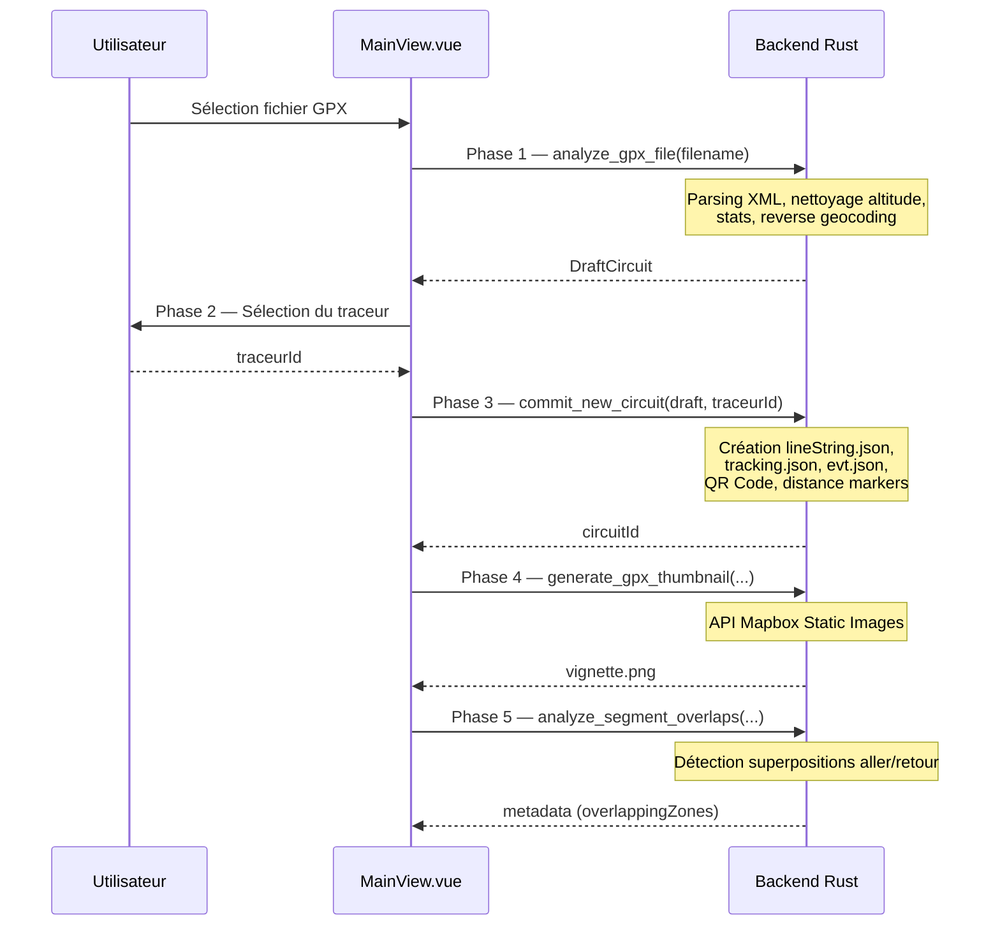
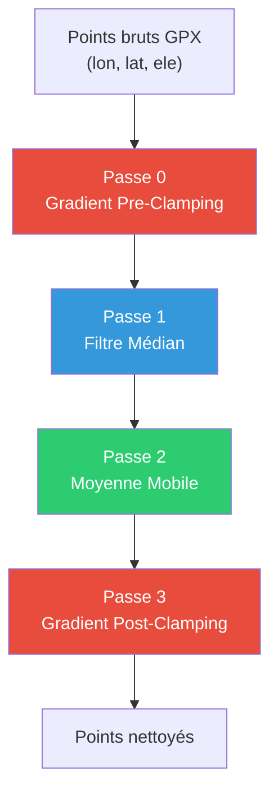
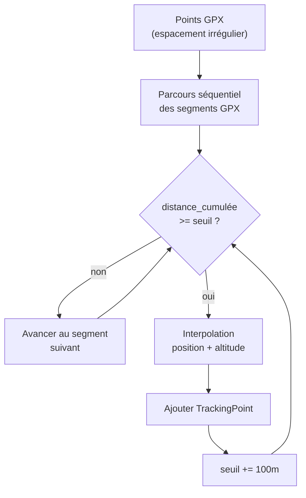
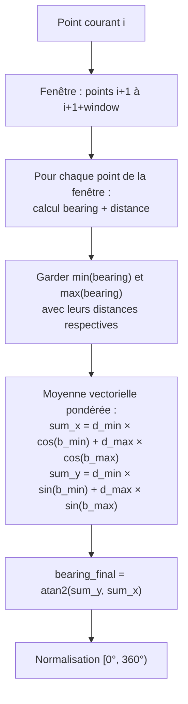
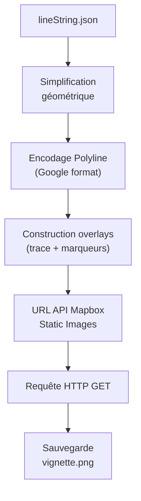
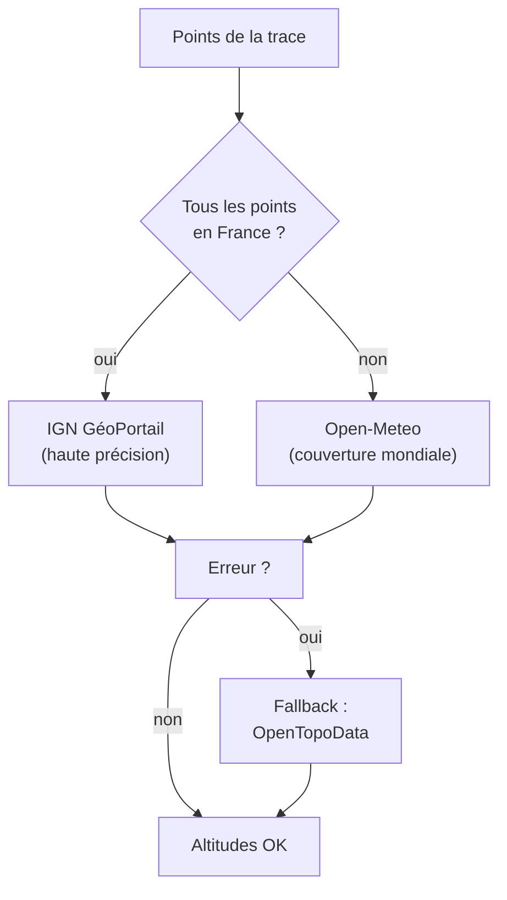

# Analyse du Pipeline d'Upload GPX — De la Trace au Fichier

> **Date** : 18 février 2026  
> **Fichiers analysés** :  
> - Backend : [gpx_processor.rs](file:///Volumes/Externe/Dev/VisuGPS/src-tauri/src/gpx_processor.rs), [tracking_processor.rs](file:///Volumes/Externe/Dev/VisuGPS/src-tauri/src/tracking_processor.rs), [thumbnail_generator.rs](file:///Volumes/Externe/Dev/VisuGPS/src-tauri/src/thumbnail_generator.rs), [elevation_provider.rs](file:///Volumes/Externe/Dev/VisuGPS/src-tauri/src/elevation_provider.rs)  
> - Frontend : [MainView.vue](file:///Volumes/Externe/Dev/VisuGPS/src/views/MainView.vue)

---

## 1. Vue d'Ensemble du Pipeline

L'import d'un fichier GPX se déroule en **5 phases séquentielles**, orchestrées par le frontend (`MainView.vue`, L240-313) :



### Fichiers Générés

| Fichier | Rôle | Phase | Générateur |
|---|---|---|---|
| `lineString.json` | Géométrie de la trace (GeoJSON) | 3 | `commit_new_circuit` → `create_line_string_file` |
| `tracking.json` | Points de contrôle caméra | 3 | `commit_new_circuit` → `generate_tracking_file` |
| `evt.json` | Événements (départ, arrivée, distances) | 3 | `commit_new_circuit` → `event::write_events` |
| `urlQrcode.png` | QR Code de l'URL source | 3 | `commit_new_circuit` (crate `qrcode`) |
| `circuits.json` | Mise à jour registre global | 3 | `commit_new_circuit` → `write_circuits_file` |
| `vignette.png` | Miniature 2D de la trace | **4** | `generate_gpx_thumbnail` |

---

## 2. Traitement de l'Altitude

### 2.1 Source des Altitudes

Les altitudes proviennent **directement du fichier GPX** (balises `<ele>` dans `<trkpt>`). L'extraction se fait dans [extract_gpx_data](file:///Volumes/Externe/Dev/VisuGPS/src-tauri/src/gpx_processor.rs#L913-L1140) :

```rust
// gpx_processor.rs L1042-1054
"gpx/trk/trkseg/trkpt/ele" => {
    if let Ok(Event::Text(t)) = reader.read_event_into(&mut buf) {
        if let (Some(lat), Some(lon)) = (current_lat, current_lon) {
            if let Ok(ele) = ele_str.parse::<f64>() {
                track_points.push(vec![lon, lat, ele]);
            }
        }
    }
}
```

> [!NOTE]
> Le fichier `elevation_provider.rs` n'est **pas** utilisé lors de l'import GPX initial — il sert uniquement pour les **variantes** (routage de segments modifiés via `variant_processor.rs`). L'altitude d'import repose exclusivement sur les données du GPX.

### 2.2 Pré-traitement : Arrondi des Coordonnées

Avant le nettoyage, les points sont arrondis ([gpx_processor.rs L379-388](file:///Volumes/Externe/Dev/VisuGPS/src-tauri/src/gpx_processor.rs#L379-L388)) :

- **Longitude / Latitude** : arrondi à 5 décimales (précision ~1.1m)
- **Altitude** : arrondi à 1 décimale (précision 0.1m)

### 2.3 Algorithme de Nettoyage de l'Altitude — `clean_altitude_data()`

Fonction : [gpx_processor.rs#L203-L327](file:///Volumes/Externe/Dev/VisuGPS/src-tauri/src/gpx_processor.rs#L203-L327)

L'algorithme se décompose en **4 passes successives** :



> [!IMPORTANT]
> **Garde spéciale** : Si toutes les altitudes sont à 0 (cas où le GPX n'a pas d'altitude), l'algorithme retourne les points inchangés pour éviter d'introduire des artéfacts de lissage (L218-222).

#### Passe 0 — Gradient Pre-Clamping (L224-251)

**But** : Limiter les variations d'altitude irréalistes **avant** le lissage.

**Algorithme** :
```
Pour chaque point i (de 1 à N) :
    dist = haversine_distance(point[i-1], point[i])   // en mètres
    max_delta = dist × (max_gradient / 100)            // pente max en mètres
    
    Si elevation[i] > elevation[i-1] + max_delta :
        elevation[i] = elevation[i-1] + max_delta      // clamp montée
    Si elevation[i] < elevation[i-1] - max_delta :
        elevation[i] = elevation[i-1] - max_delta      // clamp descente
```

- **Paramètre** : `Importation/max_gradient_percent` (défaut : **30%**)
- **Signification** : une pente de 30% = 30m de dénivelé pour 100m de distance horizontale
- **Direction** : parcours séquentiel **forward-only**

#### Passe 1 — Filtre Médian (L253-269)

**But** : Éliminer les **pics isolés** (spikes GPS) sans décaler le profil global.

**Algorithme** :
```
Pour chaque point i :
    window = [elevations[i - half_window .. i + half_window]]
    window.sort()
    elevation[i] = window[milieu]    // valeur médiane
```

- **Paramètre** : `Importation/altitude_smoothing_median_window` (défaut : **5** points)
- **Propriété** : Le filtre médian est particulièrement efficace contre les outliers car il choisit la valeur intermédiaire, ce qui ignore les valeurs extrêmes

#### Passe 2 — Moyenne Mobile (L271-284)

**But** : Lisser le profil pour obtenir une courbe fluide.

**Algorithme** :
```
Pour chaque point i :
    window = elevations[i - half_window .. i + half_window]
    elevation[i] = somme(window) / taille(window)
```

- **Paramètre** : `Importation/altitude_smoothing_avg_window` (défaut : **5** points)
- **Propriété** : Contrairement au filtre médian, la moyenne mobile traite les transitions douces mais peut introduire un léger décalage aux ruptures de pente

#### Passe 3 — Gradient Post-Clamping (L286-318)

**But** : Re-valider les gradients **après** le lissage (la moyenne mobile peut réintroduire des pentes artificielles).

**Même algorithme que la Passe 0**, avec une gestion supplémentaire :

```
Si dist <= 0.001m (< 1mm, saut vertical sans distance) :
    elevation[i] = elevation[i-1]    // aplatir complètement
```

### 2.4 Calcul du Dénivelé — `calculate_track_stats()`

Fonction : [gpx_processor.rs#L1207-L1268](file:///Volumes/Externe/Dev/VisuGPS/src-tauri/src/gpx_processor.rs#L1207-L1268)

Le D+ utilise un **lissage par distance** pour éviter de compter le bruit GPS :

```
distance_since_last_check = 0

Pour chaque point :
    distance_since_last_check += haversine_distance(prev, current)
    
    Si distance_since_last_check >= smoothing_distance :
        diff = altitude_courante - altitude_dernier_checkpoint
        Si diff > 0 :
            D+ += diff
        dernier_checkpoint = point_courant
        distance_since_last_check = 0
```

- **Paramètre** : `Importation/denivele_lissage_distance` (défaut : **10m**)
- **Principe** : Ne comptabiliser le dénivelé positif que sur des segments d'au moins 10m, ce qui filtre le micro-bruit d'altitude

---

## 3. Génération des Données Caméra — `tracking.json`

### 3.1 Vue d'Ensemble

Le fichier `tracking.json` est généré par [generate_tracking_file](file:///Volumes/Externe/Dev/VisuGPS/src-tauri/src/tracking_processor.rs#L48-L231). Il contient un tableau de `TrackingPoint`, chacun représentant un **point de contrôle caméra** positionné à intervalle régulier le long de la trace.

### 3.2 Structure d'un TrackingPoint

```rust
struct TrackingPoint {
    increment: u32,           // Index séquentiel (0, 1, 2...)
    point_de_control: bool,   // true pour 1er et dernier point uniquement
    nbr_segment: u32,         // Points jusqu'au prochain keyframe (0 par défaut)
    coordonnee: [f64; 2],     // [lon, lat] du point sur la trace
    altitude: f64,            // Altitude interpolée (m)
    commune: Option<String>,  // Nom de la commune (renseigné plus tard)
    cap: f64,                 // Bearing lissé (°)
    zoom: f64,                // Zoom caméra par défaut
    pitch: f64,               // Inclinaison caméra par défaut (°)
    coordonnee_camera: Vec<f64>, // Position caméra (vide à l'import)
    altitude_camera: f64,     // Altitude caméra (0 à l'import)
    edited_zoom: Option<f64>, // Zoom édité (null à l'import)
    edited_pitch: Option<f64>,// Pitch édité (null à l'import)
    edited_cap: Option<f64>,  // Cap édité (null à l'import)
    is_anchor_point: Option<bool>,   // Marqueur d'ancrage (variantes)
    type_troncon: Option<String>,    // Type de segment (variantes)
    actual_segment_length: Option<f64>, // Longueur réelle du segment
    is_regular_segment: Option<bool>,   // Segment de longueur nominale ?
    distance: f64,            // Distance cumulée (km)
}
```

### 3.3 Algorithme d'Échantillonnage Spatial

**Principe** : Placer un point de tracking tous les `N` mètres le long de la trace, au lieu d'utiliser les points GPX d'origine (dont l'espacement est irrégulier).

**Paramètre** : `Importation/Tracking/LongueurSegment` (défaut : **100m**)



**Détail de l'interpolation** ([tracking_processor.rs L88-118](file:///Volumes/Externe/Dev/VisuGPS/src-tauri/src/tracking_processor.rs#L88-L118)) :

```
distance_traversed = 0    // Distance parcourue dans les segments GPX
distance_needed = 100     // Prochain point de tracking attendu

Pour chaque segment [P1, P2] du GPX :
    segment_len = haversine_distance(P1, P2)
    
    Tant que distance_traversed + segment_len >= distance_needed :
        fraction = (distance_needed - distance_traversed) / segment_len
        
        // Interpolation de la position (linéaire sur le segment)
        new_point = P1 + fraction × (P2 - P1)    // geo::Line::line_interpolate_point
        
        // Interpolation de l'altitude
        new_alt = alt1 + (alt2 - alt1) × fraction
        
        Ajouter(new_point, new_alt)
        distance_needed += 100
    
    distance_traversed += segment_len
```

> [!IMPORTANT]
> L'interpolation de position utilise `geo::Line::line_interpolate_point()` qui effectue une interpolation sur **segment planaire**, pas une interpolation géodésique. Pour des segments courts (~100m), la différence est négligeable.

### 3.4 Algorithme de Calcul du Cap (Bearing) Lissé

Fonction : [calculate_smoothed_bearing](file:///Volumes/Externe/Dev/VisuGPS/src-tauri/src/tracking_processor.rs#L260-L313)

L'algorithme utilise une **moyenne circulaire pondérée par la distance**, avec une fenêtre de look-ahead :



**Paramètre** : `Importation/Tracking/LissageCap` (défaut : **15** points de look-ahead)

**Pourquoi min/max ?** L'utilisation des bearings extrêmes de la fenêtre (plutôt que la moyenne de tous les bearings) permet de :
- Capturer la **tendance directionnelle** sur la fenêtre
- Pondérer par la **distance** : les points lointains ont plus d'influence (le cap "moyen" est influencé par la direction à long terme, pas les micro-virages)
- Gérer les **discontinuités angulaires** (wrap-around 360°/0°) via la décomposition vectorielle cos/sin

### 3.5 Valeurs Caméra par Défaut

Les paramètres caméra initiaux sont **identiques pour tous les points** à l'import :

| Paramètre | Chemin Setting | Défaut |
|---|---|---|
| `zoom` | `Importation/Camera/Zoom` | **16** |
| `pitch` | `Importation/Camera/Pitch` | **60°** |
| `cap` | Calculé par `calculate_smoothed_bearing` | Variable |
| `pointDeControl` | — | `true` uniquement pour le **premier** et le **dernier** point |
| `nbrSegment` | — | **0** (pas de segment d'interpolation keyframe) |
| `coordonneeCamera` | — | `[]` (vide) |
| `editedZoom/Pitch/Cap` | — | `null` |

### 3.6 Calcul de la Distance Cumulée

Chaque point reçoit une distance cumulée en km :

```
distance = increment × segment_length / 1000
```

Exemple avec segment_length = 100m : point 0 → 0 km, point 10 → 1 km, point 50 → 5 km.

---

## 4. Création de la Vignette — `vignette.png`

### 4.1 Architecture

La vignette est une **image statique Mapbox** générée via l'[API Static Images](https://docs.mapbox.com/api/maps/static-images/).

Fonction : [generate_gpx_thumbnail](file:///Volumes/Externe/Dev/VisuGPS/src-tauri/src/thumbnail_generator.rs#L14-L232)



### 4.2 Simplification de la Trace

Le nombre de points de la trace doit être réduit pour respecter la limite de longueur d'URL de l'API Mapbox. L'algorithme de **Douglas-Peucker** (via `geo::simplify()`) est utilisé avec un seuil adaptatif :

| Points originaux | Tolérance Douglas-Peucker | Description |
|---|---|---|
| > 2000 | 0.0005° (~55m) | Forte simplification |
| 500 - 2000 | 0.0001° (~11m) | Simplification moyenne |
| 100 - 500 | 0.00005° (~5.5m) | Simplification légère |
| < 100 | 0.00001° (~1.1m) | Quasi-identique |

### 4.3 Encodage Polyline

Les points simplifiés sont encodés au **format Polyline Google** (précision 5) via le crate `polyline::encode_coordinates`. Les caractères spéciaux (`\`, `?`, `@`, `[`, `]`) sont URL-encodés pour compatibilité Mapbox.

### 4.4 Construction des Overlays

L'URL de l'API est composée de plusieurs overlays superposés :

**1. Trace** (toujours présente) :
```
path-{largeur}+{couleurHex}({polyline_encodée})
```
- Largeur configurable : `Importation/Vignette/Trace/largeurTrace` (défaut : **3**)
- Couleur configurable : `Importation/Vignette/Trace/colorGPXVignette` (défaut : `orange-darken-4`)

**2. Marqueurs Départ/Arrivée** (optionnels) :

Logique de proximité ([L126-141](file:///Volumes/Externe/Dev/VisuGPS/src-tauri/src/thumbnail_generator.rs#L126-L141)) :

```
dist = haversine_distance(départ, arrivée)
Si dist <= distance_max (défaut 250m) :
    → UN seul pin de couleur "départ-arrivée" (défaut bleu)
Sinon :
    → Pin départ (défaut vert) + Pin arrivée (défaut rouge)
```

**3. Marqueurs de distance** (optionnels) :

Si activé (`presenceDistance = true`), un pin est ajouté tous les `N` km (défaut : **10 km**). Le chiffre sur le pin est `compteur_km % 10` et la couleur varie par **dizaine** :

| `distance_marker_count / 10` | Marqueurs concernés | Distance (intervalle 10km) | Suffixe Vuetify | Résultat visuel |
|---|---|---|---|---|
| 0 | marqueurs 1-9 | 10-90 km | `lighten-3` | Clair |
| 1 | marqueurs 10-19 | 100-190 km | `lighten-2` | |
| 2 | marqueurs 20-29 | 200-290 km | `lighten-1` | |
| 3 | marqueurs 30-39 | 300-390 km | `darken-1` | |
| 4 | marqueurs 40-49 | 400-490 km | `darken-2` | |
| 5 | marqueurs 50-59 | 500-590 km | `darken-3` | Foncé |
| ≥ 6 | marqueurs 60+ | 600+ km | — | Noir |

### 4.5 URL Finale et Téléchargement

```
https://api.mapbox.com/styles/v1/{style}/static/{overlays}/auto/{largeur}x{hauteur}@2x?access_token={token}
```

- **`auto`** : Mapbox calcule automatiquement le zoom et le centrage pour afficher tous les overlays
- **`@2x`** : Image haute résolution (Retina)
- **Format** : configurable (`1/1`, `4/3`, `16/9`) → défaut `1/1`
- **Largeur** : configurable (défaut : **400** px)

L'image est sauvegardée en `data/{circuitId}/vignette.png`.

---

## 5. Autres Fichiers Générés

### 5.1 `lineString.json`

Fonction : [create_line_string_file](file:///Volumes/Externe/Dev/VisuGPS/src-tauri/src/gpx_processor.rs#L1180-L1205)

Structure simple :
```json
{
  "type": "LineString",
  "coordinates": [[lon, lat, alt], [lon, lat, alt], ...]
}
```

C'est une **copie fidèle** des points GPX nettoyés (avec altitude lissée), sous format GeoJSON.

### 5.2 `evt.json` — Événements Auto-Générés

Lors du `commit_new_circuit`, plusieurs types d'événements sont automatiquement créés :

**1. Marqueurs de distance** (si `Edition/Messages/Distance/ajouter = true`, L654-713) :
- Appel à `distance_markers::generate_distance_marker_events()`
- Génère des `RangeEvent` à chaque intervalle kilométrique

**2. Labels Départ / Arrivée** (L715-815) :
- **Départ** (si `Importation/Label Départ Arrivée/afficherDepart = true`) :
  - `startIncrement` = 0
  - `endIncrement` = `postAffichageDepart` (défaut : 10 increments)
  - Message configurable (défaut : `_Départ_green`)
- **Arrivée** (si `afficherArrivee = true`) :
  - `startIncrement` = `dernier_increment - preAffichageArrivee`
  - `endIncrement` = dernier increment
  - Message configurable (défaut : `_Arrivée_red`)

### 5.3 `urlQrcode.png`

Généré uniquement si le circuit a une URL (L592-626) :
- Utilise le crate `qrcode` pour générer l'image
- Taille configurable : `Importation/QRCode/taille` (défaut : **512** px)
- Format : image Luma8 (noir et blanc)

---

## 6. Fournisseurs d'Altitude (pour les Variantes)

Bien que non utilisé directement à l'import GPX, le module `elevation_provider.rs` est crucial pour les **variantes**. Voici sa logique :

### 6.1 Sélection Automatique du Fournisseur



| Fournisseur | API | Chunks | Délai | Précision |
|---|---|---|---|---|
| **IGN** | `data.geopf.fr` | 50 pts/req | 200ms | ~1m (RGE ALTI WLD) |
| **Open-Meteo** | `api.open-meteo.com` | 90 pts/req | 800ms | ~30m (SRTM) |
| **OpenTopoData** | `api.opentopodata.org` | 100 pts/req | 1100ms | ~30m (SRTM30m) |

Chaque fournisseur implémente un mécanisme de **retry avec backoff exponentiel** (3 tentatives max) et gère le **rate limiting** (HTTP 429).

---

## 7. Arbre des Fonctions

```
MainView.vue
└── handleImportSelection(filename)                    # L240 — Orchestre les 5 phases
    │
    ├── Phase 1 — ANALYSE
    │   └── invoke('analyze_gpx_file', { filename })
    │       └── gpx_processor::analyze_gpx_file()       # L329-481
    │           ├── get_gpx_directory()                  # L898 — Résolution dossier import
    │           ├── extract_gpx_data()                   # L913-1140 — Parsing XML
    │           │   └── quick_xml::Reader (SAX parser)
    │           │       ├── gpx/metadata/name
    │           │       ├── gpx/metadata/creator → identify_editor_from_creator()  # L1163
    │           │       ├── gpx/metadata/time
    │           │       ├── gpx/metadata/link
    │           │       ├── gpx/trk/trkseg/trkpt (lat, lon)
    │           │       └── gpx/trk/trkseg/trkpt/ele → track_points
    │           ├── Arrondi coordonnées (5 déc) + altitude (1 déc)  # L379
    │           ├── clean_altitude_data()                # L203-327 — 4 passes
    │           │   ├── Passe 0 : Gradient Pre-Clamping
    │           │   │   └── haversine_distance()         # L1310
    │           │   ├── Passe 1 : Filtre Médian (window sort)
    │           │   ├── Passe 2 : Moyenne Mobile
    │           │   └── Passe 3 : Gradient Post-Clamping
    │           ├── identify_editor_from_creator()       # L1163 — Strava/Garmin/OpenRunner/...
    │           ├── get_url_from_metadata()              # L1142 — Résolution URL éditeur
    │           ├── get_city_name_from_coords()          # L1270 — Reverse geocoding
    │           │   ├── geo.api.gouv.fr (primaire)
    │           │   └── Mapbox Geocoding (fallback)
    │           └── calculate_track_stats()              # L1207 — Distance, D+, Sommet
    │
    ├── Phase 2 — SÉLECTION TRACEUR
    │   └── traceurDialog.open()                        # UI utilisateur
    │
    ├── Phase 3 — COMMIT
    │   └── invoke('commit_new_circuit', { draft, traceurId })
    │       └── gpx_processor::commit_new_circuit()     # L483-840
    │           ├── resolve_editor_id()                  # L842 — Créer éditeur si inconnu
    │           ├── resolve_ville_id()                   # L875 — Créer ville si inconnue
    │           ├── Construction struct Circuit           # L543-585
    │           │   └── Lecture Settings : zoom départ/arrivée
    │           ├── write_circuits_file()                # L590 — MAJ circuits.json
    │           ├── QR Code Generation                   # L592-626
    │           │   └── qrcode::QrCode::new(url)
    │           ├── create_line_string_file()            # L628, L1180 — lineString.json
    │           ├── generate_tracking_file()             # L643
    │           │   └── tracking_processor.rs            # L48-231
    │           │       ├── Échantillonnage spatial      # L88-118
    │           │       │   └── geo::Line::line_interpolate_point()
    │           │       ├── Association ancres            # L120-149
    │           │       ├── calculate_smoothed_bearing()  # L260-313
    │           │       │   └── Moyenne circulaire pondérée (min/max bearing)
    │           │       └── Écriture tracking.json       # L222-228
    │           ├── Distance Markers (auto)              # L654-713
    │           │   ├── distance_markers::get_distance_markers_defaults()
    │           │   └── distance_markers::generate_distance_marker_events()
    │           ├── Labels Départ/Arrivée (auto)         # L715-815
    │           │   └── event::write_events()
    │           └── Auto-suppression GPX (optionnel)     # L818-837
    │
    ├── Phase 4 — VIGNETTE
    │   └── invoke('generate_gpx_thumbnail', { circuitId, lineStringPath, settings })
    │       └── thumbnail_generator::generate_gpx_thumbnail()  # L14-232
    │           ├── Lecture lineString.json
    │           ├── Lecture paramètres vignette (settings)
    │           ├── Simplification Douglas-Peucker       # L100-108
    │           │   └── geo::simplify()
    │           ├── Encodage Polyline Google              # L112
    │           │   └── polyline::encode_coordinates()
    │           ├── Construction overlays
    │           │   ├── Trace (path-N+color)             # L123
    │           │   ├── Marqueurs départ/arrivée         # L126-141
    │           │   │   └── haversine_distance() → proximité
    │           │   └── Marqueurs distance               # L143-190
    │           │       └── colors::convert_vuetify_color_to_hex()
    │           ├── Requête HTTP → Mapbox Static API     # L195-213
    │           └── Sauvegarde vignette.png              # L215-232
    │
    └── Phase 5 — ANALYSE SUPERPOSITIONS
        └── invoke('analyze_segment_overlaps', { circuitId, thresholdMeters })
            └── segment_analyzer::analyze_segment_overlaps()
```

---

## 8. Paramètres d'Import Configurables

| Paramètre | Chemin | Défaut | Utilisé par |
|---|---|---|---|
| `ImportDir` | `Importation/ImportDir` | `DEFAULT_DOWNLOADS` | `get_gpx_directory` |
| `autoDelete` | `Importation/autoDelete` | `false` | `commit_new_circuit` |
| `altitude_smoothing_median_window` | `Importation/...` | `5` | `clean_altitude_data` |
| `altitude_smoothing_avg_window` | `Importation/...` | `5` | `clean_altitude_data` |
| `max_gradient_percent` | `Importation/...` | `30.0` | `clean_altitude_data` |
| `denivele_lissage_distance` | `Importation/...` | `10` m | `calculate_track_stats` |
| `LongueurSegment` | `Importation/Tracking/...` | `100` m | `generate_tracking_file` |
| `LissageCap` | `Importation/Tracking/...` | `15` pts | `calculate_smoothed_bearing` |
| `Zoom` | `Importation/Camera/Zoom` | `16` | `generate_tracking_file` |
| `Pitch` | `Importation/Camera/Pitch` | `60°` | `generate_tracking_file` |
| `styleVignette` | `Importation/Vignette/...` | `streets-v12` | `generate_gpx_thumbnail` |
| `largeur` | `Importation/Vignette/Dimensions/...` | `400` px | `generate_gpx_thumbnail` |
| `format` | `Importation/Vignette/Dimensions/...` | `1/1` | `generate_gpx_thumbnail` |

---

## Annexe A — Pistes d'Amélioration du Lissage du Cap

### A.1 Problème Actuel

L'algorithme `calculate_smoothed_bearing()` actuel ne retient que le **min et le max** des bearings de la fenêtre de look-ahead, puis en fait une moyenne vectorielle pondérée par la distance. Cette approche est une approximation grossière qui ignore tous les bearings intermédiaires et peut créer des **sauts brusques** si le min/max change d'un point à l'autre.

> [!TIP]
> Avant toute modification du code, un premier test rapide consiste à augmenter le paramètre `LissageCap` de **15 à 25-30** dans les settings. Cela peut déjà réduire significativement l'agitation sans changer l'algorithme.

---

### A.2 Option 1 — Moyenne Circulaire Complète Pondérée (Recommandée)

**Principe** : Utiliser **tous les points** de la fenêtre (au lieu du seul min/max), pondérés par leur distance au point courant.

```rust
fn calculate_smoothed_bearing(
    current_index: usize,
    points: &[TrackingPoint],
    window_size: usize,
) -> f64 {
    let current = &points[current_index];
    let end_index = (current_index + 1 + window_size).min(points.len());

    let mut sum_x = 0.0;
    let mut sum_y = 0.0;

    for i in (current_index + 1)..end_index {
        let target = &points[i];
        let distance = haversine_distance(
            current.coordonnee[1], current.coordonnee[0],
            target.coordonnee[1], target.coordonnee[0],
        );
        if distance < 0.001 { continue; }

        // Bearing direct entre le point courant et le point i
        let bearing = bearing_between(current, target).to_radians();

        // Pondération par la distance : les points lointains ont plus de poids
        sum_x += distance * bearing.cos();
        sum_y += distance * bearing.sin();
    }

    if sum_x == 0.0 && sum_y == 0.0 { return 0.0; }

    let mut avg = sum_y.atan2(sum_x).to_degrees();
    if avg < 0.0 { avg += 360.0; }
    avg
}
```

**Avantages** :
- Tous les points de la fenêtre contribuent → résultat plus stable
- La pondération par distance favorise naturellement la direction à **long terme**
- Gère correctement le wrap-around 360°/0° via la décomposition cos/sin

**Inconvénient** : Légèrement plus coûteux en calcul (négligeable en pratique).

---

### A.3 Option 2 — Fenêtre Symétrique (Look-ahead + Look-behind)

**Principe** : Centrer la fenêtre de calcul **autour** du point courant, au lieu de ne regarder que devant.

```rust
// Remplacer la fenêtre [i+1 .. i+1+window] par [i-half .. i+half]
let half = window_size / 2;
let start = current_index.saturating_sub(half);
let end = (current_index + half + 1).min(points.len());
// Puis appliquer la moyenne circulaire sur [start..end]
```

**Avantages** :
- Le cap en un point reflète la direction **autour** de ce point, pas seulement devant
- Particulièrement efficace dans les **virages** : le cap de l'entrée de virage n'est plus influencé uniquement par la sortie
- Simple à implémenter

**Inconvénient** : Introduit un léger **retard** dans les changements de direction (le cap "voit" aussi le passé).

---

### A.4 Option 3 — Post-lissage par Moyenne Mobile Circulaire

**Principe** : Après avoir calculé tous les caps (avec l'algorithme actuel ou amélioré), appliquer une **deuxième passe de lissage** sur le tableau de caps.

```rust
// Après la boucle principale de génération des tracking points
let post_window = 5; // Paramètre configurable
let half = post_window / 2;
let caps: Vec<f64> = tracking_points.iter().map(|p| p.cap).collect();
let smoothed_caps: Vec<f64> = caps.iter().enumerate().map(|(i, _)| {
    let start = i.saturating_sub(half);
    let end = (i + half + 1).min(caps.len());
    circular_mean(&caps[start..end])  // moyenne vectorielle sur la sous-fenêtre
}).collect();

// Réaffecter les caps lissés
for (i, point) in tracking_points.iter_mut().enumerate() {
    point.cap = smoothed_caps[i];
}
```

**Avantages** :
- **Non-invasif** : s'ajoute après la logique existante sans la modifier
- Paramètre indépendant (`LissageCapPost`) → peut être désactivé
- Peut être combiné avec n'importe laquelle des options ci-dessus

**Inconvénient** : Double lissage → peut trop "arrondir" les changements de direction intentionnels.

---

### A.5 Recommandation

| Priorité | Option | Effort | Gain attendu |
|---|---|---|---|
| 1 (rapide) | Augmenter `LissageCap` à 25-30 | Aucun code | Moyen |
| 2 (recommandé) | Option 1 — Moyenne complète | Faible | Élevé |
| 3 (complément) | Option 3 — Post-lissage | Faible | Moyen |
| 4 (alternatif) | Option 2 — Fenêtre symétrique | Faible | Moyen |

La combinaison **Option 1 + Option 3** offre le meilleur rapport qualité/effort : l'Option 1 améliore la robustesse du calcul de base, et l'Option 3 ajoute une passe de finition indépendante et configurable.
