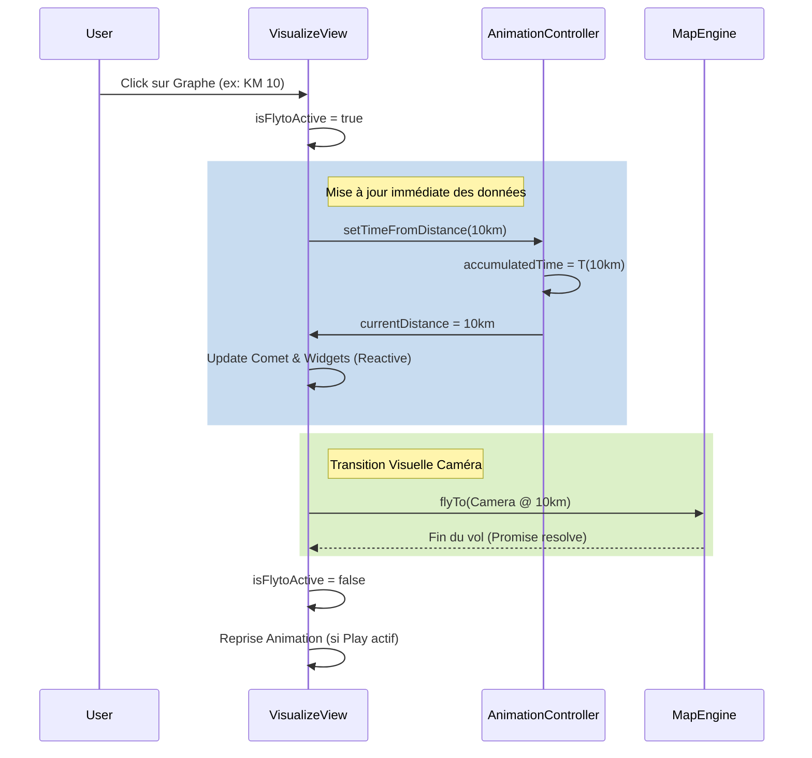

# Analyse : Implémentation du Saut Temporel (Time Jump)

Ce document présente l'analyse technique et fonctionnelle pour l'ajout d'une fonctionnalité de "Saut dans le temps" dans les vues de visualisation (`VisualizeView` et `VisualizeView`).

## 1. Besoin Fonctionnel

L'objectif est de permettre à l'utilisateur de déplacer instantanément l'état de l'animation (position sur la trace) vers un point arbitraire ou prédéfini.

**Méthodes d'interaction souhaitées :**
1.  **Clic sur le profil altimétrique (`AltitudeSVG`)** : L'utilisateur clique à n'importe quel endroit du graphique pour aller au point kilométrique correspondant.
2.  **Points prédéfinis** : Saut vers des points d'intérêt (segments, anchors) via une liste ou des marqueurs (similaire à la navigation dans les variantes).

**Comportement attendu :**
*   **Caméra** : Transition fluide (`flyTo`) de la position actuelle vers la position cible et l'orientation cible (liée au km cible).
*   **Synchronisation** :
    *   La **comète** (trace parcourue) doit s'ajuster à la nouvelle position.
    *   Le **curseur** sur le graphique d'altitude doit se positionner au bon endroit.
    *   Le widget **Distance** doit afficher le kilométrage cible.
    *   La variable interne `accumulatedTime` doit être recalculée.

---

## 2. Analyse de l'Existant

### Gestion du Temps (`useAnimationController.js`)
Actuellement, l'animation est pilotée par une boucle (`requestAnimationFrame`) qui incrémente un `accumulatedTime` via la fonction `updateTime(deltaTime)`.
*   La **Distance** est une fonction directe du temps : `distance = f(accumulatedTime)`.
*   Il n'existe pas actuellement de méthode pour inverser cette relation (définir le temps depuis une distance) ou pour forcer une valeur arbitraire de manière propre en cours d'animation.

### Boucle d'Animation (`VisualizeView.vue`)
La boucle `animateLoop` exécute les tâches suivantes à chaque frame :
1.  Met à jour le temps et la distance.
2.  Met à jour la **Comète** (géométrie).
3.  Calcule et applique la position de la **Caméra** (`map.jumpTo` ou via le `CameraInterpolator`).
4.  Gère les événements (Popups, Pauses).

**Point critique :** Il existe déjà un mécanisme `isFlytoActive` qui met en pause la mise à jour de la caméra par la boucle principale. C'est ce mécanisme que nous allons exploiter pour éviter les conflits pendant le vol de transition.

---

## 3. Solution Technique Proposée

La solution repose sur la création d'une séquence de "Saut" (`performTimeJump`) qui orchestre la mise à jour des données et l'animation de la caméra.

### 3.1. Interaction Utilisateur : `AltitudeSVG.vue`

Un gestionnaire d'événements `@click` sera ajouté sur le conteneur du graphique SVG.

*   **Calcul** : La position `offsetX` du clic sera convertie en distance (mètres) en utilisant l'échelle inverse du graphique (`totalDistance` / `viewBoxWidth`).
*   **Émission** : Le composant émettra un événement `jump-requested` avec la distance cible en paramètre.
    *   Exemple : `emit('jump-requested', 12500)` pour un saut au km 12.5.

### 3.2. Contrôleur d'Animation : Mise à jour

Le composable `useAnimationController` doit être enrichi :

*   **Nouvelle méthode** : `setDistance(targetDistanceMeters, totalDistanceMeters, totalDurationMs)`
    *   Cette méthode recalculera `accumulatedTime` pour qu'il corresponde exactement à la distance cible.
    *   Formula : `accumulatedTime = (targetDistance / totalDistance) * totalDuration`
    *   Elle mettra à jour `currentDistanceInMeters` immédiatement.

### 3.3. Séquence de Saut (`performTimeJump`)

Voici l'algorithme détaill de la fonction à implémenter dans les vues (`VisualizeView` et `VisualizeView`) :

**Entrée :** `targetDistance` (en mètres).

1.  **Suspension de l'Animation** :
    *   Si l'animation tourne, on la met en pause logique, mais on garde la boucle de rendu active pour les mises à jour visuelles statiques.
    *   Activation du flag `isFlytoActive = true`. Cela empêche `animateLoop` de forcer la position de la caméra frame par frame.

2.  **Calcul de la Cible** :
    *   On récupère les paramètres de caméra idéaux pour la `targetDistance` (Coordonnées, Bearing, Pitch, Zoom) via le `useCameraInterpolator` ou en cherchant le point de tracking le plus proche.

3.  **Mise à jour de l'État Interne (Instantanée)** :
    *   Appel de `animationController.setDistance(targetDistance)`.
    *   **Effet visuel** : La comète, le curseur altitude et le widget distance sautent *immédiatement* à la position cible.
    *   *Avantage* : L'utilisateur voit tout de suite le point d'arrivée sur la carte pendant que la caméra s'y rend.

4.  **Lancement du FlyTo (Transition)** :
    *   Appel de `map.flyTo()` vers le point cible calculé.
    *   Durée : Paramétrable (ex: 1.5s ou 2s) ou dynamique selon la distance du saut.

5.  **Finalisation (Callback fin de FlyTo)** :
    *   Une fois le vol terminé (`flyToPromise` résolu) :
    *   Désactivation de `isFlytoActive = false`.
    *   Si l'animation était en lecture avant le clic, on relance la lecture (`isPaused = false`). Sinon, on reste en pause à la nouvelle position.

---

## 4. Impact sur les Fichiers

### `src/components/Visualize/AltitudeSVG.vue`
*   **Ajout** : Écouteur `@click` sur `.svg-container`.
*   **Ajout** : Logique de conversion Pixels -> Mètres.
*   **Ajout** : Emit `jump-to`.
*   **UX** : Ajout d'un curseur `cursor: pointer` au survol pour indiquer l'interactivité.

### `src/composables/visualize/useAnimationController.js`
*   **Ajout** : Fonction `setTimeFromDistance(distance, totalDist, totalDur)`.

### `src/views/VisualizeView.vue` & `VisualizeView.vue`
*   **Modification** : Template, écoute de `@jump-to` sur le composant `<altitude-s-v-g>`.
*   **Ajout** : Fonction `handleJumpRequest(distance)`.
*   **Logique** : Implémentation de la séquence décrite en 3.3.

---

## 5. Schéma de Gestion de `accumulatedTime`

## 6. Points Prédéfinis (VisualizeView)

Pour intégrer les "points prédéfinis" mentionnés :
*   Les segments de variantes possèdent déjà des ancres (Début, Fin).
*   On peut réutiliser la logique de saut (`handleJumpRequest`) en l'appelant lors d'un clic sur une liste de segments ou sur des marqueurs spécifiques sur la carte.
*   Il suffit de connaître la **distance cumulée** du point d'intérêt pour déclencher le saut.

---

## 7. Conclusion

Cette approche permet une navigation fluide et intuitive. L'utilisation du mécanisme `isFlytoActive` existant garantit qu'il n'y aura pas de conflit (glitch) entre l'interpolation automatique de la caméra et le mouvement de saut volontaire.
