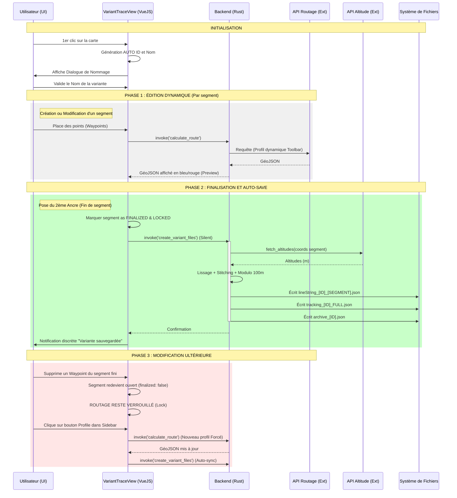

# Analyse du Processus de Création des Variantes (VariantTraceView)

Ce document détaille le flux de travail, les appels aux services externes et la génération des fichiers lors de la création de variantes dans l'application VisuGPS.

## 🛠️ Services Externes sollicités

| Service | API Utilisée | Moment de l'appel | But |
| :--- | :--- | :--- | :--- |
| **Routage** | GraphHopper / OpenRouteService | **Édition (Temps réel)** | Calculer le chemin pour le segment actif |
| **Routage (Maj)**| GraphHopper / OpenRouteService | **Clic Icône Profil** | Mise à jour forcée d'un segment avec nouveaux réglages |
| **Altitude** | IGN / Open-Meteo | **Finalisation / Maj** | Récupération Z immédiate dès qu'un segment est complet |
| **Persistance** | Système de fichiers JSON | **Automatique** | Synchro immédiate des fichiers segments et archive à chaque modification |

---

## 📈 Chronologie des opérations (Processus Auto-Save)

Le diagramme suivant illustre le cycle de vie d'une variante. La sauvegarde est désormais **transparente et incrémentale**.

---

## 🧩 Définition des types de tracés

Lors de la création d'une variante, trois types de modifications sont possibles :

*   **Départ Déporté** : Permet de déplacer le début de la trace à un endroit différent du tracé original. Le backend remplace la portion initiale (du kilomètre 0 à l'ancre) par ce nouveau chemin.
*   **Arrivée Reportée** : Permet de terminer la trace à un nouvel endroit. Le backend remplace la portion finale (de l'ancre au terminus original) par ce nouveau chemin.
*   **Segment (Déviation)** : Crée un détour localisé entre deux points d'ancrage sur la trace principale. La portion comprise entre ces deux ancres sur le Master est supprimée et remplacée par la variante.

---

## 📂 Détail du processus d'assemblage (Stitching)

Lors de la sauvegarde, le backend Rust reconstruit une trace entière en fusionnant la trace principale (Master) et vos modifications dans cet ordre :

1.  **Nouveau Départ** : Remplace toute la section initiale de la trace Master du point 0 jusqu'à l'ancre du départ.
2.  **Sections Communes** : Entre les variantes, le backend récupère les points haute résolution de la trace Master originale.
3.  **Segments (Déviations)** : Le chemin entre l'ancre de début et l'ancre de fin est remplacé par le nouveau tracé routé.
4.  **Nouvelle Arrivée** : Remplace la fin de la trace Master à partir de l'ancre de l'arrivée.

### Règle des 100 mètres
Pendant cet assemblage, le backend génère le fichier `tracking_..._FULL.json` où chaque point est espacé d'environ **100 mètres**. C'est cet échantillonnage constant qui assure une vitesse d'animation fluide et régulière dans le module de visualisation.

## 💾 Fichiers générés (Résumé)

| Fichier | utilité |
| :--- | :--- |
| `archive_XX.json` | Contient les points de clic pour pouvoir ré-éditer la variante plus tard. |
| `lineString_XX_FULL.json` | Géométrie complète haute résolution (utilisée pour l'affichage de la trace). |
| `tracking_XX_FULL.json` | Points de passage cadencés (utilisés pour la position de la caméra/marqueur). |
| `lineString_XX_SEGMENT_Y.json` | Géométrie spécifique à un tronçon (pour debugging/affichage partiel). |

---
*Note : Si une erreur de routage survient pendant l'édition, une "ligne droite" est générée temporairement en fallback pour permettre de continuer le travail.*
