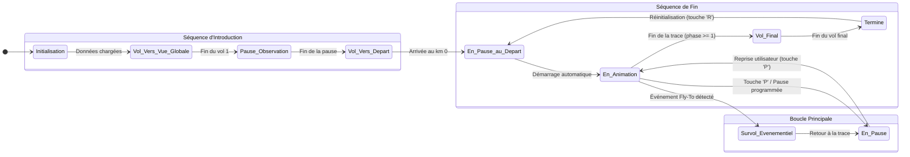

# Automate de l'Animation de la Caméra (VisualizeView.vue)

Ce document décrit le fonctionnement de l'animation de la caméra dans `VisualizeView.vue` sous la forme d'une machine à états. Chaque état représente un moment précis de l'animation, et les transitions décrivent les événements qui font passer d'un état à l'autre.

## Diagramme des États

## Description des États

*   **Initialisation** : L'état initial. La vue est en cours de chargement, les données du circuit (`lineString`, `tracking`) sont récupérées. La carte n'est pas encore interactive.

*   **Vol_Vers_Vue_Globale** : Premier vol animé. La caméra part d'une vue large (Europe) pour se positionner sur une vue d'ensemble de la trace.

*   **Pause_Observation** : Une pause statique après le premier vol, permettant à l'utilisateur d'avoir un aperçu global du parcours.

*   **Vol_Vers_Depart** : Second vol animé. La caméra zoome depuis la vue d'ensemble pour se positionner précisément au point de départ (km 0), adoptant les paramètres de caméra initiaux (pitch, bearing, zoom).

*   **En_Pause_au_Depart** : La caméra est arrivée au point de départ. L'animation est en pause, en attente du démarrage automatique ou d'une action de l'utilisateur. C'est aussi l'état de destination après une réinitialisation.

*   **En_Animation** : État principal. La boucle `animate()` est active. La caméra suit la trace en interpolant sa position soit entre les points de contrôle, soit point par point.

*   **En_Pause** : L'animation est suspendue (par l'utilisateur ou par un événement programmé). La caméra est fixe et les interactions manuelles (zoom, déplacement) sont possibles.

*   **Survol_Evenementiel** : Un événement "Fly-To" a été déclenché. L'animation principale est suspendue pendant que la caméra effectue un vol vers une coordonnée spécifique.

*   **Vol_Final** : La fin de la trace est atteinte. La caméra effectue un dernier vol pour revenir à une vue d'ensemble du circuit.

*   **Termine** : L'animation est terminée et la caméra est sur la vue d'ensemble finale. Le système attend une action de l'utilisateur (par exemple, réinitialiser avec la touche 'R').

## Description des Transitions

*   **Initialisation -> Vol_Vers_Vue_Globale**
    *   **Déclencheur :** Toutes les données nécessaires (`lineString`, `tracking.json`, `evt.json`) ont été chargées avec succès.
    *   **Action :** La séquence d'introduction commence avec le premier `flyTo`.

*   **Vol_Vers_Vue_Globale -> Pause_Observation**
    *   **Déclencheur :** L'animation du premier `flyTo` est terminée.
    *   **Action :** Un `setTimeout` est lancé pour la durée de la pause.

*   **Pause_Observation -> Vol_Vers_Depart**
    *   **Déclencheur :** Le `setTimeout` de la pause se termine.
    *   **Action :** Le second `flyTo` vers le point de départ est initié.

*   **Vol_Vers_Depart -> En_Pause_au_Depart**
    *   **Déclencheur :** L'animation du second `flyTo` est terminée.
    *   **Action :** L'interface utilisateur devient visible, l'animation est prête mais en pause.

*   **En_Pause_au_Depart -> En_Animation**
    *   **Déclencheur :** Fin du `setTimeout` de la pause initiale au km 0.
    *   **Action :** La variable `isPaused` passe à `false`, la boucle `animate()` commence à faire avancer la caméra.

*   **En_Animation -> En_Pause**
    *   **Déclencheur :** L'utilisateur appuie sur la touche `P` OU l'animation atteint un `increment` correspondant à une pause programmée.
    *   **Action :** La variable `isPaused` passe à `true`. Les interactions manuelles avec la carte sont réactivées.

*   **En_Pause -> En_Animation**
    *   **Déclencheur :** L'utilisateur appuie sur la touche `P` alors que l'animation est en pause.
    *   **Action :** Si la caméra a été déplacée, un `flyTo` la ramène à sa position d'origine. Ensuite, `isPaused` passe à `false` et l'animation reprend.

*   **En_Animation -> Survol_Evenementiel**
    *   **Déclencheur :** L'animation atteint un `increment` correspondant à un événement "Fly-To".
    *   **Action :** La fonction `executeFlytoSequence` est appelée. Elle met `isPaused` à `true` et lance le `flyTo` de l'événement.

*   **Survol_Evenementiel -> En_Pause**
    *   **Déclencheur :** L'utilisateur appuie sur `P` pour quitter le survol, et le `flyTo` de retour à la trace est terminé.
    *   **Action :** L'état revient à `En_Pause`, prêt pour que l'utilisateur relance l'animation principale.

*   **En_Animation -> Vol_Final**
    *   **Déclencheur :** La variable `phase` de l'animation atteint ou dépasse `1`.
    *   **Action :** La variable `isAnimationFinished` passe à `true`. Un `setTimeout` lance le `flyTo` final après un court délai.

*   **Vol_Final -> Termine**
    *   **Déclencheur :** L'animation du `flyTo` final est terminée.
    *   **Action :** L'animation est complètement arrêtée.

*   **Termine -> En_Pause_au_Depart**
    *   **Déclencheur :** L'utilisateur appuie sur la touche `R`.
    *   **Action :** La fonction `resetAnimation()` est appelée, ce qui remet le temps à 0 et replace la caméra au point de départ via un `flyTo`. L'application se retrouve dans le même état qu'à la fin de la séquence d'introduction.
