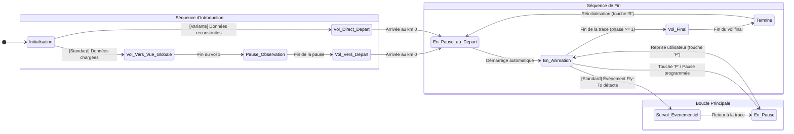

# Automate de l'Animation (VisualizeView.vue & VisualizeVariantView.vue)

Ce document décrit le fonctionnement de l'animation de la caméra dans `VisualizeView.vue` (Standard) et `VisualizeVariantView.vue` (Variantes). Bien que partageant une logique commune, elles présentent des différences notables dans leurs phases d'initialisation et de gestion des événements.

## Diagramme des États

```mermaid
stateDiagram-v2
    direction LR
    [*] --> Initialisation

    state "Séquence d'Introduction" as Intro {
        direction TB
        Initialisation --> Vol_Vers_Vue_Globale: [Standard] Données chargées
        Vol_Vers_Vue_Globale --> Pause_Observation: Fin du vol 1
        Pause_Observation --> Vol_Vers_Depart: Fin de la pause
        Vol_Vers_Depart --> En_Pause_au_Depart: Arrivée au km 0

        Initialisation --> Vol_Direct_Depart: [Variante] Données reconstruites
        Vol_Direct_Depart --> En_Pause_au_Depart: Arrivée au km 0
    }

    state "Boucle Principale" as MainLoop {
        direction TB
        En_Pause_au_Depart --> En_Animation: Démarrage automatique
        En_Animation --> En_Pause: Touche 'P' / Pause programmée
        En_Pause --> En_Animation: Reprise utilisateur (touche 'P')
        En_Animation --> Survol_Evenementiel: [Standard] Événement Fly-To détecté
        Survol_Evenementiel --> En_Pause: Retour à la trace
    }

    state "Séquence de Fin" as EndSequence {
        En_Animation --> Vol_Final: Fin de la trace (phase >= 1)
        Vol_Final --> Termine: Fin du vol final
        Termine --> En_Pause_au_Depart: Réinitialisation (touche 'R')
    }
```

## Écarts de Fonctionnement

### 1. Séquence de Lancement
*   **Mode Standard (`VisualizeView`)** : Séquence "cinématique" en 3 étapes (Europe -> Vue Globale -> Pause -> Zoom au départ).
*   **Mode Variante (`VisualizeVariantView`)** : Lancement direct vers le kilomètre 0 après reconstruction du tracé en mémoire.

### 2. Gestion des Données
*   **Standard** : Charge `tracking.json` et `LineString.json` directement issus du backend.
*   **Variante** : Reconstruit la `LineString` en fusionnant la trace maîtresse et les segments de variante. Applique un lissage frontend (`applySmoothingToTracking`) et recalcule la continuité des splines (`nbrSegment`) pour garantir la fluidité malgré les "coutures" entre segments.

### 3. Événements et Navigation
*   **Événements** : Les événements programmés (Pauses, Fly-To, Messages) sont actuellement actifs dans la vue Standard. La vue Variante charge une liste d'événements vide par défaut.
*   **Navigation** : La vue Standard permet de basculer vers les variantes à la fin de l'animation. La vue Variante permet de changer de variante ou de revenir à la trace principale via des boutons dédiés.

## Description des États (Compléments)

*   **Vol_Direct_Depart** : (Variantes uniquement) Un vol unique et rapide vers le point de départ pour une mise en action immédiate.

*   **En_Pause_au_Depart** : Commun aux deux vues. Attend la fin du délai `pauseAuKm0` ou une action utilisateur.

*   **Survol_Evenementiel** : (Actuellement Standard uniquement) Gère la suspension de la boucle `animate()` pour un détour visuel programmé dans `evt.json`.
