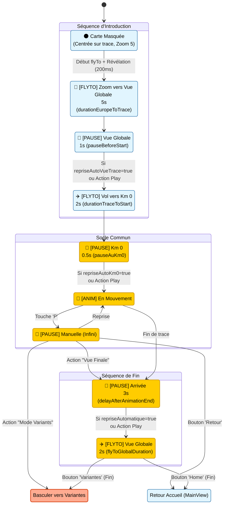
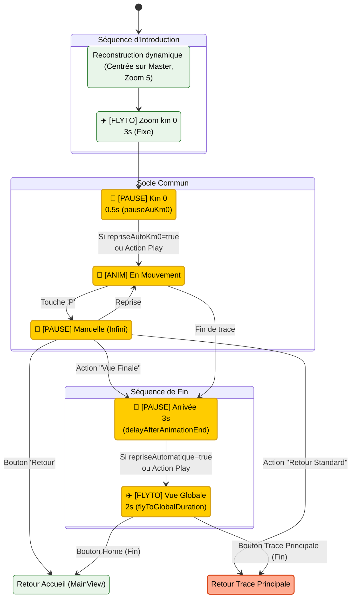

# Automate de l'Animation (VisualizeView & VisualizeVariantView)

Ce document détaille les cycles de vie de l'animation. Bien que les points d'entrée et de sortie diffèrent, ils partagent un **Socle Commun** (en orange dans les diagrammes) qui garantit la cohérence des contrôles de lecture.

---

## 1. Flux Standard (`VisualizeView.vue`)
Le flux standard est conçu comme une expérience contemplative avec une introduction progressive. La carte est initialisée **cachée et centrée sur la trace** pour garantir une fluidité totale.

```mermaid
stateDiagram-v2
    classDef common fill:#ffcc00,stroke:#d4a017,stroke-width:2px,color:black;
    classDef standard fill:#e1f5fe,stroke:#01579b,color:black;
    classDef bridge fill:#ffab91,stroke:#d84315,stroke-width:2px,color:black;

    state "Séquence d'Introduction" as IntroSTD {
        Init_STD: 🌑 Carte Masquée <br/> (Centrée sur trace, Zoom 5)
        Vol_Zoom: 🔭 [FLYTO] Zoom vers Vue Globale <br/> 5s (durationEuropeToTrace)
        Pause_Globale: 🛑 [PAUSE] Vue Globale <br/> 1s (pauseBeforeStart)
        Vol_Km0_STD: ✈️ [FLYTO] Vol vers Km 0 <br/> 2s (durationTraceToStart)
        
        Init_STD --> Vol_Zoom: Début flyTo + Révélation (200ms)
        Vol_Zoom --> Pause_Globale
        Pause_Globale --> Vol_Km0_STD: Si repriseAutoVueTrace=true <br/> ou Action Play
    }

    state "Socle Commun" as CommonSTD {
        Km0: 🛑 [PAUSE] Km 0 <br/> 0.5s (pauseAuKm0)
        Anim: 🚀 [ANIM] En Mouvement
        Pause: 🛑 [PAUSE] Manuelle (Infini)
        
        Km0 --> Anim: Si repriseAutoKm0=true <br/> ou Action Play
        Anim --> Pause: Touche 'P'
        Pause --> Anim: Reprise
        Pause --> Arrivee: Action "Vue Finale"
    }

    state "Séquence de Fin" as EndSTD {
        Arrivee: 🛑 [PAUSE] Arrivée <br/> 3s (delayAfterAnimationEnd)
        Vol_Final: ✈️ [FLYTO] Vue Globale <br/> 2s (flyToGlobalDuration)
        
        Arrivee --> Vol_Final: Si repriseAutomatique=true <br/> ou Action Play
    }

    GoHome: Retour Accueil (MainView)
    ToVariant: Basculer vers Variantes

    [*] --> IntroSTD
    Vol_Km0_STD --> Km0
    Anim --> Arrivee: Fin de trace
    
    %% Direct Transitions & Passerelles
    Pause --> ToVariant: Action "Mode Variants"
    Pause --> GoHome: Bouton 'Retour'
    Vol_Final --> ToVariant: Bouton 'Variantes' (Fin)
    Vol_Final --> GoHome: Bouton 'Home' (Fin)

    class Km0,Anim,Pause,Arrivee,Vol_Final common
    class Init_STD,Vol_Zoom,Pause_Globale,Vol_Km0_STD,GoHome standard
    class ToVariant bridge
```

---

## 2. Flux Variante (`VisualizeVariantView.vue`)
Le flux variante est optimisé pour une mise en route immédiate. Comme le flux standard, il s'initialise au centre de la trace master.

```mermaid
stateDiagram-v2
    classDef common fill:#ffcc00,stroke:#d4a017,stroke-width:2px,color:black;
    classDef variant fill:#e8f5e9,stroke:#2e7d32,color:black;
    classDef bridge fill:#ffab91,stroke:#d84315,stroke-width:2px,color:black;

    state "Séquence d'Introduction" as IntroVAR {
        Init_VAR: Reconstruction dynamique <br/> (Centrée sur Master, Zoom 5)
        Vol_Direct: ✈️ [FLYTO] Zoom km 0 <br/> 3s (Fixe)
        
        Init_VAR --> Vol_Direct
    }

    state "Socle Commun" as CommonVAR {
        Km0_V: 🛑 [PAUSE] Km 0 <br/> 0.5s (pauseAuKm0)
        Anim_V: 🚀 [ANIM] En Mouvement
        Pause_V: 🛑 [PAUSE] Manuelle (Infini)
        
        Km0_V --> Anim_V: Si repriseAutoKm0=true <br/> ou Action Play
        Anim_V --> Pause_V: Touche 'P'
        Pause_V --> Anim_V: Reprise
        Pause_V --> Arrivee_V: Action "Vue Finale"
    }

    state "Séquence de Fin" as EndVAR {
        Arrivee_V: 🛑 [PAUSE] Arrivée <br/> 3s (delayAfterAnimationEnd)
        Vol_Final_V: ✈️ [FLYTO] Vue Globale <br/> 2s (flyToGlobalDuration)
        
        Arrivee_V --> Vol_Final_V: Si repriseAutomatique=true <br/> ou Action Play
    }

    GoHome_V: Retour Accueil (MainView)
    ToStandard: Retour Trace Principale

    [*] --> IntroVAR
    Vol_Direct --> Km0_V
    Anim_V --> Arrivee_V: Fin de trace
    
    %% Direct Transitions & Passerelles
    Pause_V --> ToStandard: Action "Retour Standard"
    Pause_V --> GoHome_V: Bouton 'Retour'
    Vol_Final_V --> GoHome_V: Bouton Home (Fin)
    Vol_Final_V --> ToStandard: Bouton Trace Principale (Fin)

    class Km0_V,Anim_V,Pause_V,Arrivee_V,Vol_Final_V common
    class Init_VAR,Vol_Direct,GoHome_V variant
    class ToStandard bridge
```

---

## 3. Points Techniques Clés

### A. Initialisation Fluide
L'initialisation est conçue pour garantir une transition visuelle parfaite dès l'apparition de la carte :
1. La carte est initialisée avec `isInitializing = true` (masquée par un overlay).
2. Le centre est immédiatement fixé sur le **centre géographique de la trace** (calculé via Turf.js).
3. Le zoom est initialisé à la valeur de `zoomEurope` (défaut 5).
4. La séquence de zoom vers la vue globale est lancée alors que la carte est encore masquée.
5. `isInitializing` passe à `false` après un délai de 200ms : l'utilisateur voit alors l'animation déjà en cours, sans aucun sursaut initial.

### B. Contrôle Présentateur (Reprises Manuelles)
Trois points d'arrêt stratégiques peuvent être configurés pour attendre une action manuelle (`Play`) du présentateur :
- **Vue Globale** : Paramètre `repriseAutoVueTrace`. Permet de présenter le parcours complet.
- **Départ (Km 0)** : Paramètre `repriseAutoKm0`. Permet d'introduire le départ.
- **Arrivée** : Paramètre `repriseAutomatique`. Permet de conclure la séquence.

---

## 4. Synthèse des Paramètres (Rappel)
*Tous ces paramètres sont stockés dans `settingsDefault.json`.*

| Paramètre | Chemin | Usage | Valeur par défaut |
| :--- | :--- | :--- | :--- |
| `zoomEurope` | `Visualisation/Lancement/zoomEurope` | Standard | 5 |
| `durationEuropeToTrace` | `Visualisation/Lancement/durationEuropeToTrace` | Standard | 5.0 s |
| `pauseBeforeStart` | `Visualisation/Lancement/pauseBeforeStart` | Standard | 1.0 s |
| `repriseAutoVueTrace` | `Visualisation/Lancement/repriseAutoVueTrace` | Standard | **true** |
| `durationTraceToStart` | `Visualisation/Lancement/durationTraceToStart` | Standard | 2.0 s |
| `pauseAuKm0` | `Visualisation/Lancement/pauseAuKm0` | **Commun** | 0.5 s |
| `repriseAutoKm0` | `Visualisation/Lancement/repriseAutoKm0` | **Commun** | **true** |
| `vitesse` | `Visualisation/Lecture/vitesse` | **Commun** | 3730 ms/km |
| `timerReprisePause` | `Visualisation/Lecture/timerReprisePause` | **Commun** | 1.0 s |
| `delayAfterAnimationEnd` | `Visualisation/Finalisation/delayAfterAnimationEnd` | **Commun** | 3.0 s |
| `flyToGlobalDuration` | `Visualisation/Finalisation/flyToGlobalDuration` | **Commun** | 2.0 s |
| `repriseAutomatique` | `Visualisation/Finalisation/repriseAutomatique` | **Commun** | **false** |
