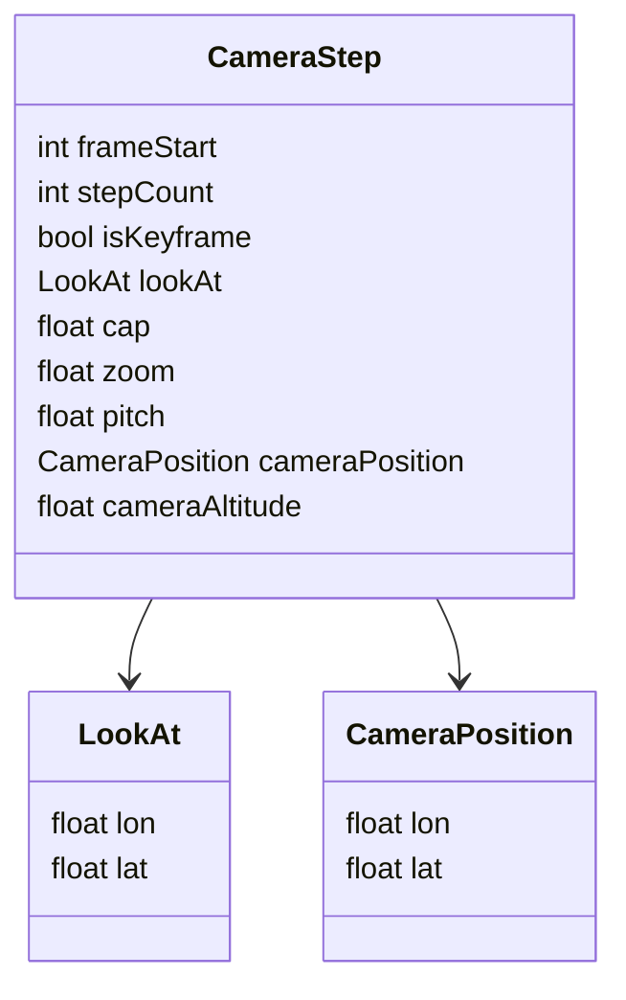

# Analyse du fichier `visu.json`

## 📌 Structure générale
Le fichier contient une **liste de points de vue caméra** utilisés pour animer la visualisation d’un parcours en 3D.

Chaque objet correspond à une étape et contient :  
- `isKeyframe` (ancien `ref`) → booléen indiquant si c’est une **image clé (keyframe)** ou un point interpolé.  
- `frameStart` (ancien `start`) → index ou frame de départ de cette étape.  
- `stepCount` (ancien `longueur`) → durée ou nombre de pas de l’étape.  
- `lookAt` → coordonnées `{ lon, lat }` de la cible regardée par la caméra.  
- `cap` → orientation de la caméra en degrés.  
- `zoom` → niveau de zoom de la vue.  
- `pitch` → inclinaison verticale de la caméra en degrés.  
- `cameraPosition` (ancien `positionCamera`) → coordonnées `{ lon, lat }` de la caméra (peut être vide si interpolé).  
- `cameraAltitude` (ancien `altitudeCamera`) → altitude de la caméra en mètres.

---

## 📌 Organisation
- Les objets avec `isKeyframe: true` sont les **points de contrôle principaux** définis manuellement.  
- Ceux avec `isKeyframe: false` sont des **points interpolés** (calculés automatiquement pour lisser la trajectoire).  

Ainsi, la caméra se déplace entre les keyframes et les points interpolés servent à fluidifier l’animation.

---

## 📌 Améliorations proposées
1. **Noms plus explicites** :  
   - `ref` → `isKeyframe`  
   - `start` → `frameStart`  
   - `longueur` → `stepCount`  
   - `positionCamera` → `cameraPosition`  
   - `altitudeCamera` → `cameraAltitude`  

2. **Coordonnées normalisées** :  
   - Utiliser des objets `{ lon, lat }` plutôt que des tableaux `[lon, lat]`.  
   Exemple :  
   ```json
   "lookAt": { "lon": 0.8833, "lat": 41.1160 }
   ```

3. **Séparer keyframes et interpolations** si besoin :  
   ```json
   {
     "keyframes": [ { ... } ],
     "interpolated": [ { ... } ]
   }
   ```

4. **Facteur commun** : valeurs comme `pitch: 60` qui sont identiques partout pourraient être placées dans des métadonnées globales.

---

## 📊 Diagramme de structure (Mermaid)



---

## 📌 Rôle du fichier
Ce fichier définit une **timeline caméra** permettant de :  
- Fixer des **images clés (keyframes)** avec `isKeyframe: true`.  
- Générer automatiquement des points **interpolés** pour lisser le mouvement.  
- Rejouer un parcours avec des transitions fluides entre différents angles, zooms et positions.  

En résumé : c’est un **script de caméra 3D** qui accompagne le parcours pour améliorer la visualisation et la narration.
