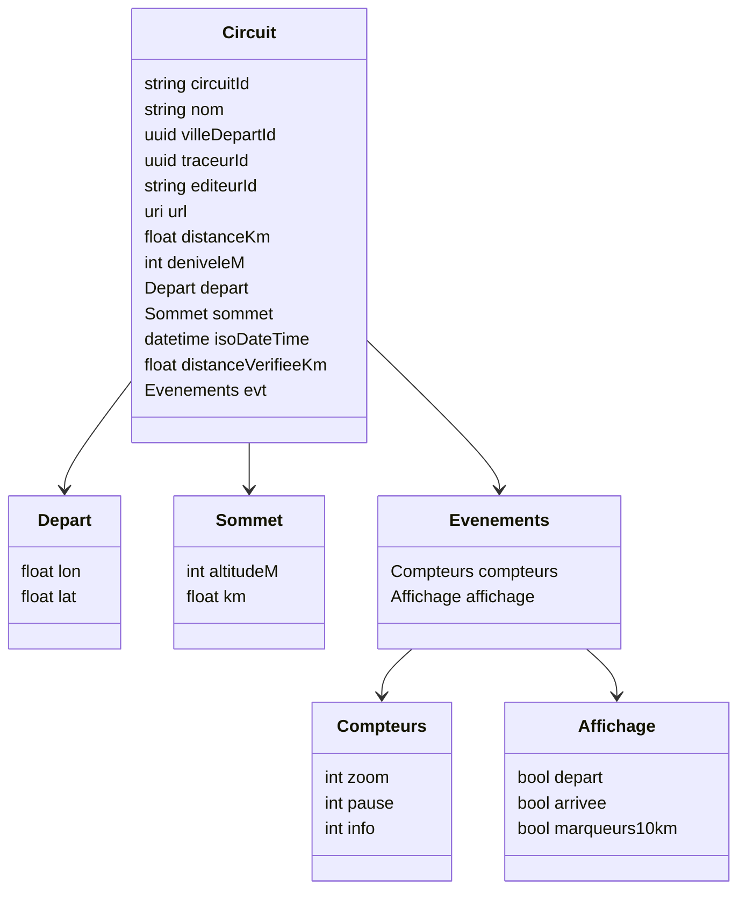
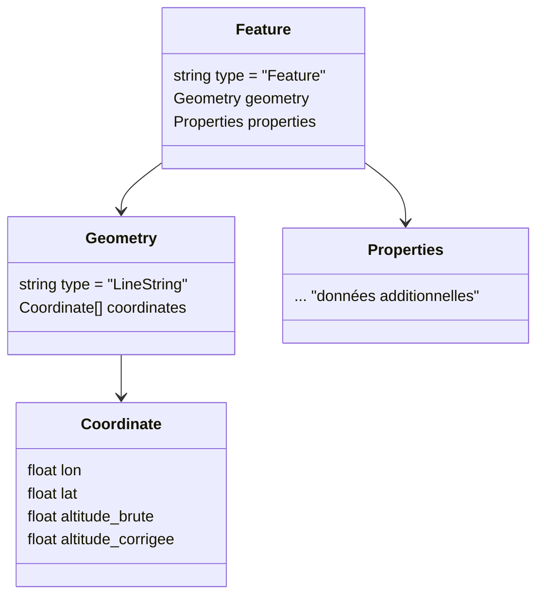
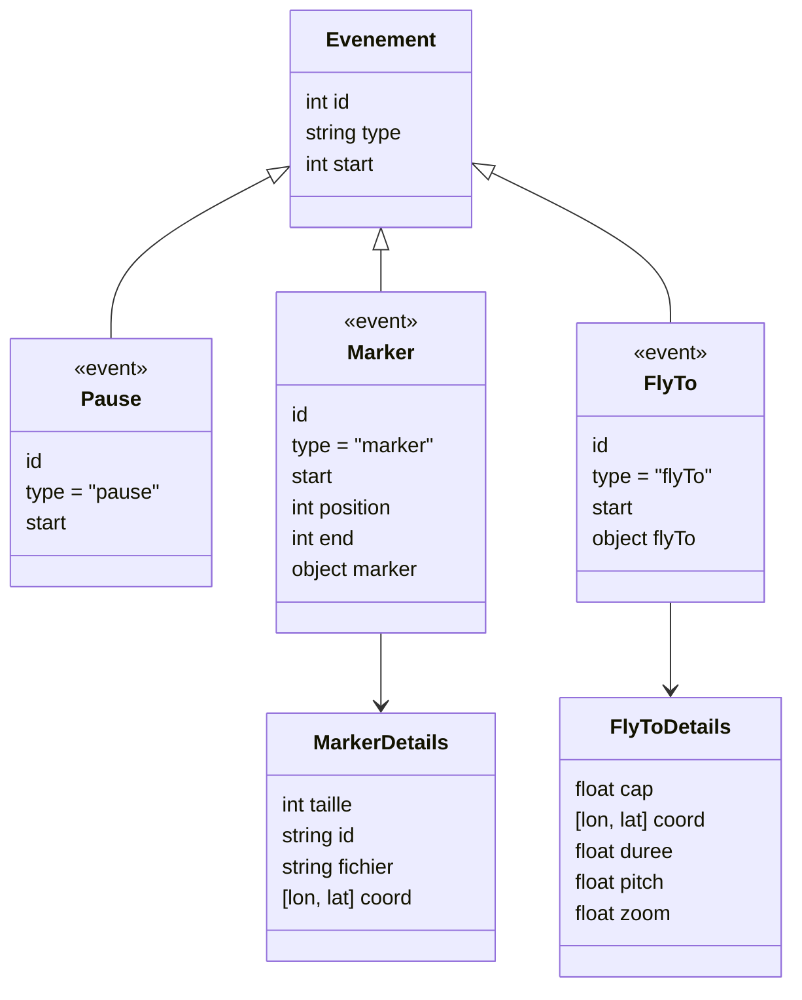
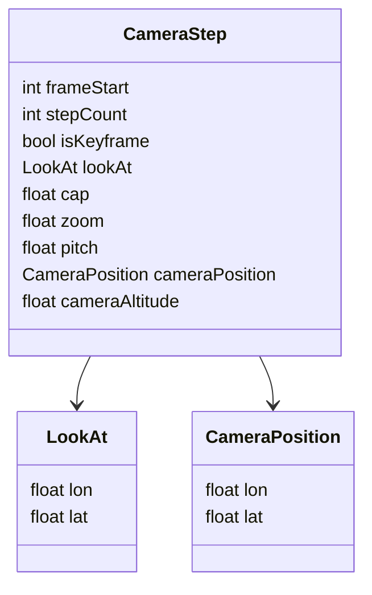
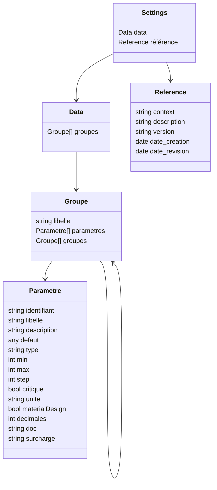

# 📘 Documentation du modèle de données VisuGPS

Ce document regroupe l’analyse de tous les fichiers JSON utilisés dans l’application.

---

# 📘Analyse du fichier `circuits.json`

## 📌 Structure générale

Le fichier contient la **configuration des circuits cyclistes** avec leurs métadonnées, les villes de départ, les traceurs et les éditeurs.  

### Champs principaux en racine :

- `version` → version du fichier (ex: 1.0.0).  
- `description` → description générale.  
- `auteur` → auteur du fichier.  
- `commentaires` → informations complémentaires.  
- `villes` → liste des villes (avec `id` et `nom`).  
- `traceurs` → liste des traceurs (avec `id` et `nom`).  
- `editeurs` → liste des éditeurs de traces GPS (avec `id` et `nom`).  
- `indexCircuits` → index courant des circuits (sert de compteur).  
- `circuits` → tableau listant chaque circuit et ses caractéristiques.  

---

## 📌 Structure d’un circuit

Un circuit contient les informations suivantes :  

- `circuitId` → identifiant du circuit.  
- `nom` → nom du parcours.  
- `villeDepartId` → identifiant de la ville de départ (clé étrangère vers `villes`).  
- `traceurId` → identifiant du traceur (clé étrangère vers `traceurs`).  
- `editeurId` → identifiant de l’éditeur (clé étrangère vers `editeurs`).  
- `url` → lien vers la trace GPS (OpenRunner, Garmin, Strava...).  
- `distanceKm` → distance totale en kilomètres (nombre).  
- `deniveleM` → dénivelé positif total en mètres (nombre).  
- `depart` → coordonnées du point de départ (`lon`, `lat`).  
- `sommet` → informations sur le sommet principal (`altitudeM`, `km`).  
- `isoDateTime` → date et heure ISO du parcours.  
- `distanceVerifieeKm` → distance recalculée à partir de la trace pour vérification.  
- `evt` → événements associés au circuit :  
  - `compteurs` : `{ zoom, pause, info }` → statistiques d’interactions.  
  - `affichage` : `{ depart, arrivee, marqueurs10km }` → options de rendu.  

---

## 📌 Exemple simplifié

```json
{
  "circuitId": "000001",
  "nom": "2025 santa susanna",
  "villeDepartId": "1f016165-90ca-6d61-bbc5-80bd9b7fe382",
  "traceurId": "1f016165-90ca-6d60-bca6-c48f11c87921",
  "editeurId": "ed-0005",
  "url": "https://www.openrunner.com/route-details/20325662",
  "distanceKm": 81.0,
  "deniveleM": 891,
  "depart": { "lon": 2.72443, "lat": 41.63522 },
  "sommet": { "altitudeM": 373, "km": 23.94 },
  "isoDateTime": "2025-04-10T14:16:08.757Z",
  "distanceVerifieeKm": 81.0,
  "evt": {
    "compteurs": { "zoom": 1, "pause": 0, "info": 0 },
    "affichage": { "depart": true, "arrivee": true, "marqueurs10km": true }
  }
}
```

---

## 📊 Diagramme de structure (Mermaid)



---

## 📌 Rôle du fichier

Ce fichier agit comme une **base de données de circuits** :  

- Il centralise les villes, traceurs et éditeurs (référentiels).  
- Il décrit les circuits avec leurs caractéristiques techniques (distance, dénivelé, sommet, etc.).  
- Il ajoute des métadonnées (`evt`) pour gérer l’affichage et les interactions côté front-end.  

En résumé : c’est le **fichier pivot de ton application** pour gérer la configuration et la visualisation des parcours.

---

# Analyse du fichier `lineString.json`

## 📌 Structure générale

Le fichier est un objet **GeoJSON** de type `Feature` contenant une géométrie `LineString`.  
Il représente une trace GPS sous forme d’une liste ordonnée de coordonnées.

### Champs principaux :

- `type` → toujours `"Feature"`.  
- `geometry` → description de la géométrie.  
  - `type` → toujours `"LineString"`.  
  - `coordinates` → tableau de points `[longitude, latitude, altitude_brute, altitude_corrigée]`.  
- `properties` → objet pouvant contenir des métadonnées supplémentaires (souvent libre).  

---

## 📌 Structure d’un point de coordonnées

Chaque point de la trace est un tableau de **4 valeurs numériques** :  

1. `longitude` → en degrés décimaux.  
2. `latitude` → en degrés décimaux.  
3. `altitude_brute` → issue directement du GPS.  
4. `altitude_corrigée` → altitude recalculée/corrigée par traitement.  

Exemple :  

```json
[ 2.72443, 41.63522, 150, 148 ]
```

---

## 📊 Diagramme de structure (Mermaid)



---

## 📌 Rôle du fichier

Ce fichier sert de **support principal pour représenter une trace GPS**.  

- La `geometry` contient la séquence ordonnée des points.  
- Chaque point porte non seulement longitude/latitude, mais aussi deux valeurs d’altitude (brute et corrigée).  
- Les `properties` permettent d’enrichir le fichier avec des informations contextuelles (nom, tags, statistiques, etc.).  

En résumé : c’est un **fichier de données géospatiales** au format GeoJSON, adapté pour stocker et exploiter une trace complète de parcours.

---

# 📘Analyse du fichier `evt.json`

## 📌 Structure générale

- C’est un **tableau d’objets**.
- Chaque objet représente un **événement** sur un parcours.
- Les champs principaux sont :
  - `id` → identifiant unique de l’événement (numérique, incrémental).
  - `type` → type d’événement (`pause`, `marker`, `flyTo` …).
  - `start` → position (probablement en secondes, en points de trace ou en index).
  - selon le `type`, des propriétés supplémentaires (`marker`, `flyTo` …).

---

## 📌 Les différents types d’événements

### 1. `pause`

```json
{ "id": 0, "type": "pause", "start": 0 }
```

➡️ Indique un arrêt ou une pause au début de la trace.

---

### 2. `marker`

Exemple :

```json
{
  "id": 2,
  "type": "marker",
  "start": 93,
  "position": 100,
  "end": 107,
  "marker": {
    "taille": 120,
    "id": "1f031978-acfe-6af0-ad41-d52d3e550d4e",
    "fichier": "§_km010.png",
    "coord": ["0.99542","41.05564"]
  }
}
```

- Utilisé pour signaler un point spécifique (départ, km10, km20, fontaine, col, ravitaillement, stop, arrivée, etc.).  
- Chaque `marker` contient :
  - **icône/image** (`fichier`)
  - **taille** (`taille`)
  - **UUID** (`id`)
  - **coordonnées** (`lon, lat`)
- Les champs `start`, `position`, `end` définissent la plage dans la trace où ce marqueur s’applique.

---

### 3. `flyTo`

Exemple :

```json
{
  "id": 25,
  "type": "flyTo",
  "start": 263,
  "flyTo": {
    "cap": -74,
    "coord": [0.8833, 41.1160],
    "duree": 5,
    "pitch": 60,
    "zoom": 17.5
  }
}
```

- Définit une **animation de caméra** (comme dans Mapbox ou Cesium).
- Contient :
  - `cap` → orientation de la caméra en degrés
  - `coord` → longitude, latitude de la vue
  - `duree` → durée de l’animation en secondes
  - `pitch` → inclinaison de la caméra
  - `zoom` → niveau de zoom

---

## 📌 Rôle du fichier

Le fichier sert à **orchestrer la narration ou la visualisation d’un parcours** :

- les **pauses** gèrent le déroulé,
- les **markers** ajoutent des icônes et points de repère sur la carte,
- les **flyTo** animent la caméra pour guider la vue du spectateur.

En résumé : c’est une **timeline enrichie** pour rejouer le parcours avec mise en valeur des étapes importantes (départ, cols, km intermédiaires, ravitaillements, arrivée…).

---

## 📊 Diagramme de structure (Mermaid)



---

# 📘Analyse du fichier `visu.json`

## 📌 Structure générale

Le fichier contient une **liste de points de vue caméra** utilisés pour animer la visualisation d’un parcours en 3D.

Chaque objet correspond à une étape et contient :  

- `isKeyframe` (ancien `ref`) → booléen indiquant si c’est une **image clé (keyframe)** ou un point interpolé.  
- `frameStart` (ancien `start`) → index ou frame de départ de cette étape.  
- `stepCount` (ancien `longueur`) → durée ou nombre de pas de l’étape.  
- `lookAt` → coordonnées `{ lon, lat }` de la cible regardée par la caméra.  
- `cap` → orientation de la caméra en degrés.  
- `zoom` → niveau de zoom de la vue.  
- `pitch` → inclinaison verticale de la caméra en degrés.  
- `cameraPosition` (ancien `positionCamera`) → coordonnées `{ lon, lat }` de la caméra (peut être vide si interpolé).  
- `cameraAltitude` (ancien `altitudeCamera`) → altitude de la caméra en mètres.

---

## 📌 Organisation

- Les objets avec `isKeyframe: true` sont les **points de contrôle principaux** définis manuellement.  
- Ceux avec `isKeyframe: false` sont des **points interpolés** (calculés automatiquement pour lisser la trajectoire).  

Ainsi, la caméra se déplace entre les keyframes et les points interpolés servent à fluidifier l’animation.

---

## 📌 Améliorations proposées

1. **Noms plus explicites** :  
   
   - `ref` → `isKeyframe`  
   - `start` → `frameStart`  
   - `longueur` → `stepCount`  
   - `positionCamera` → `cameraPosition`  
   - `altitudeCamera` → `cameraAltitude`  

2. **Coordonnées normalisées** :  
   
   - Utiliser des objets `{ lon, lat }` plutôt que des tableaux `[lon, lat]`.  
     Exemple :  
     
     ```json
     "lookAt": { "lon": 0.8833, "lat": 41.1160 }
     ```

3. **Séparer keyframes et interpolations** si besoin :  
   
   ```json
   {
     "keyframes": [ { ... } ],
     "interpolated": [ { ... } ]
   }
   ```

4. **Facteur commun** : valeurs comme `pitch: 60` qui sont identiques partout pourraient être placées dans des métadonnées globales.

---

## 📊 Diagramme de structure (Mermaid)



---

## 📌 Rôle du fichier

Ce fichier définit une **timeline caméra** permettant de :  

- Fixer des **images clés (keyframes)** avec `isKeyframe: true`.  
- Générer automatiquement des points **interpolés** pour lisser le mouvement.  
- Rejouer un parcours avec des transitions fluides entre différents angles, zooms et positions.  

En résumé : c’est un **script de caméra 3D** qui accompagne le parcours pour améliorer la visualisation et la narration.

---

# 📘Analyse du fichier `settingsDefault.json`

## 📌 Structure générale

Ce fichier définit la **configuration par défaut de l’application VisuGPS**.  
Il est organisé en **groupes** de paramètres regroupés par thèmes : Importation, Édition, Visualisation, Système.  

### Champs principaux :

- `data` → contient les groupes et paramètres.  
- `référence` → métadonnées sur la configuration (contexte, description, version, dates).  

---

## 📌 Détail des sections

### 1. Importation

- Paramètres liés au traitement des fichiers GPX importés.  
- Exemples :
  - `autoDelete` (booléen) → supprime automatiquement le fichier GPX après import.  
  - `downloadDirectory` (string) → chemin du dossier surveillé.  
- Sous-groupe **Mapbox** :
  - `styleVignette` (string) → style de carte utilisé pour générer les vignettes.  
  - `colorGPXVignette` (couleur) → couleur de la trace GPX sur la vignette (avec support Material Design).  

### 2. Édition

- Paramètres liés à l’édition de parcours.  
- Sous-groupe **Caméra** :
  - `Zoom` (réel, borné de 0 à 22, avec 2 décimales) → niveau de zoom de la caméra par défaut.  
- Sous-groupe **Mapbox** :
  - `styleEdition` (string) → style de carte utilisé pendant l’édition.  

### 3. Visualisation

- Paramètres liés à l’affichage d’un parcours.  
- Sous-groupe **Mapbox** :
  - `styleVisualisation` (string) → style de carte pour la visualisation.  
  - `startPositionVisualisation` (coordonnées `[lon, lat]`) → position initiale de la vue.  

### 4. Système

- Paramètres critiques pour le fonctionnement interne.  
- Sous-groupe **Timers** :
  - `networkPolling` (entier en ms, min 6000, max 60000) → intervalle de vérification réseau.  
- Sous-groupe **Tokens** :
  - `mapbox` (string, critique) → token d’accès aux services Mapbox.  

---

## 📌 Section `référence`

Métadonnées générales :  

- `context` → contexte d’utilisation (`OPE`).  
- `description` → description de l’exécution par défaut.  
- `version` → version de la configuration (1.0.0).  
- `date_creation`, `date_revision`, `date_revison` → dates (actuellement nulles).  

---

## 📊 Diagramme de structure (Mermaid)



---

## 📌 Rôle du fichier

Ce fichier agit comme une **configuration centralisée et hiérarchisée** :  

- Chaque paramètre est décrit avec son type, sa valeur par défaut, ses bornes éventuelles et sa documentation.  
- Les groupes permettent de structurer les paramètres par thèmes (importation, édition, visualisation, système).  
- La section `référence` garantit la traçabilité (version, contexte, dates).  

En résumé : c’est le **fichier maître des paramètres par défaut** de l’application VisuGPS, garantissant cohérence et maintenabilité.
