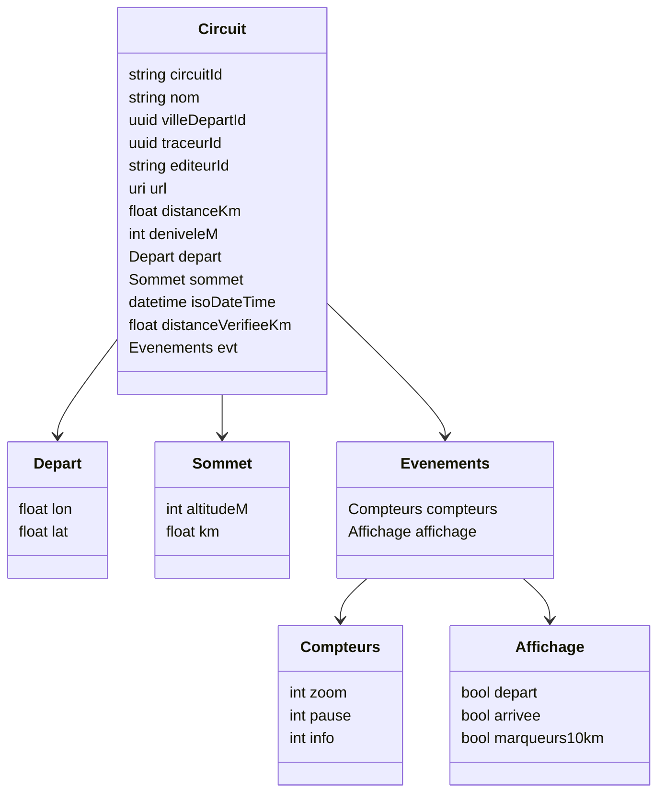

# Analyse du fichier `circuits.json`

## 📌 Structure générale
Le fichier contient la **configuration des circuits cyclistes** avec leurs métadonnées, les villes de départ, les traceurs et les éditeurs.  

### Champs principaux en racine :
- `version` → version du fichier (ex: 1.0.0).  
- `description` → description générale.  
- `auteur` → auteur du fichier.  
- `commentaires` → informations complémentaires.  
- `villes` → liste des villes (avec `id` et `nom`).  
- `traceurs` → liste des traceurs (avec `id` et `nom`).  
- `editeurs` → liste des éditeurs de traces GPS (avec `id` et `nom`).  
- `indexCircuits` → index courant des circuits (sert de compteur).  
- `circuits` → tableau listant chaque circuit et ses caractéristiques.  

---

## 📌 Structure d’un circuit
Un circuit contient les informations suivantes :  

- `circuitId` → identifiant du circuit.  
- `nom` → nom du parcours.  
- `villeDepartId` → identifiant de la ville de départ (clé étrangère vers `villes`).  
- `traceurId` → identifiant du traceur (clé étrangère vers `traceurs`).  
- `editeurId` → identifiant de l’éditeur (clé étrangère vers `editeurs`).  
- `url` → lien vers la trace GPS (OpenRunner, Garmin, Strava...).  
- `distanceKm` → distance totale en kilomètres (nombre).  
- `deniveleM` → dénivelé positif total en mètres (nombre).  
- `depart` → coordonnées du point de départ (`lon`, `lat`).  
- `sommet` → informations sur le sommet principal (`altitudeM`, `km`).  
- `isoDateTime` → date et heure ISO du parcours.  
- `distanceVerifieeKm` → distance recalculée à partir de la trace pour vérification.  
- `evt` → événements associés au circuit :  
  - `compteurs` : `{ zoom, pause, info }` → statistiques d’interactions.  
  - `affichage` : `{ depart, arrivee, marqueurs10km }` → options de rendu.  

---

## 📌 Exemple simplifié
```json
{
  "circuitId": "000001",
  "nom": "2025 santa susanna",
  "villeDepartId": "1f016165-90ca-6d61-bbc5-80bd9b7fe382",
  "traceurId": "1f016165-90ca-6d60-bca6-c48f11c87921",
  "editeurId": "ed-0005",
  "url": "https://www.openrunner.com/route-details/20325662",
  "distanceKm": 81.0,
  "deniveleM": 891,
  "depart": { "lon": 2.72443, "lat": 41.63522 },
  "sommet": { "altitudeM": 373, "km": 23.94 },
  "isoDateTime": "2025-04-10T14:16:08.757Z",
  "distanceVerifieeKm": 81.0,
  "evt": {
    "compteurs": { "zoom": 1, "pause": 0, "info": 0 },
    "affichage": { "depart": true, "arrivee": true, "marqueurs10km": true }
  }
}
```

---

## 📊 Diagramme de structure (Mermaid)



---

## 📌 Rôle du fichier
Ce fichier agit comme une **base de données de circuits** :  
- Il centralise les villes, traceurs et éditeurs (référentiels).  
- Il décrit les circuits avec leurs caractéristiques techniques (distance, dénivelé, sommet, etc.).  
- Il ajoute des métadonnées (`evt`) pour gérer l’affichage et les interactions côté front-end.  

En résumé : c’est le **fichier pivot de ton application** pour gérer la configuration et la visualisation des parcours.
