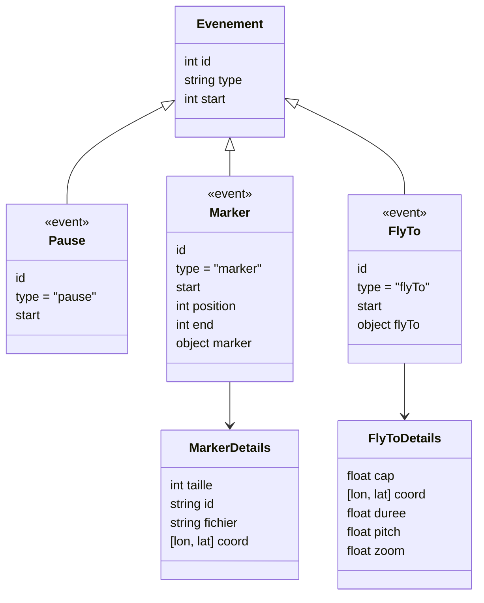

# Analyse du fichier `evt.json`

## 📌 Structure générale
- C’est un **tableau d’objets**.
- Chaque objet représente un **événement** sur un parcours.
- Les champs principaux sont :
  - `id` → identifiant unique de l’événement (numérique, incrémental).
  - `type` → type d’événement (`pause`, `marker`, `flyTo` …).
  - `start` → position (probablement en secondes, en points de trace ou en index).
  - selon le `type`, des propriétés supplémentaires (`marker`, `flyTo` …).

---

## 📌 Les différents types d’événements

### 1. `pause`
```json
{ "id": 0, "type": "pause", "start": 0 }
```
➡️ Indique un arrêt ou une pause au début de la trace.

---

### 2. `marker`
Exemple :
```json
{
  "id": 2,
  "type": "marker",
  "start": 93,
  "position": 100,
  "end": 107,
  "marker": {
    "taille": 120,
    "id": "1f031978-acfe-6af0-ad41-d52d3e550d4e",
    "fichier": "§_km010.png",
    "coord": ["0.99542","41.05564"]
  }
}
```
- Utilisé pour signaler un point spécifique (départ, km10, km20, fontaine, col, ravitaillement, stop, arrivée, etc.).  
- Chaque `marker` contient :
  - **icône/image** (`fichier`)
  - **taille** (`taille`)
  - **UUID** (`id`)
  - **coordonnées** (`lon, lat`)
- Les champs `start`, `position`, `end` définissent la plage dans la trace où ce marqueur s’applique.

---

### 3. `flyTo`
Exemple :
```json
{
  "id": 25,
  "type": "flyTo",
  "start": 263,
  "flyTo": {
    "cap": -74,
    "coord": [0.8833, 41.1160],
    "duree": 5,
    "pitch": 60,
    "zoom": 17.5
  }
}
```
- Définit une **animation de caméra** (comme dans Mapbox ou Cesium).
- Contient :
  - `cap` → orientation de la caméra en degrés
  - `coord` → longitude, latitude de la vue
  - `duree` → durée de l’animation en secondes
  - `pitch` → inclinaison de la caméra
  - `zoom` → niveau de zoom

---

## 📌 Rôle du fichier
Le fichier sert à **orchestrer la narration ou la visualisation d’un parcours** :
- les **pauses** gèrent le déroulé,
- les **markers** ajoutent des icônes et points de repère sur la carte,
- les **flyTo** animent la caméra pour guider la vue du spectateur.

En résumé : c’est une **timeline enrichie** pour rejouer le parcours avec mise en valeur des étapes importantes (départ, cols, km intermédiaires, ravitaillements, arrivée…).


---

## 📊 Diagramme de structure (Mermaid)


