# Analyse du fichier `lineString.json`

## 📌 Structure générale
Le fichier est un objet **GeoJSON** de type `Feature` contenant une géométrie `LineString`.  
Il représente une trace GPS sous forme d’une liste ordonnée de coordonnées.

### Champs principaux :
- `type` → toujours `"Feature"`.  
- `geometry` → description de la géométrie.  
  - `type` → toujours `"LineString"`.  
  - `coordinates` → tableau de points `[longitude, latitude, altitude_brute, altitude_corrigée]`.  
- `properties` → objet pouvant contenir des métadonnées supplémentaires (souvent libre).  

---

## 📌 Structure d’un point de coordonnées
Chaque point de la trace est un tableau de **4 valeurs numériques** :  
1. `longitude` → en degrés décimaux.  
2. `latitude` → en degrés décimaux.  
3. `altitude_brute` → issue directement du GPS.  
4. `altitude_corrigée` → altitude recalculée/corrigée par traitement.  

Exemple :  
```json
[ 2.72443, 41.63522, 150, 148 ]
```

---

## 📊 Diagramme de structure (Mermaid)

```mermaid
classDiagram
    class Feature {
      string type = "Feature"
      Geometry geometry
      Properties properties
    }

    class Geometry {
      string type = "LineString"
      Coordinate[] coordinates
    }

    class Coordinate {
      float lon
      float lat
      float altitude_brute
      float altitude_corrigee
    }

    class Properties {
      ... "données additionnelles"
    }

    Feature --> Geometry
    Geometry --> Coordinate
    Feature --> Properties
```



---

## 📌 Rôle du fichier
Ce fichier sert de **support principal pour représenter une trace GPS**.  
- La `geometry` contient la séquence ordonnée des points.  
- Chaque point porte non seulement longitude/latitude, mais aussi deux valeurs d’altitude (brute et corrigée).  
- Les `properties` permettent d’enrichir le fichier avec des informations contextuelles (nom, tags, statistiques, etc.).  

En résumé : c’est un **fichier de données géospatiales** au format GeoJSON, adapté pour stocker et exploiter une trace complète de parcours.
