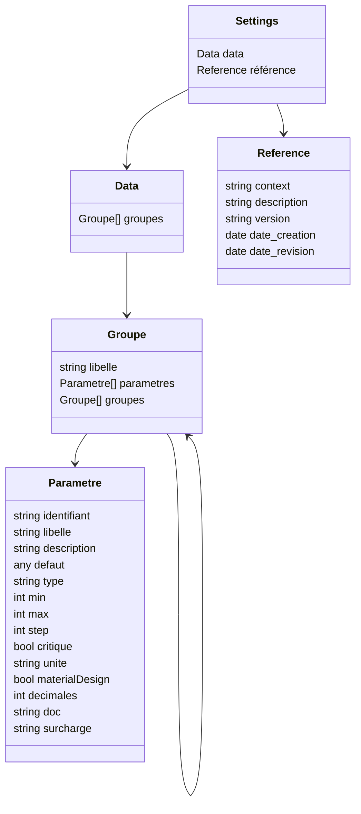

# Analyse du fichier `settingsDefault.json`

## 📌 Structure générale
Ce fichier définit la **configuration par défaut de l’application VisuGPS**.  
Il est organisé en **groupes** de paramètres regroupés par thèmes : Importation, Édition, Visualisation, Système.  

### Champs principaux :
- `data` → contient les groupes et paramètres.  
- `référence` → métadonnées sur la configuration (contexte, description, version, dates).  

---

## 📌 Détail des sections

### 1. Importation
- Paramètres liés au traitement des fichiers GPX importés.  
- Exemples :
  - `autoDelete` (booléen) → supprime automatiquement le fichier GPX après import.  
  - `downloadDirectory` (string) → chemin du dossier surveillé.  
- Sous-groupe **Mapbox** :
  - `styleVignette` (string) → style de carte utilisé pour générer les vignettes.  
  - `colorGPXVignette` (couleur) → couleur de la trace GPX sur la vignette (avec support Material Design).  

### 2. Édition
- Paramètres liés à l’édition de parcours.  
- Sous-groupe **Caméra** :
  - `Zoom` (réel, borné de 0 à 22, avec 2 décimales) → niveau de zoom de la caméra par défaut.  
- Sous-groupe **Mapbox** :
  - `styleEdition` (string) → style de carte utilisé pendant l’édition.  

### 3. Visualisation
- Paramètres liés à l’affichage d’un parcours.  
- Sous-groupe **Mapbox** :
  - `styleVisualisation` (string) → style de carte pour la visualisation.  
  - `startPositionVisualisation` (coordonnées `[lon, lat]`) → position initiale de la vue.  

### 4. Système
- Paramètres critiques pour le fonctionnement interne.  
- Sous-groupe **Timers** :
  - `networkPolling` (entier en ms, min 6000, max 60000) → intervalle de vérification réseau.  
- Sous-groupe **Tokens** :
  - `mapbox` (string, critique) → token d’accès aux services Mapbox.  

---

## 📌 Section `référence`
Métadonnées générales :  
- `context` → contexte d’utilisation (`OPE`).  
- `description` → description de l’exécution par défaut.  
- `version` → version de la configuration (1.0.0).  
- `date_creation`, `date_revision`, `date_revison` → dates (actuellement nulles).  

---

## 📊 Diagramme de structure (Mermaid)

---

## 📌 Rôle du fichier
Ce fichier agit comme une **configuration centralisée et hiérarchisée** :  
- Chaque paramètre est décrit avec son type, sa valeur par défaut, ses bornes éventuelles et sa documentation.  
- Les groupes permettent de structurer les paramètres par thèmes (importation, édition, visualisation, système).  
- La section `référence` garantit la traçabilité (version, contexte, dates).  

En résumé : c’est le **fichier maître des paramètres par défaut** de l’application VisuGPS, garantissant cohérence et maintenabilité.
