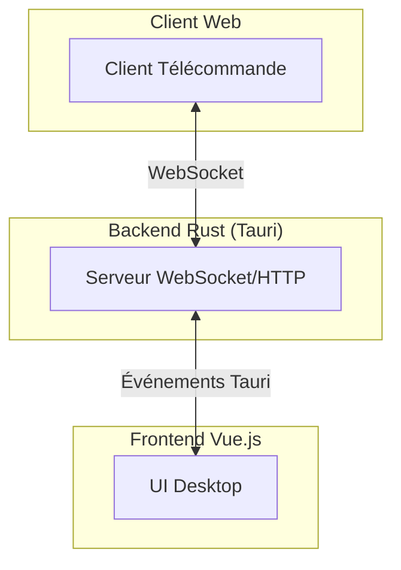
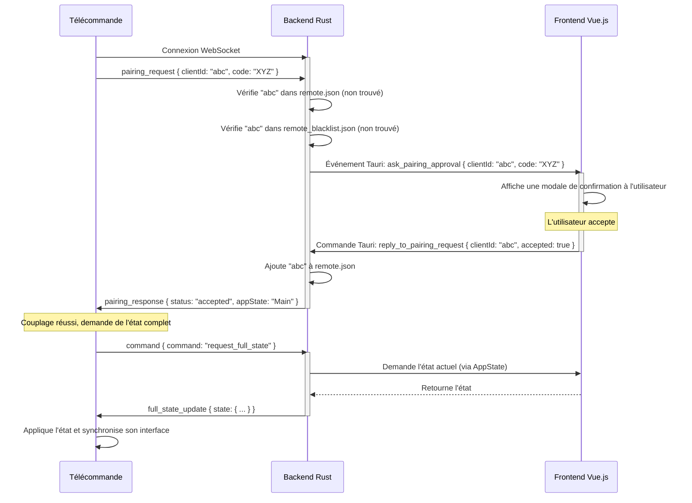
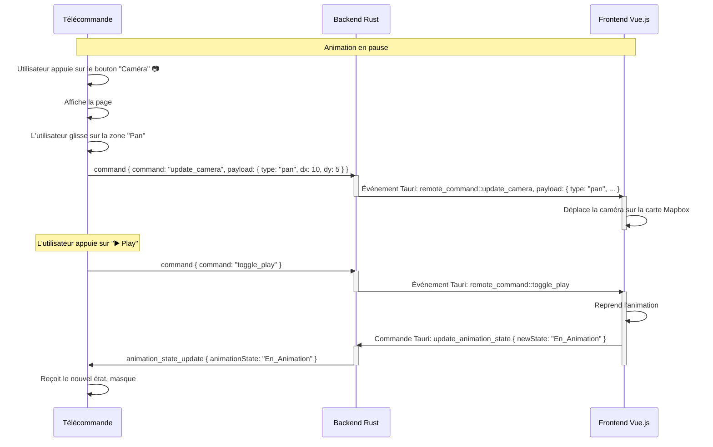

# Analyse Technique Approfondie : Télécommande VisuGPS

Ce document fournit une analyse technique détaillée de l'architecture et des flux de communication du système de télécommande de VisuGPS.

## 1. Architecture Générale

Le système repose sur trois composants principaux qui communiquent de manière asynchrone :

1.  **Le Client de Télécommande**: Une application web monopage (`single-page application`) servie par le backend. C'est l'interface que l'utilisateur manipule sur son appareil mobile.
2.  **Le Serveur WebSocket/HTTP (Backend Rust)**: Intégré à l'application Tauri, il a un double rôle : servir les fichiers du client web et gérer la communication en temps réel via WebSocket.
3.  **Le Frontend Desktop (Vue.js)**: L'interface principale de l'application VisuGPS qui exécute les commandes reçues et dont l'état est reflété sur la télécommande.

---

## 2. Le Client de Télécommande : `src/remote_client`

L'application cliente est conçue pour être légère et réactive. Sa logique est répartie en plusieurs fichiers JavaScript spécialisés.

### 2.1. Structure et Rôle des Fichiers

*   **`index.html`**: Squelette de l'application. Il définit toutes les "pages" possibles (`#page-visualize`, `#page-camera-edit`, etc.) et les zones de contrôle. La visibilité de ces éléments est entièrement gérée par JavaScript.

*   **`style.css`**: Mise en forme de l'interface. Utilise Bootstrap 5 pour les composants de base et ajoute des styles spécifiques pour les zones tactiles (`.touch-area`) et les interrupteurs (`.form-switch`) afin d'améliorer l'ergonomie sur mobile.

*   **`remote-utils.js`**: Contient des fonctions pures et sans dépendances pour des tâches simples comme la génération d'UUID et de codes aléatoires.

*   **`remote-speed.js`**: Isole la logique complexe de mappage entre la position d'un slider (valeur de 0 à 100) et la vitesse de l'animation. Cette courbe non linéaire permet un contrôle plus fin à basse vitesse.

*   **`remote-camera.js`**: Gère la page `#page-camera-edit`. Il implémente une logique de détection de "glisser" (`handleDrag`) sur les différentes zones tactiles. Lorsqu'un glissement est détecté, il calcule le déplacement (`dx`, `dy`) et envoie une commande `update_camera` via WebSocket.

*   **`remote-websocket.js` (La Couche Transport)**:
    *   **Rôle**: Gérer exclusivement la connexion WebSocket. Il est le seul module à interagir directement avec l'objet `WebSocket`.
    *   **Fonctions Clés**:
        *   `connectWebSocket()`: Tente la connexion, gère les erreurs et la logique de reconnexion automatique (3 tentatives max).
        *   `sendCommand(command, payload)`: Encapsule et envoie les messages sortants au format JSON. C'est le point d'entrée pour tous les autres modules qui veulent communiquer avec le serveur.
        *   `ws.onmessage`: Point d'entrée unique pour les messages entrants. Il parse le JSON et, en fonction du `type` de message, appelle les fonctions appropriées dans `remote-ui.js` pour mettre à jour l'interface. Il ne contient aucune logique de manipulation du DOM.

*   **`remote-ui.js` (Le Chef d'Orchestre)**:
    *   **Rôle**: Mettre à jour l'état visuel de l'application en réponse aux messages du serveur. Il manipule le DOM pour afficher/masquer des pages, changer le texte, et modifier l'état des contrôles.
    *   **Fonctions Clés**:
        *   `updateRemoteInterface(appState)`: Affiche la "page" (`#page-visualize`, `#page-edit`, etc.) correspondant à la vue active de l'application desktop.
        *   `handleFullStateUpdate(state)`: Fonction cruciale pour la synchronisation. À la connexion, elle reçoit un objet contenant l'état de tous les éléments de l'interface (widgets, vitesse, état de l'animation) et les applique en une seule fois.
        *   `updatePlayPauseButton(animationState)`: Logique complexe qui adapte l'interface en fonction de l'état précis de l'animation (ex: `En_Pause`, `Termine`). C'est ici que le bouton "Rewind" ⏪ se transforme en bouton "Caméra" 📷 lorsque l'animation est en pause, offrant un raccourci contextuel vers la page de contrôle de la caméra.
        *   `updateSpeedDisplay(speed)`: Met à jour le texte de la vitesse et la position du slider.

*   **`main.js` (Le Point d'Entrée)**:
    *   Initialise la connexion WebSocket au chargement de la page.
    *   Appelle `setupButtonListeners()` de `remote-ui.js` pour lier les événements (clics, changements) des éléments HTML aux fonctions qui envoient des commandes via `sendCommand`.

---

## 3. Le Serveur (Backend Rust)

Le backend gère la logique métier de la télécommande.

*   **Double Rôle HTTP/WebSocket**: Le serveur écoute sur un seul port. Il inspecte les en-têtes de chaque nouvelle connexion pour déterminer s'il s'agit d'une requête HTTP (pour servir les fichiers du client) ou d'une demande de mise à niveau WebSocket.
*   **Injection d'IP Dynamique**: Lors d'une requête pour `/remote/main.js`, le serveur lit le template, remplace les placeholders d'IP et de port par sa propre configuration réseau, et envoie le script personnalisé.
*   **Gestion des Clients et Persistance**:
    *   `remote.json`: Fichier contenant la "liste blanche" des clients autorisés (`clientId`, nom, date). Un client présent dans ce fichier est automatiquement accepté après sa `pairing_request`.
    *   `remote_blacklist.json`: Fichier contenant les `clientId` des appareils explicitement refusés par l'utilisateur. Ces clients sont immédiatement rejetés.
*   **Rôle de Passerelle (Gateway)**: Le backend ne contient pas la logique de l'animation elle-même. Il agit comme une passerelle :
    1.  Il reçoit une commande WebSocket de la télécommande.
    2.  Il la traduit en un **événement Tauri** (ex: `remote_command::toggle_play`).
    3.  Il propage cet événement au frontend Vue.js.
    4.  Inversement, lorsque le frontend change d'état, il notifie le backend via une commande Tauri (ex: `update_animation_state`).
    5.  Le backend traduit cette notification en un message WebSocket (`animation_state_update`) et l'envoie à la télécommande.

---
## 4. Flux de Communication Détaillés (Chronogrammes)

### 4.1. Couplage d'un Nouvel Appareil

Ce scénario se produit lorsqu'un appareil inconnu se connecte.

### 4.2. Contrôle de la Caméra en Pause

