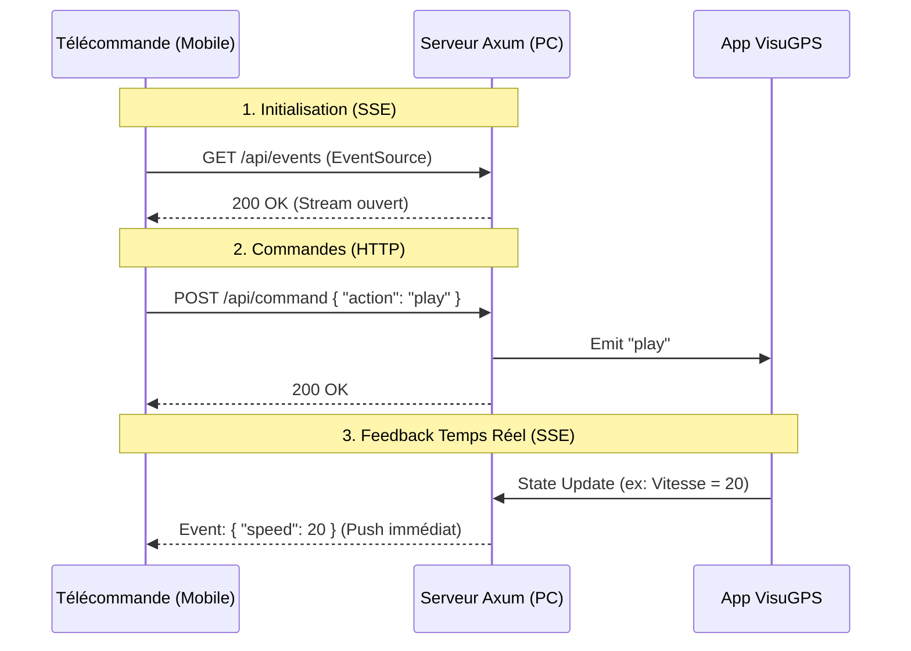

# Synthèse et Architecture V2 : Contrôle à Distance VisuGPS

Ce document synthétise les problèmes rencontrés, les solutions validées lors de la session de débogage, et propose une architecture "propre" (V2) pour une refonte pérenne incluant le **Server-Sent Events (SSE)**.

## 1. Bilan : Pourquoi l'ancienne version échouait ?

| Problème | Cause Technique | Symptôme Utilisateur |
| :--- | :--- | :--- |
| **Instabilité Serveur** | Implémentation manuelle de TCP/WebSocket avec `tokio` brut. Gestion manuelle du handshake difficile. | "Connection Reset", serveur qui crash (panic). |
| **Blocage iOS** | Safari sur iOS et certains pare-feux bloquent proactivement les connexions `ws://` non sécurisées sur réseau local. | Blocage infini sur "Connexion...", erreur 1006. |
| **Mise à jour Cache** | Le navigateur mobile garde en cache des versions JS obsolètes. | Le téléphone semble ignorer les correctifs. |

## 2. Solutions Validées (Ce qui fonctionne)

1.  **Framework Axum** : Remplacer le code manuel par `Axum` a résolu 100% des instabilités serveur. C'est la fondation solide.
2.  **Mode Robuste (Fallback)** : Prévoir un plan B est obligatoire. Le WebSocket *va* échouer chez certains utilisateurs.
3.  **Timeout Agressif** : Ne jamais laisser une connexion en attente > 3 secondes. Si ça ne marche pas tout de suite, ça ne marchera pas plus tard.

## 3. Architecture Recommandée "V2" (Repartir de zéro)

Pour une base de code propre, maintenable et "Future-Proof" (2026 Ready), voici l'architecture cible :

### A. Backend (Rust / Axum)

Le serveur ne gère plus de logique complexe de "handshake manuel". Il expose 3 types de routes :

1.  **Commandes (HTTP POST)** : `/api/command`
    - Réception des ordres (Play, Pause, etc.).
    - Simple, stateless, impossible à bloquer.
2.  **État Temps Réel (SSE)** : `/api/events`
    - **Remplaçant du Polling**.
    - Un flux unidirectionnel (`text/event-stream`) où le serveur "pousse" les mises à jour (État appl, Vitesse, Position).
    - Avantage : Zéro latence, pas de surcharge réseau, supporté nativement par tous les navigateurs.
3.  **WebSocket (Optionnel/Legacy)** : `/ws`
    - On peut le garder pour la compatibilité, mais avec SSE + HTTP POST, le WebSocket devient presque superflu pour une simple télécommande.
    - *Recommandation* : Garder le WebSocket comme "Upgrade" optionnelle, mais démarrer par défaut en SSE.

### B. Frontend (VueJS / Vanilla JS)

Le client `remote-client` doit être agnostique du transport.

- **Classe `RemoteClient`** :
    - Méthode `connect()` : Tente d'abord SSE (car plus robuste).
    - Méthode `sendCommand()` : Utilise toujours `fetch (POST)`. C'est plus fiable que d'envoyer des messages dans un socket qui peut se déconnecter.
- **Gestionnaire d'État** :
    - Reçoit les événements SSE (`onmessage`).
    - Met à jour l'UI instantanément.

## 4. Plan d'Implémentation "Clean Slate"

Si nous repartons de zéro maintenant, voici les étapes :

1.  **Nettoyage** : Supprimer tout le vieux code `ws_handler` complexe.
2.  **Serveur Axum SSE** :
    - Ajouter une route `GET /api/events` qui souscrit au `broadcast::channel` de l'application.
    - Transformer les messages Rust interne en format SSE (`data: {...}\n\n`).
3.  **Client JS v2** :
    - Remplacer `new WebSocket()` par `new EventSource('/api/events')`.
    - Remplacer `ws.send()` par `fetch('/api/command', ...)`.
4.  **Pairing** :
    - Le pairing se fait via une simple requête HTTP POST `/api/pair` sécurisée par le code PIN. Plus besoin de handshake complexe.

### Schéma de Communication V2

## Conclusion

L'utilisation de **SSE (lecture)** + **HTTP POST (écriture)** est l'architecture la plus robuste pour une télécommande locale. Elle évite tous les pièges du WebSocket bidirectionnel (firewalls, timeouts, déconnexions fantômes) tout en gardant l'aspect "Temps Réel".
