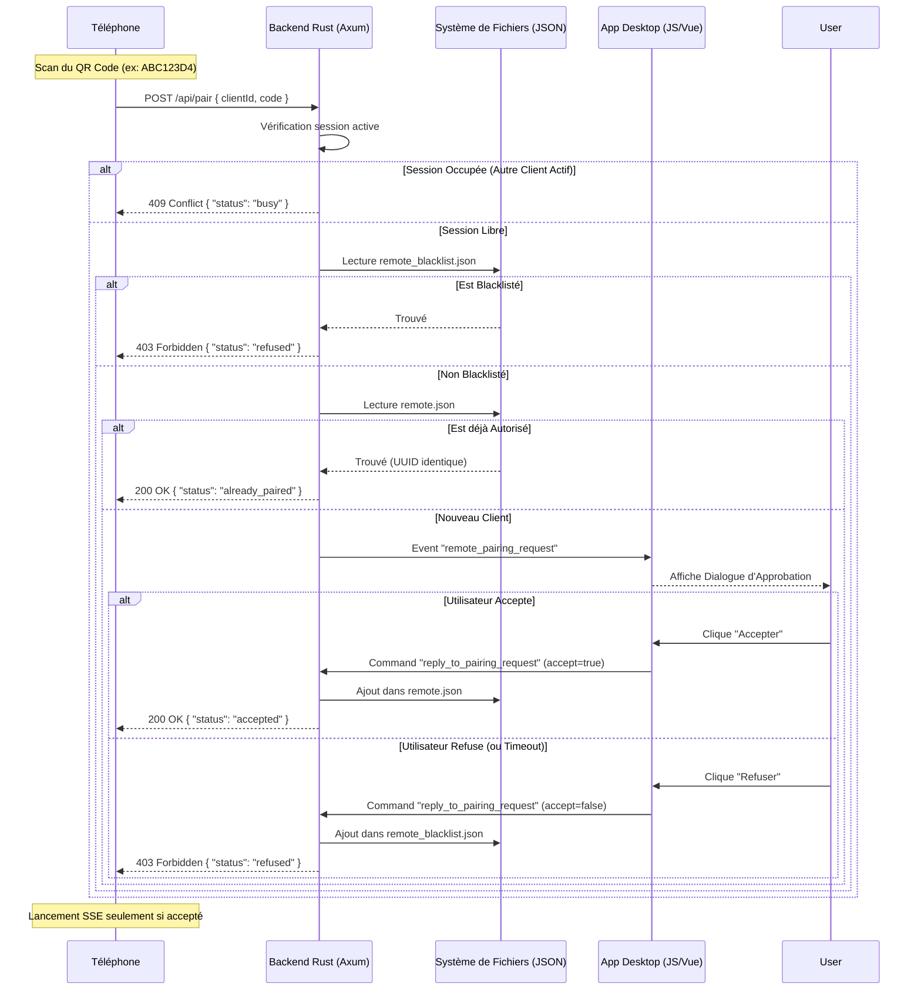
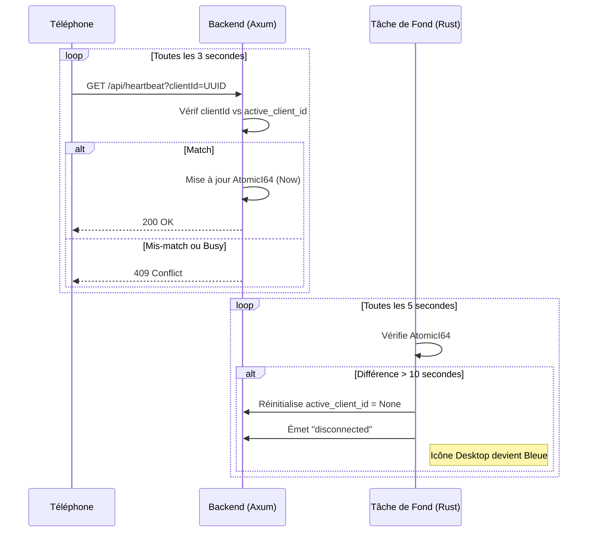

# Flux Logiques : Couplage, Connexion et Heartbeat

Ce document décrit les séquences logiques permettant d'établir et de maintenir la liaison entre le PC et la télécommande.

## 1. Flux de Couplage (Pairing)

Le couplage est nécessaire la première fois qu'un appareil se connecte ou si son autorisation a été révoquée.

## 2. Système de Heartbeat (Maintien de Vie)

Le Heartbeat assure que le PC sait si la télécommande est toujours "là" malgré la nature asynchrone du réseau.

## 3. Reconnexion et Watchdog

La télécommande mobile (v18+) implémente une double sécurité :
1.  **Reconnexion Native** : L'objet `EventSource` tente automatiquement de se reconnecter au flux SSE en cas de coupure réseau.
2.  **Watchdog JS** : Si aucun battement de coeur réussi n'a eu lieu depuis plus de 10s, la télécommande force un signal de vie immédiat pour tenter de "réveiller" la liaison.
3.  **App State Sync** : À chaque changement de vue sur le Desktop, une notification SSE est envoyée, forçant la télécommande à rafraîchir son interface et son état de connexion (Passage au vert).
