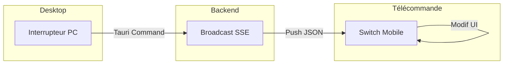

# Interactions IHM : Liste des Commandes et États

Ce document liste l'ensemble des interactions possibles entre l'interface utilisateur de la télécommande et l'application desktop.

## 1. Commandes du Mobile -> PC (Actions IHM)

Ces commandes sont envoyées via `POST /api/command`.

| Commande | Payload | Effet sur le Desktop |
| :--- | :--- | :--- |
| `toggle_play` | `null` | Alterne entre Lecture et Pause de l'animation. |
| `start_rewind` | `null` | Démarre le défilement rapide vers l'arrière. |
| `stop_rewind` | `null` | Arrête le défilement arrière. |
| `restart_animation` | `null` | Repart du début (après la fin d'une trace). |
| `update_speed` | `{ "speed": number }` | Change la vitesse de l'animation. |
| `update_camera` | `{ "type": "pan"\|"tilt"\|"zoom"\|"bearing", "dx": number, "dy": number }` | Manipule la caméra 3D directement depuis le mobile. |
| `toggle_altitude_profile`| `null` | Affiche/masque le graphe d'altitude. |
| `toggle_commands_widget`| `null` | Affiche/masque le bandeau de contrôle. |
| `toggle_distance_display`| `null` | Affiche/masque le compteur de distance. |
| `toggle_weather_static` | `null` | Affiche/masque le tableau météo. |
| `toggle_weather_dynamic`| `null` | Affiche/masque le widget météo/boussole flottant. |

---

## 2. États et Notifications du PC -> Mobile (Feedback IHM)

Ces états sont poussés via SSE pour mettre à jour l'affichage de la télécommande.

### 2.1 États de l'Animation (`animation_state_update`)
- **`En_Animation`** : Le bouton de lecture affiche "Pause".
- **`En_Pause`** : Le bouton de lecture affiche "Play". Le bouton rewind se transforme en icône "Caméra" 📷 pour accéder aux contrôles 3D.
- **`Termine`** : Le bouton rewind se transforme en icône "Redémarrer" 🔄.

### 2.2 Navigation entre Vues (`app_state_update`)
- **`Main`** : La télécommande affiche la page d'accueil (historique/choix).
- **`Visualize`** : La télécommande active les contrôles de lecture et de caméra.
- **`Settings`** : La télécommande affiche un message de configuration.

### 2.3 Synchronisation des Switches
Chaque widget activé sur le Desktop (via un raccourci clavier ou clic souris) est immédiatement reflété par l'allumage ou l'extinction du switch correspondant sur le téléphone via l'événement `visualize_view_state_update`.

