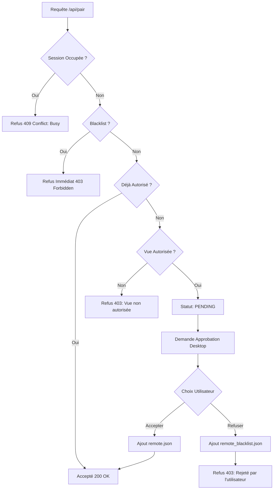

# Sécurité et Persistance : Gestion des Accès Télécommande

Ce document détaille la couche de sécurité de VisuGPS, la structure des fichiers de persistance et la logique de décision du Backend Rust lors des tentatives de connexion.

## 1. Modèle de Persistance (JSON)

La sécurité repose sur deux fichiers JSON stockés dans le dossier d'environnement de l'application (`app_env_path`).

### 1.1 `remote.json` (Liste Blanche)
Contient les identifiants des appareils explicitement autorisés par l'utilisateur.

**Structure Technique :**
```json
{
  "version": "1.0",
  "description": "Fichier de configuration des clients de télécommande autorisés.",
  "clients": [
    {
      "client_id": "UUID-V4-UNIQUE",
      "name": "Nom de l'appareil (ex: iPhone de Jean)",
      "last_seen": "ISO-8601-TIMESTAMP"
    }
  ]
}
```

### 1.2 `remote_blacklist.json` (Liste Noire)
Contient les identifiants des appareils bannis. Une fois blacklisté, un appareil est rejeté immédiatement sans même demander l'avis de l'utilisateur sur le Desktop.

**Structure Technique :**
```json
{
  "version": "1.0",
  "description": "Liste des clients de télécommande bloqués.",
  "blacklisted_clients": [
    {
      "clientId": "UUID-V4-UNIQUE",
      "reason": "Raison du blocage",
      "timestamp": "ISO-8601-TIMESTAMP"
    }
  ]
}
```

---

## 2. Logique de Validation et Refus

Lorsqu'un client appelle `POST /api/pair`, le serveur suit un arbre de décision strict.

### 2.1 L'Arbre de Décision (Backend Rust)



### 2.2 Détails Technique des Refus

| Scénario | Code HTTP | JSON de Réponse | Conséquence Mobile |
| :--- | :--- | :--- | :--- |
| **Session Active** | `409` | `{"status": "busy", "reason": "Un autre appareil est déjà connecté."}` | Affiche un message de blocage orange. |
| **Blacklisté** | `403` | `{"status": "refused", "reason": "Cet appareil a été bloqué."}` | Affiche un message d'erreur rouge permanent. |
| **Vue Non Gérée** | `403` | `{"status": "refused", "reason": "Le couplage est uniquement autorisé depuis l'accueil..."}` | Demande à l'utilisateur de changer de page sur le PC. |
| **Refus Utilisateur** | `403` | `{"status": "refused", "reason": "Accès refusé par l'utilisateur."}` | Blackliste l'appareil pour les futures tentatives. |

---

## 3. Sécurité des Échanges (Watchdog & Session)

### 3.1 Token de Session
Lorsqu'un couplage est réussi, le serveur génère un `sessionToken` (UUID).
- Ce token doit être inclus dans chaque `POST /api/command`.
- Si le token est invalide ou absent, la commande est ignorée (en cours d'implémentation v2).

### 3.2 Robustesse Integrité
Le module Rust `remote_clients.rs` inclut une sécurité contre la corruption de fichier :
- Si `remote.json` est illisible ou corrompu, il est automatiquement renommé en `.bak` et un nouveau fichier vide est créé pour ne pas bloquer l'application.
- Chaque écriture utilise une indentation (`pretty-print`) pour rester auditable manuellement par l'utilisateur.

### 3.3 Révocation
L'utilisateur peut révoquer un accès à tout moment depuis le Desktop.
1. La commande Tauri `remove_authorized_client` est appelée.
2. L'entrée est supprimée de `remote.json`.
3. Le backend émet un événement SSE `server_shutdown` vers le mobile.
4. La connexion SSE est coupée côté serveur.
