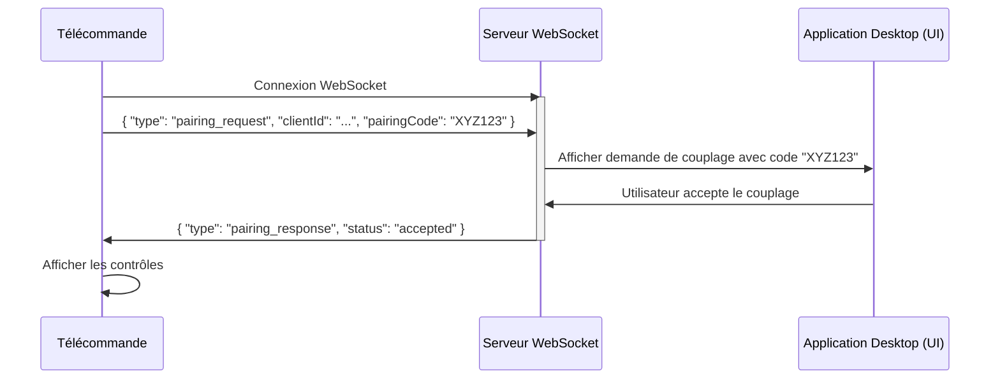
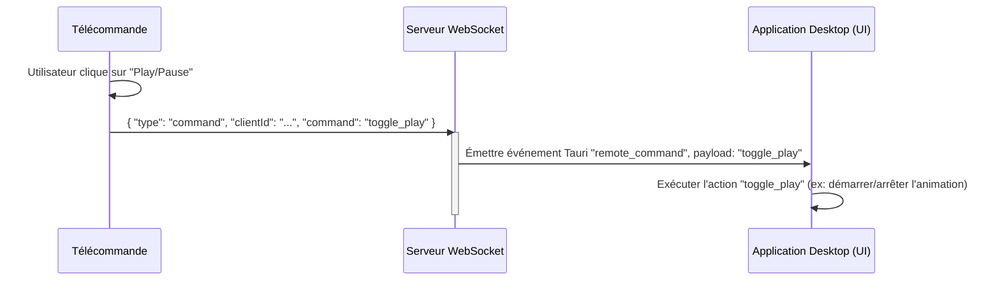
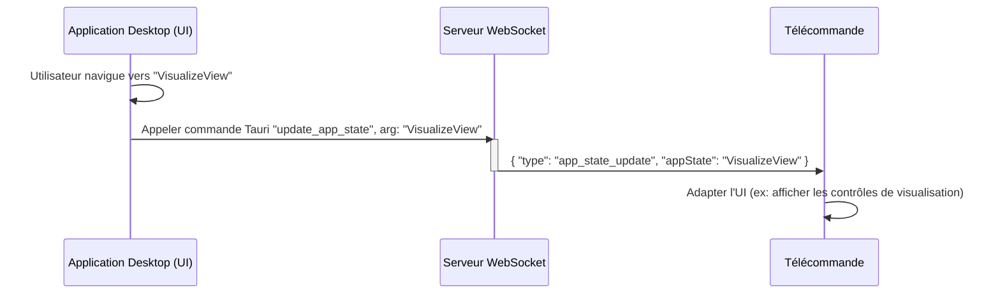

# Spécification de l'Interface de Communication : Télécommande VisuGPS

Ce document décrit en détail les messages échangés entre le client de télécommande (application web) et le serveur WebSocket intégré à l'application desktop VisuGPS. Il spécifie le format des messages et illustre les flux de communication à l'aide de diagrammes de séquence UML (Mermaid).

## Table des Matières

1.  [Introduction](#1-introduction)
2.  [Format Général des Messages](#2-format-général-des-messages)
3.  [Messages Émis par le Client de Télécommande](#3-messages-émis-par-le-client-de-télécommande)
    *   [3.1. `pairing_request`](#31-pairing_request)
    *   [3.2. `command`](#32-command)
4.  [Messages Émis par le Serveur WebSocket](#4-messages-émis-par-le-serveur-websocket)
    *   [4.1. `pairing_response`](#41-pairing_response)
    *   [4.2. `app_state_update`](#42-app_state_update)
5.  [Diagrammes de Séquence Complets](#5-diagrammes-de-séquence-complets)
    *   [5.1. Processus de Couplage](#51-processus-de-couplage)
    *   [5.2. Envoi d'une Commande](#52-envoi-dune-commande)
    *   [5.3. Mise à Jour de l'État de l'Application](#53-mise-à-jour-de-létat-de-lapplication)
6.  [Considérations](#6-considérations)

---

## 1. Introduction

L'interface de communication entre la télécommande VisuGPS et l'application desktop est basée sur le protocole WebSocket, permettant un échange bidirectionnel et en temps réel de messages. Ces messages sont formatés en JSON et permettent au client de télécommande d'envoyer des commandes et de recevoir des mises à jour d'état.

## 2. Format Général des Messages

Tous les messages échangés sont des objets JSON. Ils partagent une structure commune pour faciliter leur traitement.

*   **`type` (string, obligatoire)**: Identifie le type de message (par exemple, `"pairing_request"`, `"command"`, `"pairing_response"`, `"app_state_update"`).
*   **`clientId` (string, obligatoire pour les messages client -> serveur)**: L'identifiant unique du client de télécommande.

## 3. Messages Émis par le Client de Télécommande

Ces messages sont envoyés par l'application web de télécommande vers le serveur WebSocket de l'application desktop.

### 3.1. `pairing_request`

*   **Description**: Message envoyé par un nouveau client de télécommande (ou un client non couplé) pour initier le processus de couplage avec l'application desktop.
*   **But**: Demander l'autorisation de se connecter et de contrôler l'application desktop.
*   **Structure JSON**:
    ```json
    {
        "type": "pairing_request",
        "clientId": "string_uuid_unique_du_client",
        "pairingCode": "string_code_alphanumérique_de_8_caractères"
    }
    ```
*   **Diagramme de Séquence**:
    ```mermaid
    sequenceDiagram
        participant Client as Télécommande
        participant Server as Serveur WebSocket
        Client->>Server: { "type": "pairing_request", "clientId": "...", "pairingCode": "..." }
    ```

### 3.2. `command`

*   **Description**: Message envoyé par un client de télécommande couplé pour exécuter une action spécifique sur l'application desktop.
*   **But**: Contrôler les fonctionnalités de l'application desktop (lecture/pause, affichage de widgets, etc.).
*   **Structure JSON**:
    ```json
    {
        "type": "command",
        "clientId": "string_uuid_unique_du_client",
        "command": "string_nom_de_la_commande"
    }
    ```
*   **Commandes Actuellement Définies**:
    *   `"toggle_play"`: Bascule l'état lecture/pause de l'animation.
    *   `"toggle_commands_widget"`: Affiche/masque le widget des commandes.
    *   `"toggle_altitude_profile"`: Affiche/masque le profil d'altitude.
    *   `"toggle_communes_display"`: Affiche/masque l'affichage des communes.
    *   `"toggle_distance_display"`: Affiche/masque l'affichage de la distance.
    *   `"toggle_home"`: Retourne à la vue principale de l'application desktop.
*   **Diagramme de Séquence**:
    ```mermaid
    sequenceDiagram
        participant Client as Télécommande
        participant Server as Serveur WebSocket
        Client->>Server: { "type": "command", "clientId": "...", "command": "toggle_play" }
    ```

## 4. Messages Émis par le Serveur WebSocket

Ces messages sont envoyés par le serveur WebSocket de l'application desktop vers le client de télécommande.

### 4.1. `pairing_response`

*   **Description**: Réponse du serveur à une `pairing_request`, indiquant le résultat du processus de couplage.
*   **But**: Informer le client de télécommande si son couplage a été accepté, refusé ou s'il est déjà couplé.
*   **Structure JSON**:
    ```json
    {
        "type": "pairing_response",
        "status": "accepted" | "refused" | "already_paired",
        "reason": "string_message_explicatif_si_refusé_ou_erreur" // Optionnel
    }
    ```
*   **Diagramme de Séquence**:
    ```mermaid
    sequenceDiagram
        participant Server as Serveur WebSocket
        participant Client as Télécommande
        Server->>Client: { "type": "pairing_response", "status": "accepted" }
    ```

### 4.2. `app_state_update`

*   **Description**: Message envoyé par le serveur pour informer le client de télécommande d'un changement d'état significatif de l'application desktop.
*   **But**: Permettre à la télécommande d'adapter son interface utilisateur en fonction du contexte de l'application desktop (par exemple, n'afficher les contrôles que si l'application est dans une vue spécifique).
*   **Structure JSON**:
    ```json
    {
        "type": "app_state_update",
        "appState": "string_état_actuel_de_l_application" // Ex: "MainView", "EditView", "VisualizeView"
    }
    ```
*   **Diagramme de Séquence**:
    ```mermaid
    sequenceDiagram
        participant Server as Serveur WebSocket
        participant Client as Télécommande
        Server->>Client: { "type": "app_state_update", "appState": "VisualizeView" }
    ```

## 5. Diagrammes de Séquence Complets

Ces diagrammes illustrent les flux de communication complets pour les scénarios clés.

### 5.1. Processus de Couplage



### 5.2. Envoi d'une Commande



### 5.3. Mise à Jour de l'État de l'Application



## 6. Considérations

*   **Gestion des Erreurs**: Le serveur doit gérer les erreurs de parsing JSON, les `clientId` inconnus ou non couplés, et les commandes invalides, en renvoyant des messages d'erreur appropriés au client si nécessaire (bien que non spécifié dans les messages actuels).
*   **Sécurité**: Le couplage actuel est basé sur un code simple. Pour des environnements plus sensibles, des mécanismes d'authentification plus robustes pourraient être nécessaires.
*   **Persistance**: Le serveur devrait persister les informations sur les clients couplés pour éviter de devoir les recoupler à chaque redémarrage de l'application desktop.
