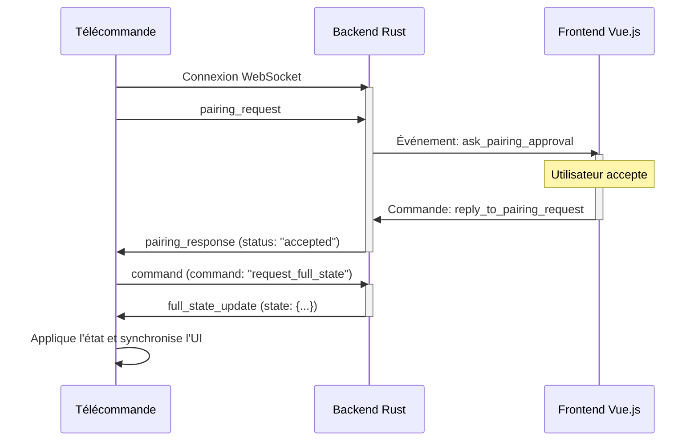
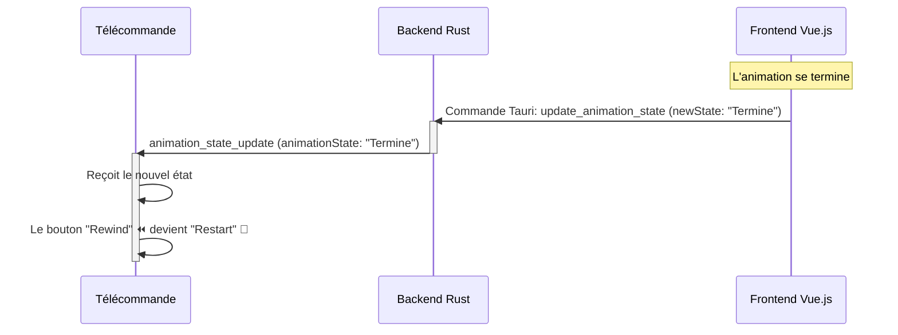
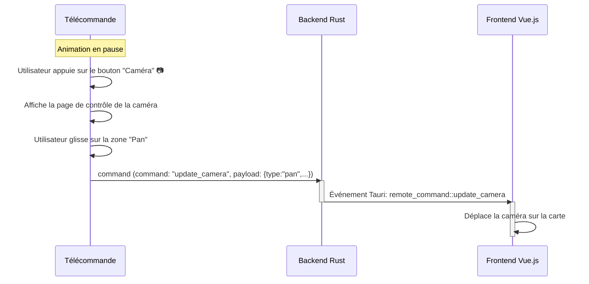

# Spécification de l'Interface de Communication : Télécommande VisuGPS

Ce document spécifie le contrat d'interface (API) pour la communication WebSocket entre le client de télécommande et le serveur VisuGPS.

## 1. Format Général

Tous les messages sont des objets JSON.
*   **`type` (string)**: Identifiant obligatoire du type de message.
*   **`clientId` (string)**: UUID du client, obligatoire pour tous les messages émis par le client.

---

## 2. Messages Émis par le Client (Télécommande -> Serveur)

### 2.1. `pairing_request`
*   **Contexte**: Envoyé immédiatement après l'établissement d'une connexion WebSocket pour initier le couplage.
*   **Action Attendue du Serveur**: Vérifier si le `clientId` est connu/blacklisté. Si inconnu, demander la validation de l'utilisateur desktop. Répondre avec un `pairing_response`.
*   **Structure**:
    ```json
    {
        "type": "pairing_request",
        "clientId": "string_uuid_du_client",
        "pairingCode": "string_code_alphanumérique"
    }
    ```

### 2.2. `command`
*   **Contexte**: Envoyé lorsqu'un utilisateur interagit avec l'interface de la télécommande (clic sur un bouton, mouvement d'un slider, etc.).
*   **Action Attendue du Serveur**: Valider le `clientId`, puis relayer la commande et son `payload` au frontend desktop via un événement Tauri.
*   **Structure**:
    ```json
    {
        "type": "command",
        "clientId": "string_uuid_du_client",
        "command": "string",
        "payload": "any" 
    }
    ```
*   **Liste des `command` et `payload`**:
    | Commande | Payload | Description |
    | :--- | :--- | :--- |
    | `request_full_state` | `null` | Demande un état complet de l'UI pour la synchronisation. |
    | `toggle_commands_widget`| `null` | Affiche/masque le widget des commandes. |
    | `toggle_altitude_profile`| `null` | Affiche/masque le profil d'altitude. |
    | `toggle_communes_display`| `null` | Affiche/masque le nom de la commune. |
    | `toggle_distance_display`| `null` | Affiche/masque l'indicateur de distance. |
    | `toggle_play` | `null` | Bascule l'état lecture/pause de l'animation. |
    | `update_speed` | `{ "speed": number }` | Change la vitesse de l'animation. |
    | `start_rewind` | `null` | Déclenche le retour en arrière rapide. |
    | `stop_rewind` | `null` | Arrête le retour en arrière. |
    | `restart_animation` | `null` | Redémarre une animation terminée. |
    | `update_camera` | `{ "type": string, "dx": number, "dy": number }` | Déplace la caméra. `type` peut être `pan`, `bearing`, `zoom`, `tilt`. |

---

## 3. Messages Émis par le Serveur (Serveur -> Télécommande)

### 3.1. `pairing_response`
*   **Contexte**: En réponse à une `pairing_request`.
*   **Action Attendue du Client**: Si `status` est `accepted` ou `already_paired`, envoyer une commande `request_full_state`. Si `refused`, afficher la raison à l'utilisateur.
*   **Structure**:
    ```json
    {
        "type": "pairing_response",
        "status": "accepted" | "refused" | "already_paired",
        "reason": "string",
        "appState": "string",
        "settings": { "speed_min_value": number, "speed_max_value": number }
    }
    ```

### 3.2. `app_state_update`
*   **Contexte**: Envoyé lorsque l'utilisateur navigue entre les vues principales de l'application desktop.
*   **Action Attendue du Client**: Changer la "page" affichée sur la télécommande (`updateRemoteInterface`).
*   **Structure**:
    ```json
    {
        "type": "app_state_update",
        "appState": "Main" | "Edit" | "Visualize" | "Settings"
    }
    ```

### 3.3. `full_state_update`
*   **Contexte**: Envoyé en réponse à une commande `request_full_state`.
*   **Action Attendue du Client**: Appliquer l'état reçu à tous les éléments de l'interface pour une synchronisation parfaite (`handleFullStateUpdate`).
*   **Structure**:
    ```json
    {
        "type": "full_state_update",
        "state": {
            "visualize_view": { /* ... état des switches ... */ },
            "animation_state": "string",
            "animation_speed": number
        }
    }
    ```

### 3.4. `visualize_view_state_update`
*   **Contexte**: Envoyé lorsque l'un des widgets de la vue de visualisation est affiché/masqué depuis l'application desktop.
*   **Action Attendue du Client**: Mettre à jour l'état du `switch` correspondant.
*   **Structure**:
    ```json
    {
        "type": "visualize_view_state_update",
        "state": { "isControlsCardVisible": boolean, /* ... */ }
    }
    ```

### 3.5. `animation_state_update`
*   **Contexte**: Envoyé à chaque transition de la machine d'état de l'animation.
*   **Action Attendue du Client**: Mettre à jour l'interface contextuelle, notamment les boutons play/pause et rewind/camera (`updatePlayPauseButton`).
*   **Structure**:
    ```json
    {
        "type": "animation_state_update",
        "animationState": "En_Pause" | "En_Animation" | "Termine" | ...
    }
    ```

### 3.6. `animation_speed_update`
*   **Contexte**: Envoyé lorsque la vitesse est modifiée (par le slider ou par un reset).
*   **Action Attendue du Client**: Mettre à jour la position du slider et le texte affiché (`updateSpeedDisplay`).
*   **Structure**:
    ```json
    {
        "type": "animation_speed_update",
        "speed": number
    }
    ```

### 3.7. `server_shutdown`
*   **Contexte**: Envoyé lorsque le serveur met fin à la connexion (ex: autorisation révoquée).
*   **Action Attendue du Client**: Afficher le message, fermer la connexion et ne pas tenter de se reconnecter.
*   **Structure**:
    ```json
    {
        "type": "server_shutdown",
        "reason": "string"
    }
    ```

---

## 4. Chronogrammes des Échanges

### 4.1. Couplage et Synchronisation Initiale



### 4.2. Mise à Jour de l'État (Frontend -> Télécommande)



### 4.3. Envoi d'une Commande (Télécommande -> Frontend)


