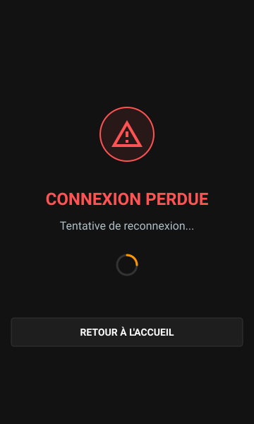

# Guide de Couplage et États de Connexion

Ce document détaille les phases d'établissement de la liaison entre votre smartphone (télécommande) et l'application desktop VisuGPS, ainsi que la gestion des erreurs réseau.

---

## 1. Phase de Couplage (Pairing)

Le couplage est l'étape initiale qui permet de sécuriser la connexion entre le PC et la télécommande. Il ne doit être effectué qu'une seule fois par appareil.

### Vue Globale de l'IHM

  

### Étapes du couplage :
1.  **Affichage sur le PC** : Allez sur l'écran d'accueil de VisuGPS sur votre ordinateur. Un QR Code est affiché.
2.  **Scan** : Ouvrez l'URL de la télécommande sur votre téléphone et autorisez l'accès à la caméra pour scanner le QR Code.
3.  **Approbation** : Une fois le code reconnu, une demande de confirmation apparaît sur l'écran de votre ordinateur pour valider l'accès de ce nouvel appareil.
4.  **Mémorisation** : L'appareil est alors enregistré dans la "Liste Blanche" (voir les paramètres de rétention).

---

## 2. Phase de Connexion

Une fois couplé, le téléphone tente automatiquement de se reconnecter dès que vous ouvrez l'interface de la télécommande.

### Vue Globale de l'IHM

  

### Déroulement :
*   **Reconnaissance** : Le serveur vérifie si l'identifiant unique de votre téléphone est présent dans `remote.json`.
*   **Synchronisation** : Dès que la liaison est établie, le serveur envoie l'état actuel de VisuGPS (lecture en cours, circuit chargé, widgets actifs) pour que la télécommande s'adapte instantanément.

---

## 3. Perte de Connexion

Si le réseau WiFi est instable ou si le serveur VisuGPS est arrêté sur le PC, la télécommande bascule en mode survie.

### Vue Globale de l'IHM

  

### Comportement automatique :
*   **Reconnexion infinie** : La télécommande tente de rétablir le flux SSE (Server-Sent Events) à intervalles réguliers.
*   **Indicateur visuel** : Un message d'alerte rouge informe l'utilisateur que les commandes ne sont plus opérationnelles.
*   **Retour Manuel** : Le bouton "Retour à l'accueil" permet de réinitialiser l'interface si le serveur a changé d'adresse IP ou de port.

---

## 4. Paramètres de Rétention

Ces réglages permettent de gérer automatiquement le cycle de vie des accès sécurisés :

| Paramètre | Description | Défaut |
| :--- | :--- | :---: |
| **Rétention Autorisations** | Durée (en jours) avant qu'un appareil autorisé doive se recoupler s'il ne s'est pas connecté. | 7 j |
| **Rétention Liste Noire** | Durée (en jours) de bannissement automatique d'un appareil refusé. | 14 j |
